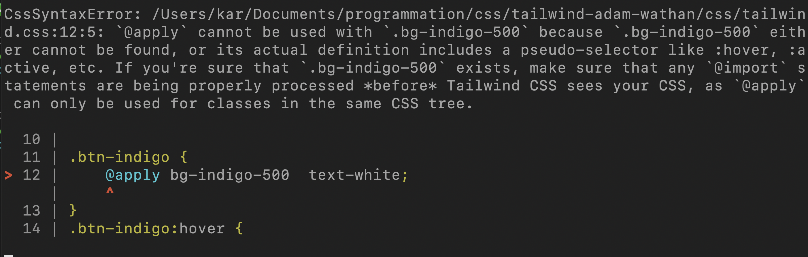

# 06 Customisation

On a un fichier de configuration `tailwind.config.js` dans lequel on a déjà ajouté des `variants` (variations).

```js
module.exports = {
  purge: [],
  theme: {
    extend: {},
  },
  variants: {
    backgroundColor: ["responsive", "focus", "hover", "active"],
    fontSize: ["responsive", "hover"],
  },
  plugins: [],
};
```

On va en créer un autre plus complet avec la commande suivante :

```bash
npx tailwind init tailwind-full.config.js --full
```

Cela va générer un fichier de configuration complet :

```js
module.exports = {
  purge: [],
  target: 'relaxed',
  prefix: '',
  important: false,
  separator: ':',
  theme: {
    screens: {
      sm: '640px',
      md: '768px',
      lg: '1024px',
      xl: '1280px',
    },
      // ...
```

Ce fichier ne doit pas servir réellement de fichier de configuration mais plutôt de guide exhaustif.

## Ajouter une nouvelle couleur

Si on doit ajouter une couleur spécifique lié à l'identité graphique du projet, on va utiliser `tailwind.config.js`.

```js
module.exports = {
  purge: [],
  theme: {
    extend: {},
    colors: {
      "brand-blue": "#1992d4",
    },
  },

  variants: {
    backgroundColor: ["responsive", "focus", "hover", "active"],
    fontSize: ["responsive", "hover"],
  },
  plugins: [],
};
```

On ajoute au thème une couleur particulière, mais on va obtenir une erreur de compilation :



Car en fait la couleur vient écraser toutes les autres et du coup `bg-indigo-500` n'existe plus !

C'est une bonne solution si on veut fournir l'entièreté des couleurs.

Dans notre cas on va plutôt utiliser `extend`.

```js
module.exports = {
  purge: [],
  theme: {
    extend: {
      colors: {
        "brand-blue": "#1992d4",
      },
    },
  },

  variants: {
    backgroundColor: ["responsive", "focus", "hover", "active"],
    fontSize: ["responsive", "hover"],
  },
  plugins: [],
};
```

On peut maintenant utiliser notre `custom color` comme n'importe quelle couleur :

`index.html`

```html
<span class="text-brand-blue">Take advantage of it.</span>

// ...

<a class="btn bg-brand-blue text-white" href="#">Book your escape</a>
```

## Ajouter une taille - une hauteur `h-72`

Cette hauteur n'existe pas on va l'ajouter.

De base on a les `spacing` dans `tailwind-full.config.js` :

```js
spacing: {
      px: '1px',
      '0': '0',
      '1': '0.25rem',
      '2': '0.5rem',
      '3': '0.75rem',
      '4': '1rem',
      '5': '1.25rem',
      '6': '1.5rem',
      '8': '2rem',
      '10': '2.5rem',
      '12': '3rem',
      '16': '4rem',
      '20': '5rem',
      '24': '6rem',
      '32': '8rem',
      '40': '10rem',
      '48': '12rem',
      '56': '14rem',
      '64': '16rem',
    },
```

On voit que ça s'arrête à `64` et que `"4"` équivaut à `1rem`, donc `72` équivaut à `18rem`.

Dans `tailwind.config.js` :

```js
// ...

theme: {
    extend: {
      colors: {
        "brand-blue": "#1992d4",
      },
      spacing: {
        "72" : "18rem",
      }
    },
  },

// ...
```

dans le `html` :

```html

```
