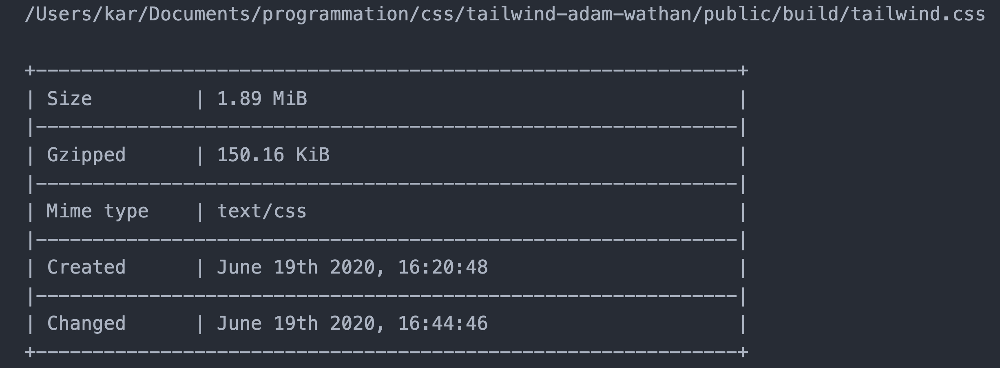
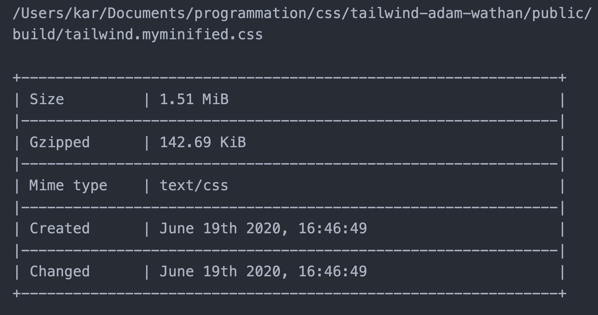
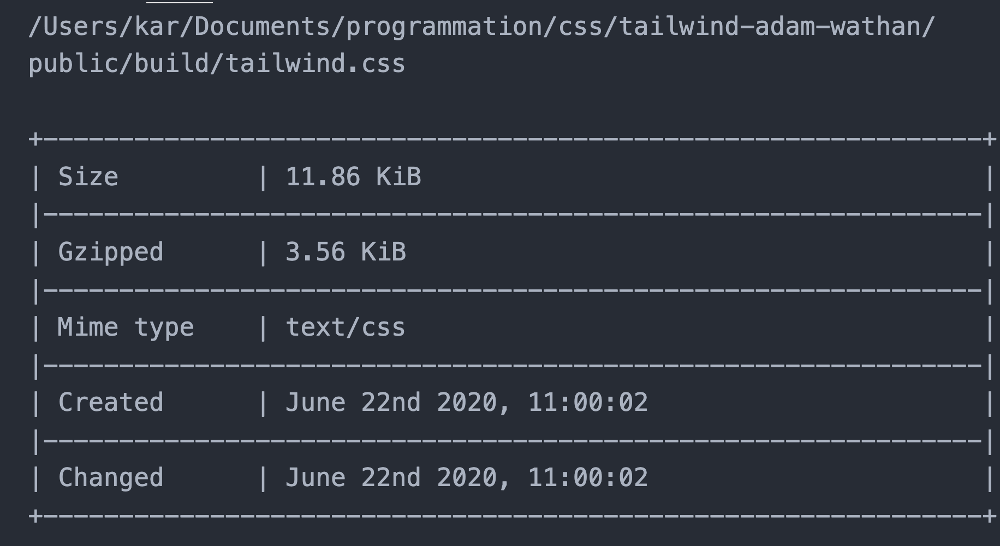
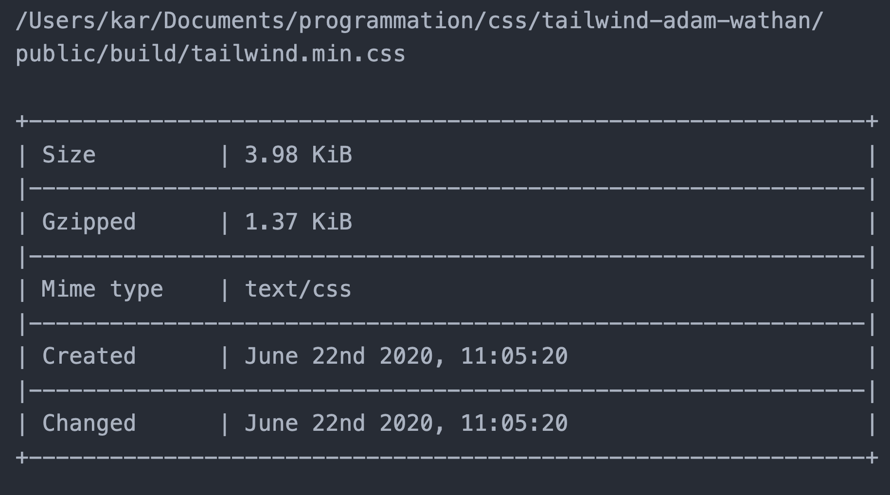

# 07 Optimisation

`tailwindcss` génère beaucoup de css, il y a moyen d'optimiser la taille du fichier `css`.

## Minification des `css`

### `cssnano`

Fonctionne avec `postcss`

```bash
npm i cssnano
```

Puis dans `postcss.config.js` :

```js
module.exports = {
  plugins: [
    require("tailwindcss"),
    require("autoprefixer"),
    require("cssnano")({
      preset: "default",
    }),
  ],
};
```

### `clean-css-cli`

Pour plus d'indépendance et pouvoir _minifier_ quand ça me plait.

```bash
sudo npm install -g clean-css-cli
```

```bash
cleancss -o ./public/build/tailwind.myminified.css ./public/build/tailwind.css
```

#### Installation de l'extension VSCode `filesize`

Le fichier `tailwind.css` (via l'extension `filesize` raccourci `cmd + "`) : `1935KB`



Le fichier _minifié_ : `1546 KB`



## `PurgeCss`

`PurgeCss` existe comme plugin de `Postcss`.

### Installation

```bash
npm i @fullhuman/postcss-purgecss
```

On modifie le fichier `postcss.config.js`

```js
module.exports = {
  plugins: [
    require("tailwindcss"),
    require("autoprefixer"),
    require("@fullhuman/postcss-purgecss")({
      content: ["./public/*.js", "./public/index.html"],
      defaultExtractor: (content) => content.match(/[A-Za-z0-9-_:/]+/g) || [],
    }),
  ],
};
```

On spécifie les fichiers concerné dans `content` et on donne une `regex` pour les classes.

### résultat

Taille du fichier _purgé_ : `12 KB`



Et maintenant _minifié_ : `4 KB`



C'est un facteur `500` fois plus petit !!

## utilisation uniquement en production

Pour utiliser `purgecss` seulement en production, on peut légérement modifier `postcss.config.js` :

```js
module.exports = {
  plugins: [
    require("tailwindcss"),
    require("autoprefixer"),
    process.env.NODE_ENV === "production" &&
      require("@fullhuman/postcss-purgecss")({
        content: ["./public/*.js", "./public/index.html"],
        defaultExtractor: (content) => content.match(/[A-Za-z0-9-_:/]+/g) || [],
      }),
  ],
};
```
