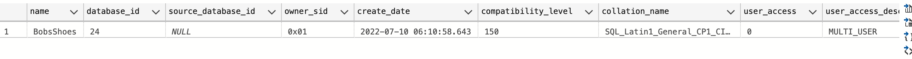
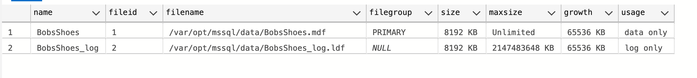

# 03 Créer une `DB`


## `SQL` de création

```sql
USE master;
GO
CREATE DATABASE BobsShoes;
GO
```


### Regarder l'entrée pour `BobsShoes` dans la table `system`

```sql
SELECT * FROM sys.databases WHERE name = 'BobsShoes';
```




### Montrer les fichiers utilisés pour la `DB`

```sql
EXEC sp_helpfile
```




### Créer le `schema`

C'est une bonne pratique.

```sql
CREATE SCHEMA Orders
    AUTHORIZATION dbo;
GO
```


### Créer des nouveaux `filegroups` pour `data` et `log`

```sql
ALTER DATABASE BobsShoes
	ADD FILEGROUP BobsData;
ALTER DATABASE BobsShoes
	ADD FILE (
    	NAME = BobsData,
        FILENAME = '/Users/hukar/Documents/mssql/BobsShoes/BobsData.mdf'
    )
    TO FILEGROUP BobsData;
    
ALTER DATABASE BobsShoes
	ADD LOG FILE (
        NAME = BobsLogs,
        FILENAME = '/Users/hukar/Documents/mssql/BobsShoes/BobsLogs.ldf'
    );
GO
```

On choisie son adresse, ici je mets les fichiers dans `Documents/mssql`.

On a l'extension `mdf` pour les données et `ldf` pour les `logs`.

En production il serait intéressant de mettre ces deux fichiers sur des disques différents (pour les performances).