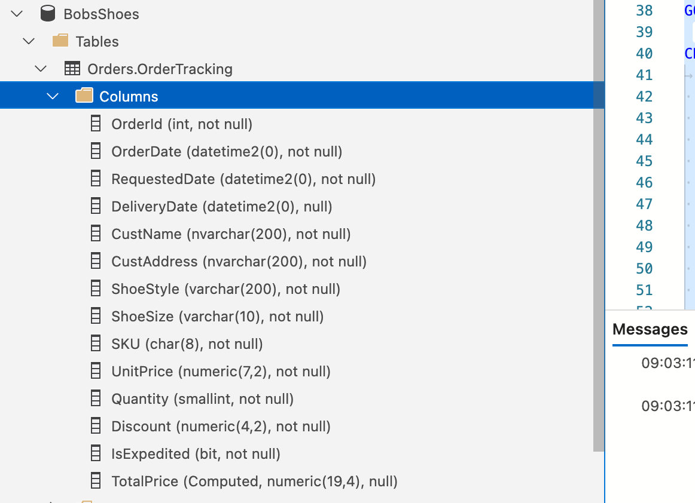

# 04 Créer des `tables`


## Code `SQL`

```sql
USE BobsShoes;
GO

CREATE TABLE Orders.OrderTracking (
	OrderId int IDENTITY (1,1) NOT NULL,
    OrderDate datetime2(0) NOT NULL,
    RequestedDate datetime2(0) NOT NULL,
    DeliveryDate datetime2(0) NULL,
    CustName nvarchar(200) NOT NULL,
    CustAddress nvarchar(200) NOT NULL,
    ShoeStyle varchar(200) NOT NULL,
    ShoeSize varchar(10) NOT NULL,
    SKU char(8) NOT NULL,
    UnitPrice  numeric(7,2) NOT NULL,
    Quantity smallint NOT NULL,
    Discount numeric(4,2) NOT NULL,
    IsExpedited bit NOT NULL,
    TotalPrice AS (Quantity * UnitPrice * (1.0 - Discount)),
)
ON BobsData
WITH (DATA_COMPRESSION = PAGE);
GO
```

`datetime2(0)` précision de `0` chiffre pour les fractions de seconde => précision à la seconde.

La commande `GO` est appelée `batch separator` (`batch` = par lot).

Les commandes ne sont envoyées au serveur que lorsque la commande `GO` est atteinte.

`NULL` et `NOT NULL` sont des contraintes.

La dernière colonne (colonne calculée) n'est pas persister mais calculée à chaque fois qu'une commande `SELECT` la demande, on peut la rendre persistente avec le mot clé `PERSISTED`.

Ajouter la `DATA_COMPRESSION` est une bonne pratique :

> #### Traduction du cours
>
> J'ai mentionné que je voulais utiliser `BobsData` comme groupe de fichiers pour contenir les données de la table de suivi des commandes. J'ai également ajouté une option de table pour `DATA_COMPRESSION`. Je vous recommande de compresser la plupart des tables et d'avoir une bonne raison si vous choisissez de ne pas le faire. Bien que la compression et la décompression des données coûtent des cycles `CPU`, elles permettent d'économiser sur les `E/S` et les cycles `CPU` nécessaires pour gérer ces `E/S` supplémentaires. Le compromis en vaut presque toujours la peine. Ici, j'ai spécifié une compression au niveau de la `PAGE`. La compression au niveau `ROW` est également disponible. Les détails, les limitations et les notes d'implémentation dépassent le cadre de ce cours, et vous devriez consulter la documentation officielle pour plus d'informations. Je vous recommande simplement de l'utiliser pour la plupart des nouveaux travaux. Et notez qu'avant `SQL Server 2016`, la compression des données n'était disponible que dans l'édition entreprise. 
>
> Traduit avec www.DeepL.com/Translator (version gratuite)



On voit que `TotalPrice` a un type attribué par la `DB` : `numeric(19,4)`.


## `Key constraint`

```sql
USE BobsShoes;
GO

ALTER TABLE Orders.OrderTracking
ADD CONSTRAINT PK_OrderTRacking_OrderId
	PRIMARY KEY (OrderId)
		ON [BobsData];
GO
```

 Nom de la `CONSTRAINT` : `TYPEOFCONTRAINT_TableName_ColumnName`.

Un `Backing index` est construit sur la `Key Constraint` mais un `index` et une `constraint` sont deux choses différentes.


## Introduire de données

```sql
INSERT INTO Orders.Customers (
        CustName, 
        CustStreet, 
        CustCity, 
        CustStateProv, 
        CustCountry, 
        CustPostalCode, 
        CustSalutation)
VALUES 
    ('Arthur Dent', '1 Main St', 'Golgafrincham', 'GuideShire', 'UK', '1MSGGS', 'Mr.'),
    ('Trillian Astra', '42 Cricket St.', 'Islington', 'Greater London', 'UK', '42CSIGL', 'Miss')

INSERT INTO Orders.Stock (
        StockSKU, 
        StockName, 
        StockSize, 
        StockPrice)

VALUES
    ('OXFORD01', 'Oxford', '10_D', 50.),
    ('BABYSHO1', 'BabySneakers', '3', 20.),
    ('HEELS001', 'Killer Heels', '7', 75.)

INSERT INTO Orders.Orders(
    OrderDate, 
    OrderRequestedDate, 
    CustID, 
    OrderIsExpedited)

VALUES 
    ('20190301', '20190401', 1, 0),
    ('20190301', '20190401', 2, 0)

INSERT INTO Orders.OrderItems(
    OrderID, 
    StockSKU,
    StockSize,
    Quantity, 
    Discount)

VALUES
    (1, 'Oxford', '10_D', 1, 20.),
    (2, 'HEELS001', '7', 1, 20.)

-- Show the results

SELECT * FROM Orders.Customers;
SELECT * FROM Orders.Stock
SELECT * FROM Orders.Orders;
SELECT * FROM Orders.OrderItems;

```

