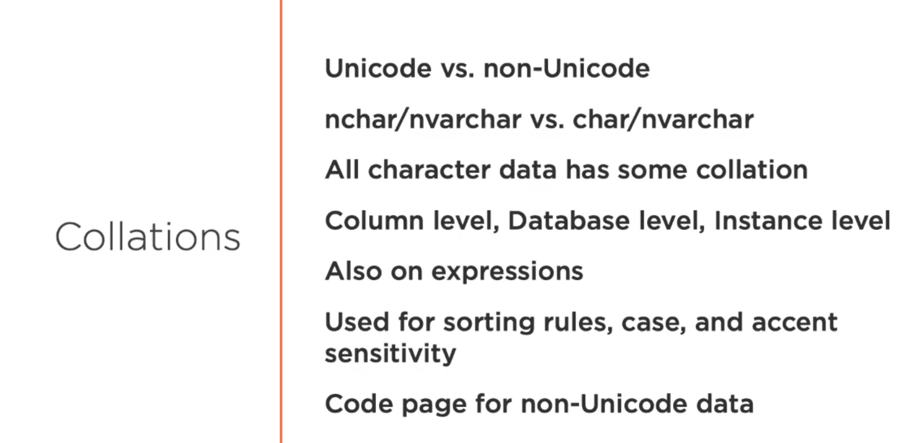
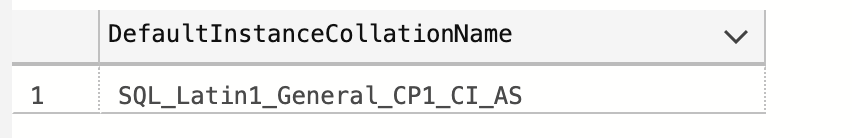
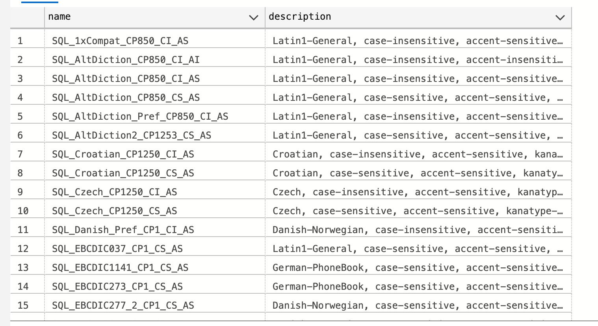

# 05 `Collations`

> A collation specifies the bit patterns that represent each character in a data set. Collations also determine the rules that sort and compare data.




## Demo en `DB`

### `Collation` pour l'instance

```sql
-- Voire la collation configurée pour l'instance
SELECT SERVERPROPERTY('collation') AS DefaultInstanceCollationName;
```



`CI` signifie `Case Insensitive`

`AS` signifie `Accent Sensitive`


### `Collation` pour la `DB`

```sql
-- Voire la collation configuré pour la base de données
SELECT DATABASEPROPERTYEX(DB_NAME(), 'collation') AS DatabaseCollationName;
```


### `Collation` pour les colonnes

```sql
-- Voire la collation pour toutes les colonnes de la table OrderTracking
SELECT name AS ColumnName, collation_name AS ColumnCollation;
FROM sys.columns
WHERE object_id = OBJECT_ID(N'Orders.OrderTracking');

-- Montrer la description pour la collation
SELECT name, description
FROM sys.fn_helpcollation()
WHERE name = N'SQL_Latin1_general_CP1_CI_AS';
```


```
Latin1-General, case-insensitive, accent-sensitive, kanatype-insensitive, width-insensitive for Unicode Data, SQL Server Sort Order 52 on Code Page 1252 for non-Unicode Data
```

On voit que les colonnes contenant des caractères utilise la `collation`


### Lister les `collations`

```sql
-- Montrer les collations SQL ne contenant pas 'LATIN'
SELECT name, description
FROM sys.fn_helpcollations()
WHERE name LIKE N'SQL_%' AND name NOT LIKE N'SQL_Latin%';
```




### Changer de `collation`

Si nos client sont en Suede par exemple :

```sql
-- Changer la colonne du nom du client en collation scandinave
ALTER TABLE Orders.OrderTracking
ALTER COLUMN CustName nvarchar(200)
COLLATE SQL_Scandinavian_CP850_CI_AS
NOT NULL.
```

