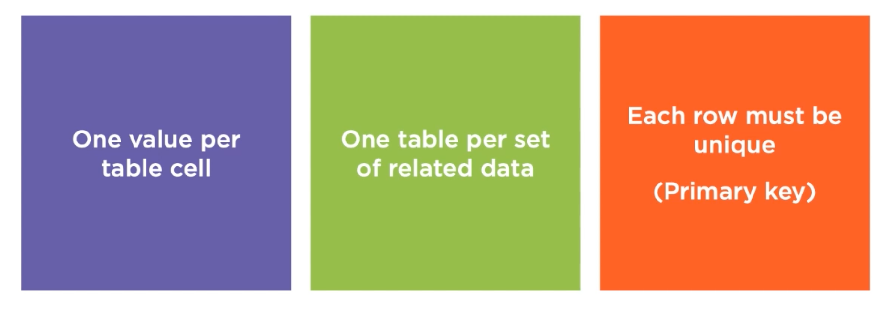

# 06 Normalization

## `DRY` principle

Don't Repeat Yourself, pour le moment notre modèle engendre beaucoup de répétition :

```sql
USE BobsShoes;
GO

TRUNCATE TABLE Orders.OrderTracking;

INSERT INTO Orders.OrderTracking (
	OrderDate,
    RequestedDate,
    CustName,
    CustAddress,
    ShoeStyle,
    ShoeSize,
    SKU,
    UnitPrice,
    Quantity,
    Discount,
    IsExpedited
)
VALUES 
	('20190301', '20190401', 'Arthur Dent', 'Golgafrincham', 'Oxford', '10_D', 'OXFORD01', 50.0, 1, 0, 0),
	('20190301', '20190401', 'Arthur Dent', 'Golgafrincham', 'BabySneakers', '3', 'BABYSHO01', 20.0, 1, 0, 0),
	('20190301', '20190401', 'Arthur Dent', 'Golgafrincham', 'Killer Heels', '7', 'HEELS001', 75.0, 1, 0, 0),
```

Chaque colonne est précisée pour que le code soit claire et auto-documenté.

## `Normalisation`

>  La normalisation est le processus d'organiser une base de données en réduisant la redondance et en améliorant l'intégrité des données.


### Les objectifs de la `normalisation`

- Éliminer les anomalies
- Réduire la restructuration de la base de données
- Pouvoir fournir plus d'information
- Neutralité vis à vis la fréquence des requêtes (celle-ci pouvant changer)

Dans notre cas pour changer l'adresse il faut faire une modification dans toutes les lignes avec une clause `WHERE`.

On ne peut pas juste introduire un nouveau client.

On a des anomalies à l'`INSERT` et au `DELETE` à cause de la non séparation des données.


## Première Forme Normale - `1NF`



- Une seule valeur par cellule de table
- Une `table` par groupe de données en relation
- Chaque ligne doit être unique => principe de `Primary Key` simple ou composite. La `Primary Key` doit être `Not Null` et unique.

### Transformation de la `DB` enpremière forme normale

`DROP TABLE IF EXISTS` permet de faire place net avant modification.

```sql
USE BobsShoes;
GO

DROP TABLE IF EXISTS Orders.Customers, Orders.Stock, Orders.Orders, Orders.OrderItems;

CREATE TABLE Orders.Customers (
	CustId int IDENTITY(1,1) NOT NULL PRIMARY KEY,
    -- CONSTRAINT PK_Customers_CustID PRIMARY KEY,
    CustName nvarchar(200) NOT NULL,
    CustStreet nvarchar(100) NOT NULL,
    CustCity nvarchar(100) NOT NULL,
    CustStateProv nvarchar(100) NOT NULL,
    CustCountry nvarchar(100) NOT NULL,
    CustPostalCode nvarchar(20) NOT NULL,
    CustSalutation char(5) NOT NULL
);

CREATE TABLE Orders.Stock(
	StockSKU char(8) NOT NULL,
    StockSize varchar(10) NOT NULL,
    StockName varchar(100) NOT NULL,
    StockPrice numeric(7,2) NOT NULL,
    CONSTRAINT PK_Stock_StockSKU_StockSize PRIMARY KEY (StockSKU, StockSize)
);

CREATE TABLE Orders.Orders(
	OrderId int IDENTITY(1,1) NOT NULL PRIMARY KEY,
    -- CONSTRAINT PK_Orders_OrderId PRIMARY KEY,
    OrderDate date NOT NULL,
    OrderRequestedDate date NOT NULL,
    OrderDeliveryDate datetime2(0) NULL,
    CustId int NOT NULL,
    OredrIsExpedited bit NOT NULL
);

CREATE TABLE Orders.OrderItems(
	OrderItemId int IDENTITY(1,1) NOT NULL PRIMARY KEY,
    -- CONSTRAINT PK_OrderItems_OrderItemId PRIMARY KEY,
    OrderId int NOT NULL,
    StockSKU char(8) NOT NULL,
    StockSize varchar(10) NOT NULL,
    Quantity smallint NOT NULL,
    Discount numeric(4,2) NOT NULL
);

RETURN;
```

`CONSTRAINT PK_Stock_StockSKU_StockSize PRIMARY KEY (StockSKU, StockSize)` est une clé composite.


Le nom de la `constraint` de `primary key` n'est pas explicite (compréhensible), on peut dé-commenter les `CONSTRAINTS` explicite de notre code `SQL` :

```sql
CREATE TABLE Orders.Customers (
	CustId int IDENTITY(1,1) NOT NULL -- PRIMARY KEY,
    CONSTRAINT PK_Customers_CustID PRIMARY KEY,

-- ...
```


## Index


`SQL Server` a créé des `Index` à partir des `Primary Keys` appelées `Backing Index`.

Il sont `Unique` et `clustered`.

Une table est ordonnée par rapport à la `clustered key`. Il peut n'y avoir qu'une `clustered key`.

Une `Primary Key` peut être `nonclustered index` si besoin.


