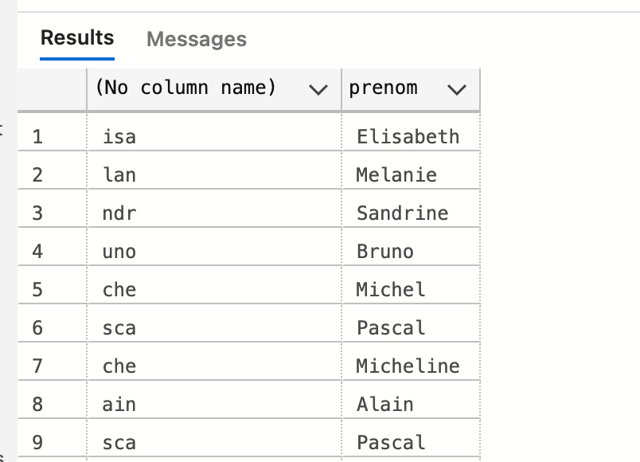
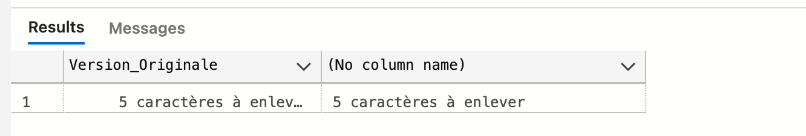
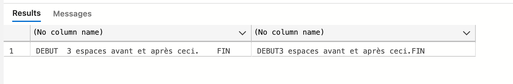
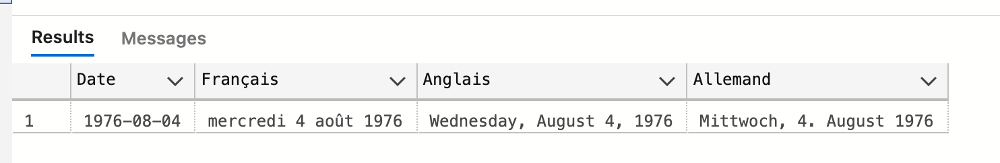

# 06.1 Les chaines de caractères


## `SUBSTRING`

Va sélectionner une partie de la chaîne de caractère

### `SUBSTRING(colonne, index_prmiere_lettre, nb_lettres)`

Le premier nombre correspond à l'index de la première lettre choisie en commençant par `1`.

Ensuite le deuxième nombre correspond au nombre de lettres sélectionnées.

```sql
SELECT SUBSTRING(prenom,1,1), prenom FROM Contact -- L'initiale
```

```sql
SELECT SUBSTRING(prenom,3,3), prenom FROM Contact
```



Ici on prend `3` lettres à partir de la troisième lettre.

```sql
SELECT SUBSTRING(prenom,2,4), prenom FROM Contact
```


## `TRIM`, `LTRIM` et `RTRIM`

Supprime les espaces (à droite, à gauche, les deux)

### `LTRIM`

```sql
DECLARE @espace_a_enlever varchar(50);
SET @espace_a_enlever = '      5 caractères à ma gauche';
SELECT @espace_a_enlever AS vo, LTRIM(@espace_a_enlever);
GO
```

`DECLARE` déclare une variable.

`SET` attribut une valeur à une variable.




### `RTRIM`

```sql
DECLARE @espace_a_enlever varchar(50);
SET @espace_a_enlever = '4 espaces après ceci.   ';
SELECT @espace_a_enlever + 'FIN', RTRIM(@espace_a_enlever) + 'FIN';
GO
```

`+` concaténe les caractères.


### `TRIM`

```sql
DECLARE @espace_a_enlever varchar(50);
SET @espace_a_enlever = '  3 espaces avant et après ceci.    ';
SELECT 'DEBUT' + @espace_a_enlever + 'FIN', 'DEBUT' + TRIM(@espace_a_enlever) + 'FIN';
GO
```




## `UPPER` et `LOWER`

```sql
SELECT UPPER(nom), LOWER(prenom) FROM Contact
```


## `FORMAT`

Permet la mise en forme avec des chaînes de valeurs date/heure et de valeurs numériques compatibles avec les paramètres régionaux.

### `FORMAT(value, format[, culture])`

### Avec les dates

```sql
SELECT TOP(1)
date_de_Naissance as Date,
FORMAT(date_de_naissance, 'd', 'fr-FR') AS Français,
FORMAT(date_de_naissance, 'd', 'en-US') AS Anglais,
FORMAT(date_de_naissance, 'd', 'de-de') AS Allemand
FROM Contact
```


Avec `D` majuscule :

```sql
SELECT TOP(1)
date_de_Naissance as Date,
FORMAT(date_de_naissance, 'D', 'fr-FR') AS Français,
FORMAT(date_de_naissance, 'D', 'en-US') AS Anglais,
FORMAT(date_de_naissance, 'D', 'de-de') AS Allemand
FROM Contact
```




### `FORMAT` avec les devises

```sql
CREATE TABLE table_devise (devise money)
INSERT INTO table_devise VALUES ('1.5'), ('7.5'), ('1248'), ('3.67')

SELECT
FORMAT(devise, 'C', 'en-US') AS dollar,
FORMAT(devise, 'C', 'fr-FR') AS euro,
FORMAT(devise, 'C', 'en-GB') AS anglais,
FORMAT(devise, 'C', 'sv-SE') AS suedois,
FORMAT(devise, 'C', 'ar-SA') AS arabe,
FORMAT(devise, 'C', 'th-TH') AS thailandais
FROM table_devise
```


### Connaître son langage

```sql
exec sp_configure 'default language'

exec sp_helplanguage
```

> ### Modifier son langage par défaut
>
> ```sql
> EXEC sp_configure 'default language', 2; -- pour le français
> GO
> RECONFIGURE;
> GO
> ```
>
> 


