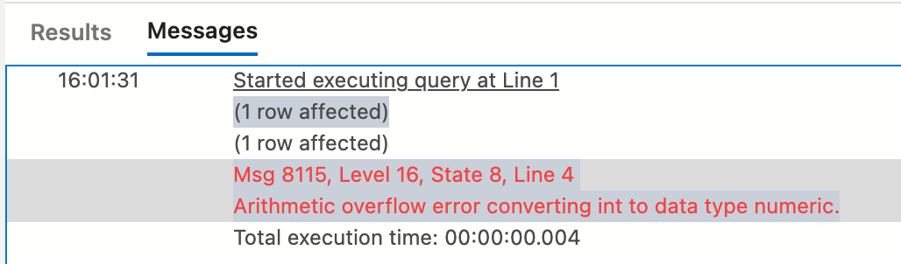
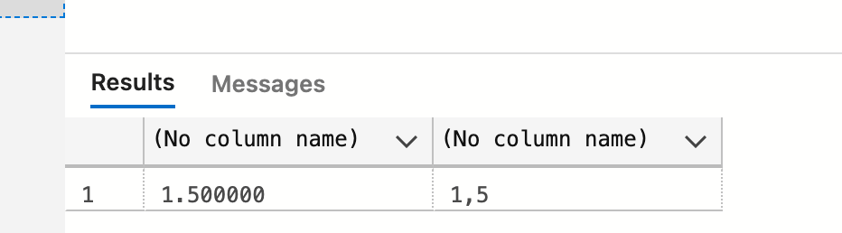

# 04 Conversion entre les différents types de nombres

## Conversion implicite

```sql
SELECT 3/2 -- 1
SELECT 3.0/2 -- 1.500000
SELECT 3/2.0 -- 1.500000
```

```sql
DECLARE @myvar AS DECIMAL(5,2) = 3

SELECT @myvar
```

Ici `3` est convertit en `DECIMAL` de façon implicite.


## Conversion explicite

```sql
SELECT CONVERT(DECIMAL(5,2), 3)/2 -- 1.500000
```

Cette conversion est un `CAST`, on peut l'écrire d'une autre façon :

```sql
SELECT CAST(3 AS DECIMAL(5,2))/2 -- 1.500000

-- On peut aussi multiplier la première partie par un non int
SELECT 3*1.0/2
```

On peut avoir une erreur d'`overflow` (de dépassement) si la valeur est trop grande pour le type :

```sql
SELECT CONVERT(DECIMAL(5,3), 1000)
```



On peut convertir vet `int` :

```sql
SELECT CONVERT(int, 12.789) -- 12
```


## `TRY_CAST` et `TRY_CONVERt`

Met un `null` aux endroits où le conversion n'est pas possible au lieu de lever une exception `arithmetic overflow`.

```sql
select TRY_CAST(system_type_id * 2 AS tinyint)
```


## Retirer les zéros non significatifs `CAST AS float`

https://stackoverflow.com/questions/2938296/remove-trailing-zeros-from-decimal-in-sql-server

```sql
SELECT 3*1.0/2, CAST(3*1.0/2 as float)
```




