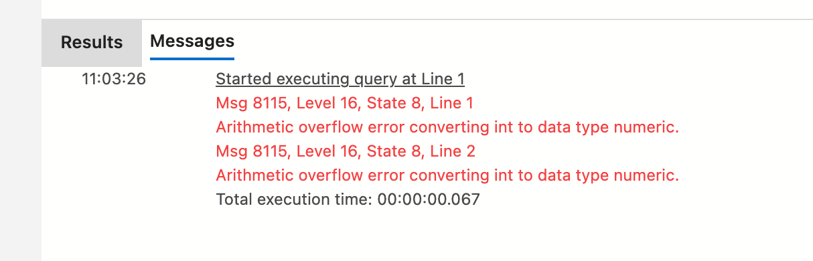
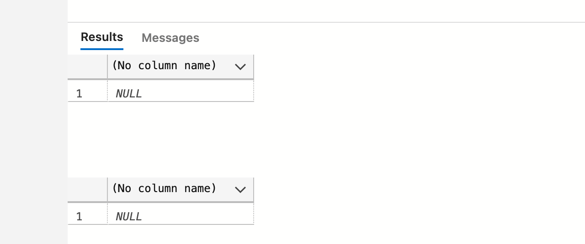

# 06 `NULL`

Que se passe-t-il si une variable est déclaré mais sans valeur assignée.

dans la pluspart des langages de programmation, elle prend la valeur par défaut de son type (`0` pour un `int`).

Dans `SQL Server` ce n'est pas le cas.

```sql
DECLARE @myInt AS int

SELECT @myInt
```

```
NULL
```

Une variable non assignée est considérée comme inconnue, donc `NULL`.


## Problèmes posés par `NULL`

N'importe quel calcul avec seulement un élément à `NULL` donne `NULL`

```sql
DECLARE @myInt AS int

SELECT 9 + 3 + @myInt + 1 + 5
```

```
NULL
```

De même avec un `string`

```sql
DECLARE @myString AS nvarchar(20)

SELECT left(@myString, 2), len(@myString), datalength(@myString)
```

```
NULL, NULL, NULL
```

Même le `datalength` est indéterminé dans ce cas.


## `TRY_CONVERT` et `TRY_CAST`

Quand on essaye de convertir une valeur impossible on a une erreur :

```sql
SELECT CONVERT(decimal(5,2), 1000)
SELECT CAST(1000 AS decimal(5,2))
```



#### `arithmetic overflow`

Maintenant en utilisant `TRY_CONVERT` et `TRY_CAST` :

```sql
SELECT TRY_CONVERT(decimal(5,2), 1000)
SELECT TRY_CAST(1000 AS decimal(5,2))
```



On obtient deux fois la valeur `NULL` plutôt que des erreurs.

On peut traduire `NULL` par `JE NE SAIS PAS`.

Sur une table de plusieurs million de lignes, sans `TRY_` on aurait une erreur si seulement un enregistrement ne convenait pas.

Avec `TRY_` on aurait une table avec seulement un enregistrement à `NULL` (`JE NE SAIS PAS`), c'est beaucoup plus satisfaisant.