# 07 Le type `dates`

https://docs.microsoft.com/en-us/sql/t-sql/functions/date-and-time-data-types-and-functions-transact-sql?view=sql-server-ver16

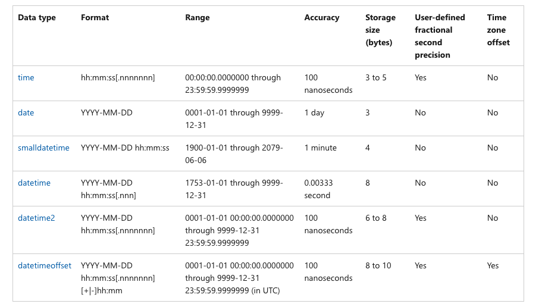

## `datetime`

Du 01 janvier 1753 au 31 décembre 9999.

Précision : 0,00333 seconde

taille : 8 bytes

Problème de taille et de précision.

```sql
DECLARE @mydate as datetime = '2015-06-24 12:34:56.124'

SELECT @mydate
```


la précision étant de `0.00333`, il ne peut y avoir comme dernier chiffre que `3`, `7` ou `0` (en arrondissant `0.00666` vers `0.007` et `0.00999` vers `0.000`)

On peut aussi écrire la date sans tiret :

```sql
DECLARE @mydate2 as datetime = '20150604 12:34:56.124'
```


## `Date`

Si on a pas besoin de l'heure.

Du 01 janvier 0001 au 31 décembre 9999.

Taille : 3 bytes


## `smalldatetime`

S'arrête le 06 juin 2079 !!!

taille : 4 bytes

précision : à la minute.


## `datetime2`

On peut définir la précision en nanoseconde.

Du 01 janvier 0001 au 31 décembre 9999.

Taille : de `6` à `8 bytes`

Plus léger que `datetime` et avec une plus grosse plage de valeurs.

```sql
DECLARE @mydate as datetime = '2015-06-24 12:34:56.124'
DECLARE @mydate2 as datetime = '20150604 12:34:56.124'
DECLARE @mydate3 as datetime2 = '20150604 12:34:56.124'

SELECT @mydate, @mydate2, @mydate3
```


On remarque la précision accrue de `datetime2`.

On peut choisir la précision, jusqu'à `3`, `datetime2` prend `6 bytes`.

On peut aller jusqu'à `7`

```sql
DECLARE @mydate0 as datetime2(0) = '20150624 12:34:56.124'
DECLARE @mydate1 as datetime2(1) = '20150624 12:34:56.124'
DECLARE @mydate2 as datetime2(2) = '20150624 12:34:56.124'
DECLARE @mydate3 as datetime2(3) = '20150624 12:34:56.124'
DECLARE @mydate4 as datetime2(4) = '20150604 12:34:56.124'
DECLARE @mydate5 as datetime2(5) = '20150604 12:34:56.124'
DECLARE @mydate6 as datetime2(6) = '20150604 12:34:56.124'
DECLARE @mydate7 as datetime2(7) = '20150604 12:34:56.124'
DECLARE @mydatedefault as datetime2 = '20150604 12:34:56.124'

SELECT 
    @mydate0, datalength(@mydate0) as T0, 
    @mydate1, datalength(@mydate1) as T1,
    @mydate2, datalength(@mydate2) as T2
SELECT 
    @mydate3, datalength(@mydate3) as T3,
    @mydate4, datalength(@mydate4) as T4
SELECT
    @mydate5, datalength(@mydate5) as T5,
    @mydate6, datalength(@mydate6) as T6, 
    @mydate7, datalength(@mydate7) as T7
SELECT
    @mydatedefault, datalength(@mydatedefault) as TDefault
```

Dans `datetime2(n)`, `n` est le nombre de nanoseconde précisée allant de `0` à `7`.

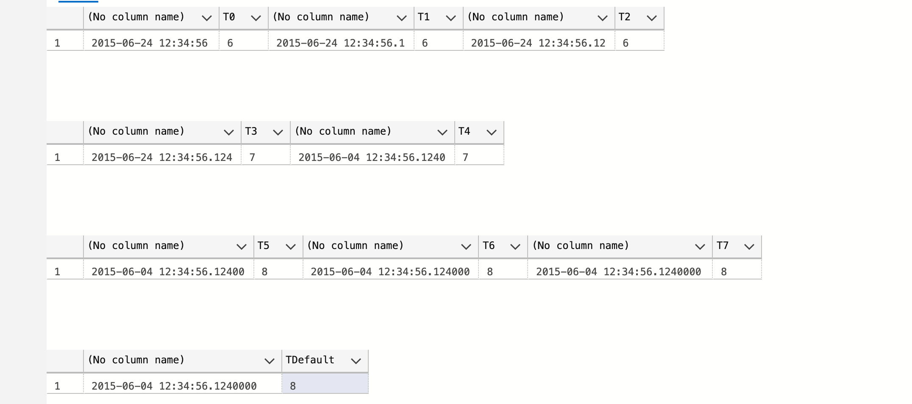


## `datefromparts`

```sql
SELECT datefromparts(2015,10,27)
```

```
2015-10-27
```


## `datetime2fromparts`

```sql
SELECT datetime2fromparts(2019,11,23,15,56,33,4528,4)
```

Le dernier argument étant la précision et devant correspondre au nombre de chiffres de l'avant dernier argument.

```
2019-11-23 15:56:33.4528
```


## `year`, `month` et `day`

```sql
DECLARE @mydate as datetime2(2) = '2019-09-26 12:00:00.00'

SELECT year(@mydate) as year, month(@mydate) as month, day(@mydate) as day
```

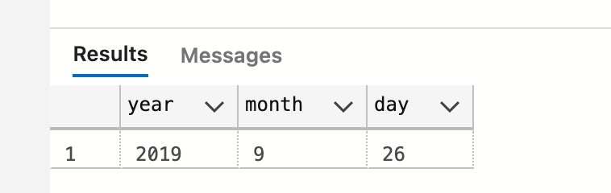


## `date` du jour

```sql
SELECT 
	CURRENT_TIMESTAMP as tmstp, -- datetime fini par 0, 3 ou 7
	getdate() as gtdt,  -- datetime
	SYSDATETIME() as sysdate -- datetime2(7)
```


`CURRENT_TIMESTAMP` est du `sql` standard.

`Microsoft` n'aimant la syntaxe avec `_` à ajouter `getdate()` qui est identique.

`SYSDATETIME()` quant à lui est plus précis et renvoie un `dattime2(7)`.


##  `dateadd(type, quantity, date)`

Ajoute du temps à une date :

```sql
DECLARE @mydate AS datetime2(3) = '2018-08-19 15:32:42.678'

SELECT 
	dateadd(YEAR, 2, @mydate), 
	dateadd(WEEK, 8, @mydate), 
	dateadd(MINUTE, 893, @mydate)
```


## `datename`

```sql
SELECT 
	datename(WEEKDAY, getdate()), 
	datename(YEAR, getdate()), 
	datename(QUARTER, getdate()), 
	datename(MONTH, getdate())
```

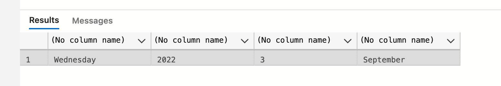

Va donner une version littéral si elle existe (ici pour `WEEKDAY` et `MONTH`).


## `datepart`

```sql
SELECT datepart(HOUR, SYSDATETIME()) as Hour, SYSDATETIME() as N'Date now'
```

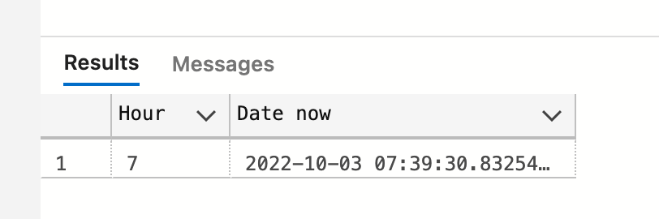

> Il n'y a pas de fonction `HOUR(@date)` comme `YEAR(@date)` ou `DAY(@date)`


## `datediff`

va donner l'écart de temps entre deux dates

```sql
DECLARE @mydate AS datetime2(3) = '2018-08-19 15:32:42.678'

SELECT datediff(MONTH, @mydate, getdate()), datediff(DAY, @mydate, getdate())
```

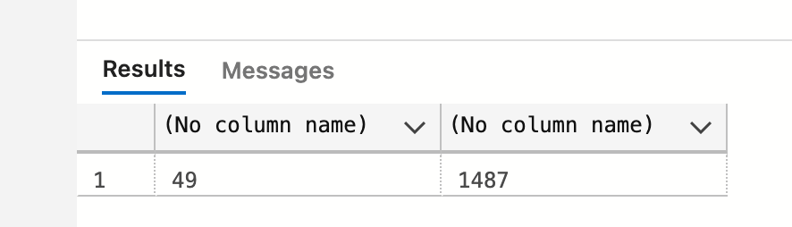


## `Datetimeoffset`

D'après la documentation microsoft, c'est le type par défaut si on veut un type `date`.

>https://learn.microsoft.com/en-us/dotnet/standard/datetime/choosing-between-datetime
>
>These uses for `DateTimeOffset` values are much more common than those for `DateTime` values. As a result, consider `DateTimeOffset` as the default date and time type for application development.
>
>
>
>Ces utilisations des valeurs `DateTimeOffset` sont beaucoup plus courantes que celles des valeurs `DateTime`. Par conséquent, considérez `DateTimeOffset` comme le type de date et d'heure par défaut pour le développement d'applications.


On voit que l'`offset` est `(UTC+2)`.

`Universal Time Coordinated` = temps universel.

On a donc `+2` heures sur le temps universelle

`datetimeoffset` permet de spécifier la `time zone`.

`datetimeoffset` est une variante de `datetime2` avec la même précision.

```sql
DECLARE @myDateOffset as datetimeoffset = '2015-10-04 01:12:45.895 +05:30'
DECLARE @myDate as datetime2 = '2015-10-04 01:12:45.895'

SELECT @myDateOffset WithOffset, @myDate WithoutOffset
```

`datetimeoffset` prend deux `bytes` en plus que `datetime2`, il requière donc entre `8` et `10 bytes`.

`datetimeoffset(2)` => `8 bytes`.


### `TODATETIMEOFFSET`

Transforme un `datetime2` en `datetimeoffset`.

```sql
SELECT TODATETIMEOFFSET(SYSDATETIME(),'+02:00') WithOffset, SYSDATETIME() WithoutOffset
```

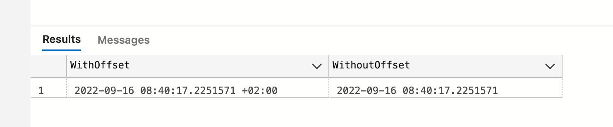

Cela ne modifie pas l'heure, ça ajoute seulement le `timezone`.


### `datetimeoffsetfromparts`

Fonctionne comme `datetime2fromparts` en ajoutant le nombre d'heures et de minutes avant la précision :

```sql
SELECT DATETIME2FROMPARTS     (2019,11,23,15,56,33,4528      ,4)
SELECT DATETIMEOFFSETFROMPARTS(2019,11,23,15,56,33,4528,02,30,4)
```


### `switchoffset`

permet de changer de `timezone`.

```sql
SELECT SWITCHOFFSET(SYSDATETIME(), '+02:00')
```

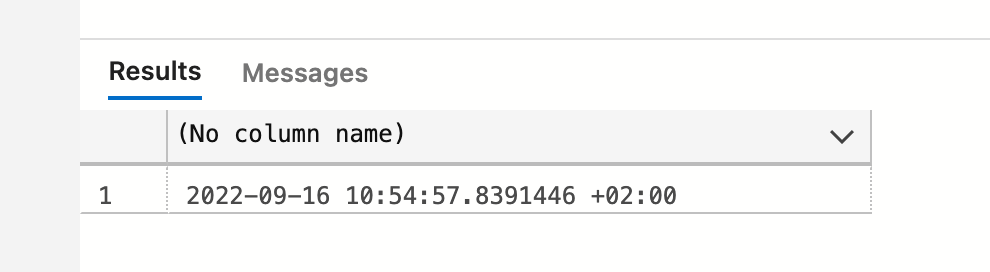

Ici on a l'heure de Belgique avec le `timezone` indiqué.


## Conversion avec les `Dates`


### Conversion d'un `string` vers une `datetime`

```sql
DECLARE @mydate as datetime = '2022-10-04 14:50:20'
SELECT @mydate
```

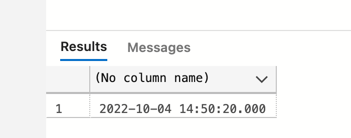


### Conversion d'une `date` en `string`

```sql
DECLARE @mydate as datetime = '2022-10-04 14:50:20'
SELECT 'The date and time is: ' + @mydate
```


Il faut utiliser `convert` ou `cast` :

```sql
SELECT 'The date and time is: ' + convert(nvarchar(20), @mydate)
SELECT 'The date and time is: ' + cast(@mydate as nvarchar(20))
```

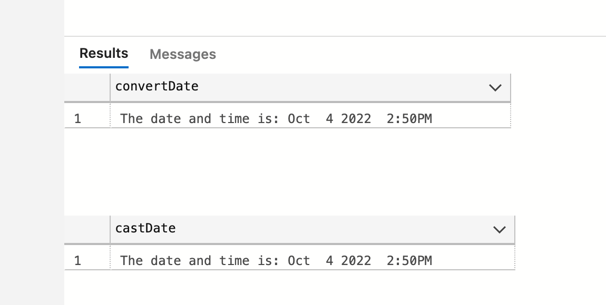


### Transformer un `string` complexe en `date` : `parse`

`parse` tente de transformer un `string` en une `date` valide :

```sql
SELECT convert(date, 'Thursday, 25 june 2015') AS ConvertedDate
```


```sql
SELECT parse(date, 'Thursday, 25 june 2015') AS ParsedDate
```

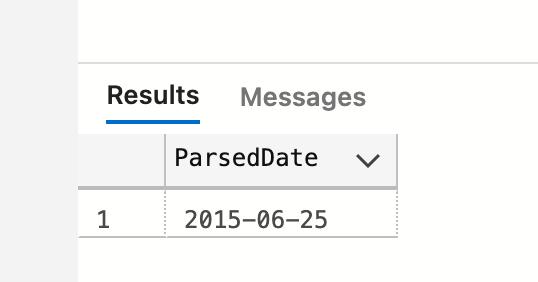

Attention la date doit être correcte sinon :

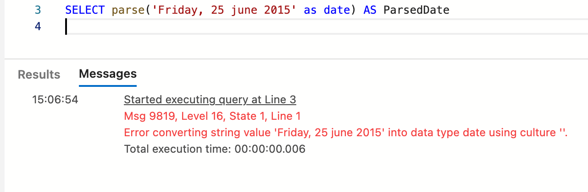


```sql
SELECT parse(date, 'Jeudi, 25 juin 2015') AS FrenchParsedDate
```


Le message d'erreur nous dit qu'il faut régler la culture (la langue) :

```sql
SELECT parse(date, 'Jeudi, 25 juin 2015' using 'fr-FR') AS FrenchParsedDate
```

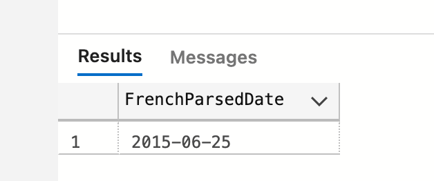

Maintenant cela fonctionne.


### La fonction `format`

```sql
FORMAT( value, format [, culture ] ) 
```


La fonction `format` donne beaucoup de flexibilité pour convertir une `date` en `string`

```sql
SELECT format(cast('2015-06-25 01:02:03.456' as datetime), 'D') as N'my formated long date'
SELECT format(cast('2015-06-25 01:02:03.456' as datetime), 'd') as N'my formated short date'
SELECT format(cast('2015-06-25 01:02:03.456' as datetime), 'dd-MM-yyyy') as N'my formated french date'
```

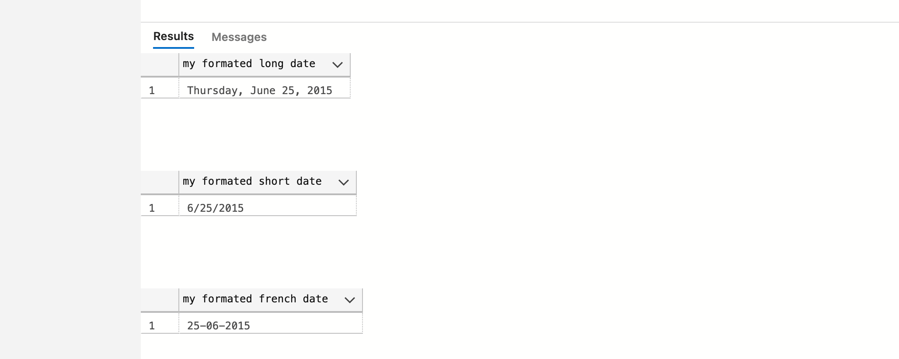

`mm` sont les minutes et `MM` le mois.

On peut ajouter entroisième paramètre la `culture` :

```sql
SELECT format(cast('2015-06-25 01:02:03.456' as datetime), 'D', 'fr-FR') as N'my formated french long date'
```

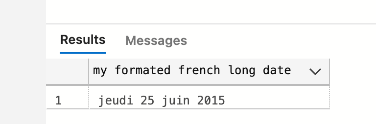

En chinois

```sql
SELECT format(cast('2015-06-25 01:02:03.456' as datetime), 'D', 'zh-CN') as N'my formated chinese long date'
```


### `convert` et le type d'affichage

```sql
CONVERT ( data_type [ ( length ) ] , expression [ , style ] ) 
```

On peut aussi utiliser un code pour définir le format d'affichage de la `date` avec la fonction `convert`

https://learn.microsoft.com/en-us/sql/t-sql/functions/cast-and-convert-transact-sql?view=sql-server-ver16

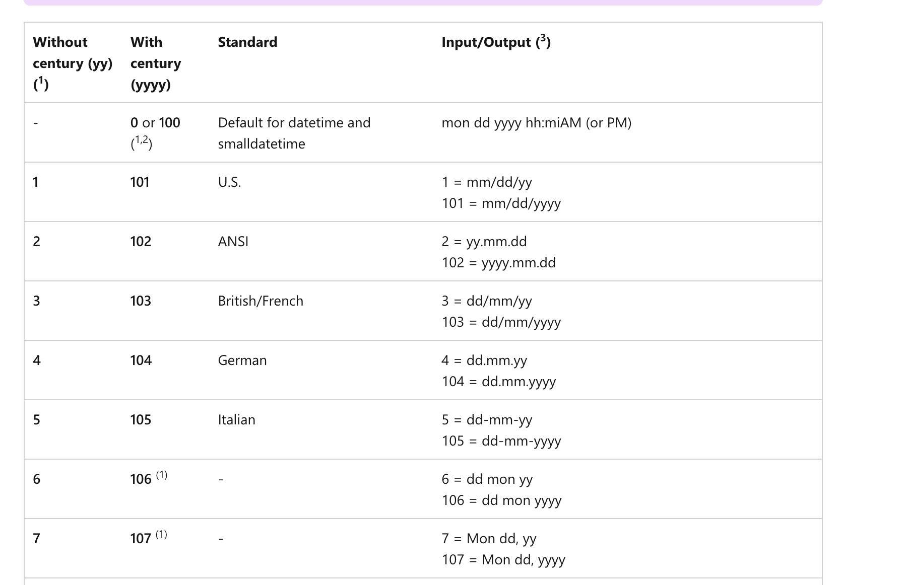

```sql
DECLARE @date AS datetime = '2015-06-25 01:02:03.456'

SELECT 
	convert(nvarchar(20), @date, 101),
	convert(nvarchar(20), @date, 1),
	convert(nvarchar(20), @date, 105),
	convert(nvarchar(20), @date, 5),
	convert(nvarchar(20), @date, 111),
	convert(nvarchar(20), @date, 11)
```

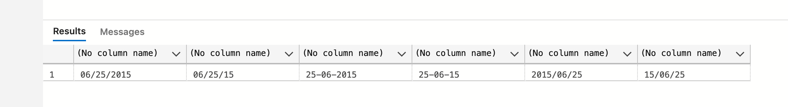

Cette technique n'est pas possible avec `cast`.

