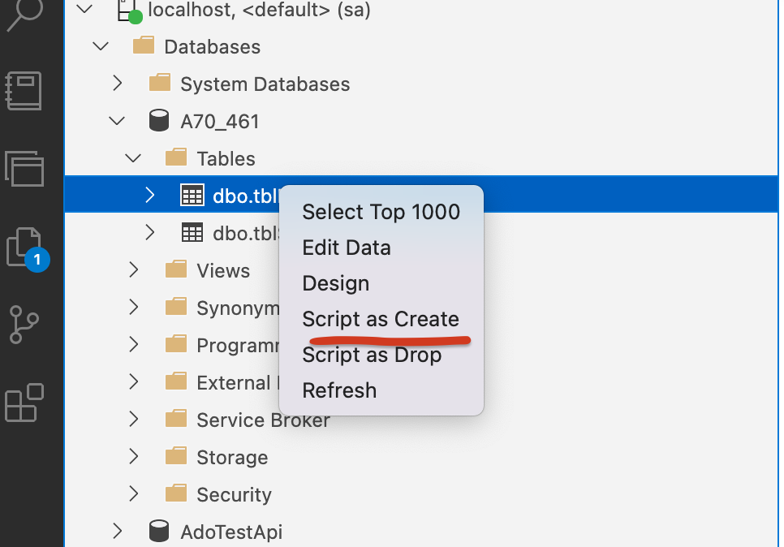

## 01 Créer une table et choisir les bons `data type`


## Choisir les bons type de données

```sql
CREATE TABLE tableName ( ... )
```

```sql
CREATE TABLE tblEmployee
(
	EmployeeNumber INT NOT NULL,
    EmployeeFirstName NVARCHAR(50) NOT NULL,
    EmployeeMiddleName NVARCHAR(50) NULL,
    EmployeeLastName NVARCHAR(50) NOT NULL,
    EmployeeGovernmentID NCHAR(10) NULL,
    DateOfBirth DATE NOT NULL
)
```

### `EmployeeNumber`

On utilise `INT` pour `EmployeeNumber` car `SMALLINT` va uniquement jusqu'à `32 000` ce qui peut être trop peu pour une grande entreprise.

`NOT NULL`  car on ne peut pas créer un `Employee` sans pouvoir l'identifier de manière unique.


### `EmployeeFirstName`

On a le choix entre `4` types : `CHAR`, `NCHAR`, `VARCHAR` et `NVARCHAR`.

Contrairement au cours je choisis `NVARCHAR`.

`NCHAR` ne doit être choisi que si le champ est de taille fixe : Numéro National, Code interne, numéro de téléphone (et encore !?).

Dans notre exemple `EmployeeGovernmentID` ets un code du gouvernement de longueur fixe `NCHAR(10)`.

Voici une raison intéressante sur `stackoverflow`

>https://stackoverflow.com/questions/144283/what-is-the-difference-between-varchar-and-nvarchar
>
>
>
>Une colonne `nvarchar` peut stocker n'importe quelle donnée `Unicode`. Une colonne `varchar` est limitée à une page de code de `8 bits`. Certaines personnes pensent que la colonne `varchar` devrait être utilisée car elle prend moins de place. Je pense que ce n'est pas la bonne réponse. Les incompatibilités de `Codepage` sont une plaie, et `Unicode` est le remède aux problèmes de `Codepage`. Avec des disques et des mémoires bon marché de nos jours, il n'y a vraiment plus de raison de perdre du temps à s'embêter avec des `Codepages`.
>
>Tous les systèmes d'exploitation et les plateformes de développement modernes utilisent `Unicode` en interne. En utilisant `nvarchar` plutôt que `varchar`, vous pouvez éviter d'effectuer des conversions d'encodage chaque fois que vous lisez ou écrivez dans la base de données. Les conversions prennent du temps et sont sujettes à des erreurs. Et la récupération des erreurs de conversion est un problème non trivial.
>
>Si vous vous interfacez avec une application qui n'utilise que l'`ASCII`, je vous recommande d'utiliser l'`Unicode` dans la base de données. Les algorithmes de `collation` du système d'exploitation et de la base de données fonctionneront mieux avec l'`Unicode`. L'`Unicode` évite les problèmes de conversion lors de l'interfaçage avec d'autres systèmes. Et vous vous préparerez pour l'avenir. Et vous pourrez toujours valider vos données limitées à l'`ASCII 7 bits` sur n'importe quel système hérité que vous devez maintenir, tout en profitant de certains des avantages d'un stockage complet en `Unicode`.
>
>## Codepage
>
>Une **page de code** est un standard [informatique](https://fr.wikipedia.org/wiki/Informatique) qui vise à donner un numéro à chaque [caractère](https://fr.wikipedia.org/wiki/Caractère_(informatique)) d'une langue, ou de quelques langues proches. La multiplicité des `Codepage` est résolu avec `Unicode`.


## Récupérer le script d'une table existante



`Azure Data Studio` va générer le script `SQL`  de création de la table :

```sql
SET ANSI_NULLS ON
GO
SET QUOTED_IDENTIFIER ON
GO
CREATE TABLE [dbo].[tblEmployee](
	[EmployeeNumber] [int] NOT NULL,
	[EmployeeFirstName] [nvarchar](50) NOT NULL,
	[EmployeeMiddleName] [nvarchar](50) NULL,
	[EmployeeLastName] [nvarchar](50) NOT NULL,
	[EmployeeGovernmentID] [nchar](10) NULL,
	[DateOfBirth] [date] NOT NULL
) ON [PRIMARY]
GO

```

