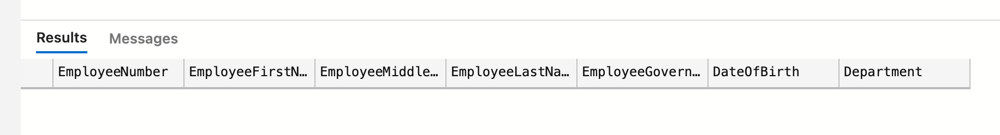
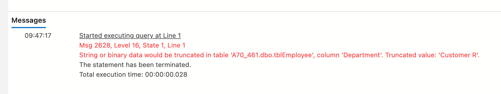
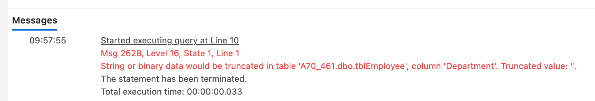
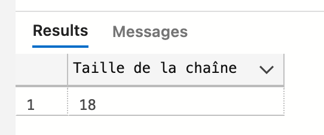

# 02 Ajouter des colonnes

## `ALTER TABLE` : `ADD`

```sql
ALTER TABLE tblEmployee
ADD Department NVARCHAR(10)

SELECT * FROM tblEmployee
```




## Supprimer une colonne `DROP COLUMN`

```sql
INSERT INTO tblEmployee
VALUES (123, N'Dylan', N'A', N'word', N'HN513777D', '19920914', N'Customer Relations')
```



La colonne `Department` n'a pas une capacité suffisante.

L'enregistrement n'est pas enregistré en `DB`.

```sql
ALTER TABLE tblEmployee
DROP COLUMN Department

ALTER TABLE tblEmployee
ADD Department NVARCHAR(15)
```


## Modifier une colonne `ALTER COLUMN`

```sql
ALTER TABLE tblEmployee
ALTER COLUMN Department NVARCHAR(20)

SELECT * FROM tblEmployee
```


Si on voulait réduire le nombre de caractère d'une colonne :

```sql
ALTER TABLE tblEmployee
ALTER COLUMN Department NVARCHAR(15)
```

On aurait une erreur car `Department` contient maintenant des chaînes plus longues :



On pourrait faire :

```sql
ALTER TABLE tblEmployee
ALTER COLUMN Department NVARCHAR(19)
```

Car la taille max de notre `string` est :

```sql
SELECT LEN('Customer Relations') AS N'Taille de la chaîne'
```




