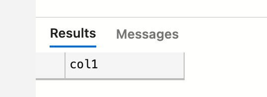
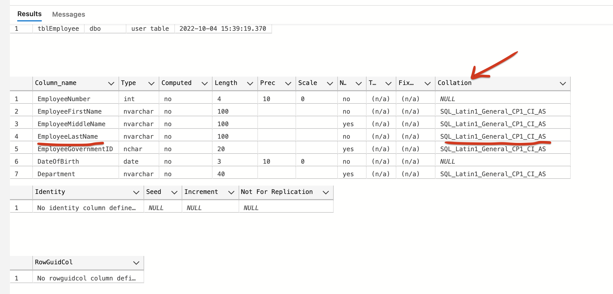
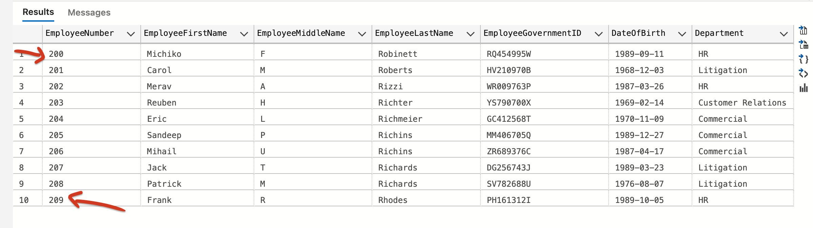

# 03 Rechercher des données : `SELECT`


## `SELECT` et `WHERE`

### `=`, `<>` (ou `!=`), `>` et `<=`

```sql
SELECT * FROM tblEmployee
WHERE EmployeeLastName = N'Word'

SELECT * FROM tblEmployee
WHERE EmployeeLastName <> N'Word'

-- équivalent à ci-dessus
SELECT * FROM tblEmployee
WHERE EmployeeLastName != N'Word'

SELECT * FROM tblEmployee
WHERE EmployeeLastName < N'Word'

SELECT * FROM tblEmployee
WHERE EmployeeLastName >= N'Word'
```


### `LIKE`

N'utilise pas `*` mais `%`

```sql
SELECT * FROM tblEmployee
WHERE EmployeeLastName LIKE N'W%'
```

`%` : `0` ou plus de n'importe quel caractère `N'%ate%'`

`_` : `1` et un seul caractère `WHERE Aliment LIKE '_ean'`

`[]` : Un unique caractère dans l'ensemble donné `[a-j]` ou `[aeuio]`

`[^]` Un unique caractère **pas** dans l'autre ensemble donné `[^poij]`


> ### Attention en `Unicode` les espaces de fin sont significatifs dans le `pattern matching` de `LIKE`
>
> ```sql
> CREATE TABLE t (col1 NCHAR(30));  
> INSERT INTO t VALUES (N'Robert King');  
> SELECT *   
> FROM t   
> WHERE col1 LIKE N'% King';
> ```
>
> 
>
> En fait il faut tenir compte des espaces de fin du champ :
>
> 
>
> ### Il suffit d'écrire `LIKE N'% King%'`
>
> ```sql
> SELECT *   
> FROM t   
> WHERE col1 LIKE N'% King%';
> ```
>
> 


## `LIKE` , `COLLATION` et `Case Insensitive`

Si on exécute cette requête :

```sql
SELECT * FROM tblEmployee
WHERE EmployeeLastName LIKE N'%W'
```


On voit que le `matching` n'est pas sensible à la case, cela est dû à la `collation`.

la `collation` nous dit comment un morceau de texte doit être comparé à un autre.

Pour connaitre la collation d'une colonne il existe une procédure stockée : `sp_help`

```sql
sp_help tblEmployee
```



On voit ici que le `_CI_` à la fin est mit pour `Case Insensitive`.


### Le nom a un `e` en troisième position

```sql
SELECT * FROM tblEmployee
WHERE EmployeeLastName LIKE N'__E%'
```

Avec deux `_` underscore.


### Le nom ne commence pas par certaine consonnes

```sql
SELECT * FROM tblEmployee
WHERE EmployeeLastName LIKE N'[^pcgbknwlmfdrtszhv]%'
```


### Rechercher un caractère utilisé comme `wildcard`

Si on recherche un `%` ou un `_` dans le texte, on doit le mettre entre crochet `[%]`.

```sql
SELECT * FROM tblEmployee
WHERE EmployeeLastName LIKE N'[_]%'
```


## `WHERE NOT`

Permet de rechercher l'opposé d'une condition.

```sql
SELECT * FROM tblEmployee
WHERE NOT EmployeeNumber > 200
```


## `AND`

Le `WHERE` doit valider deux conditions.

```sql
SELECT * FROM tblEmployee
WHERE EmployeeNumber >= 200 AND EmployeeNumber <= 209
```

avec le `NOT`, ici les parenthèses sont utiles :

```sql
SELECT * FROM tblEmployee
WHERE NOT (EmployeeNumber >= 200 AND EmployeeNumber <= 209)
```


## `OR`

```sql
SELECT * FROM tblEmployee
WHERE EmployeeNumber <= 150 OR EmployeeNumber >= 200
```


## `BETWEEN`

```sql
SELECT * FROM tblEmployee
WHERE EmployeeNumber BETWEEN 200 AND 209
```

C'est un ensemble inclusif :



### Avec `NOT`

```sql
SELECT * FROM tblEmployee
WHERE EmployeeNumber NOT BETWEEN 200 AND 209
```


## `IN ( ..., ..., ...)` 

Retrouver des valeurs dans une liste.

```sql
SELECT * FROM tblEmployee
WHERE EmployeeNumber IN (200, 201, 202)
```

Et avec `NOT`

```sql
SELECT * FROM tblEmployee
WHERE EmployeeNumber NOT IN (200, 201, 202)
```


## Avec les `dates`

Si on veut toutes les dates entre `1976` et `1986` on peut faire ainsi :

```sql
SELECT * FROM tblEmployee
WHERE DateOfBirth BETWEEN '19760101' AND '19861231'
```

Le problème c'est que cette `Date` correspond à la première minute du matin après minuit si elle correspond à un `datetime`.

Pour la première date pas de problème mais pour la seconde on perd toutes les personnes naient le `31 décembre 1986`, ce qui n'est pas correcte.

On peut reformuler le `WHERE` :

```sql
SELECT * FROM tblEmployee
WHERE DateOfBirth >= '19760101' AND DateOfBirth < '19870101'
```

Ainsi on a bien les personnes naient le `31/12/1986`.

Ou encore 

```sql
SELECT * FROM tblEmployee
WHERE YEAR(DateOfBirth) BETWEEN 1976 AND 1986
```

#### ! cette solution n'est pas souhaitable à cause de SARG ???


