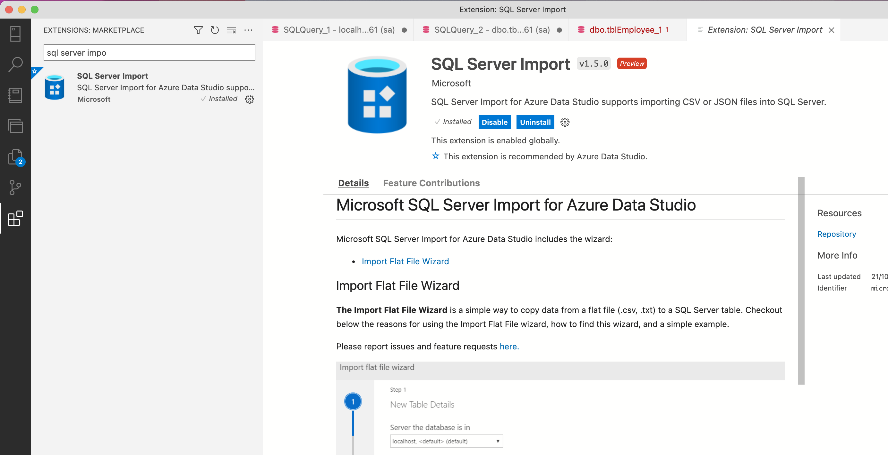
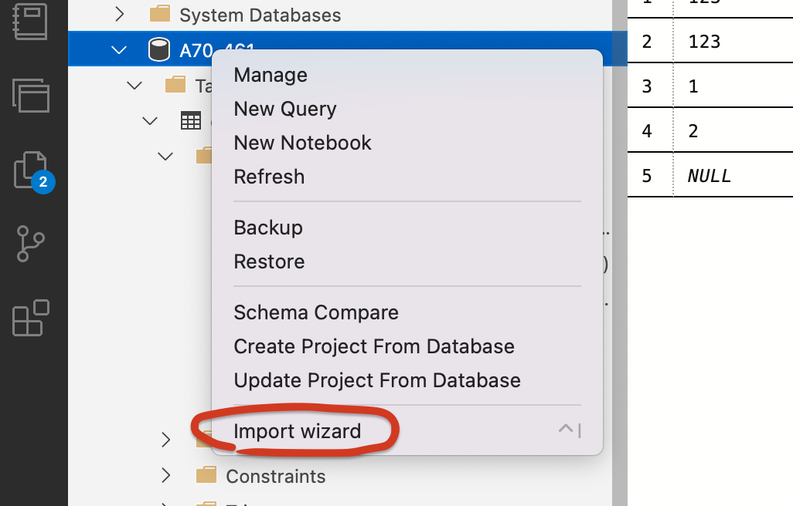
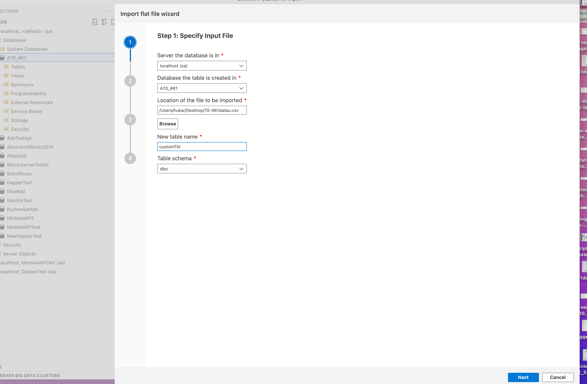
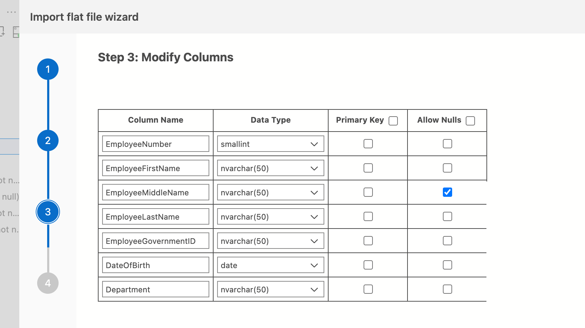

# 03.5 Charger un fichier `CSV`

`Azure Data Studio` ne permettant pas le copié-collé depuis `Excel`, on doit d'abord passer par un export des données en `CSV`.

> ## Attention au format de la date
>
> J'ai dû corrigé le format de la date car l'import n'acceptait pas `12/10/2012` mais `2012_10_12`.
>
> Ce changement s'effectue dans `Excel`


## `SQL Server Import`

On doit ajouter à `Azure Data Studion` un plugin `SQL Server Import` :



Ensuite l'import ce fait en quelques clicks :






On peut régler/modifier le type avant d'importer les données.




## Nettoyage

Ensuite j'ai chargé le contenu de cette table dans ma table `tblEmployee` et je l'ai supprimée :

```sql
INSERT INTO tblEmployee
SELECT * FROM [dbo].[70-461datau2]

DROP TABLE [dbo].[70-461datau2]
```


