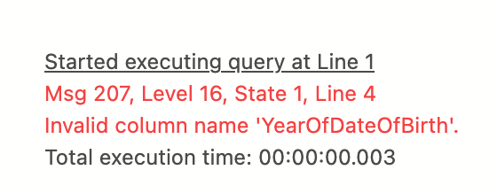
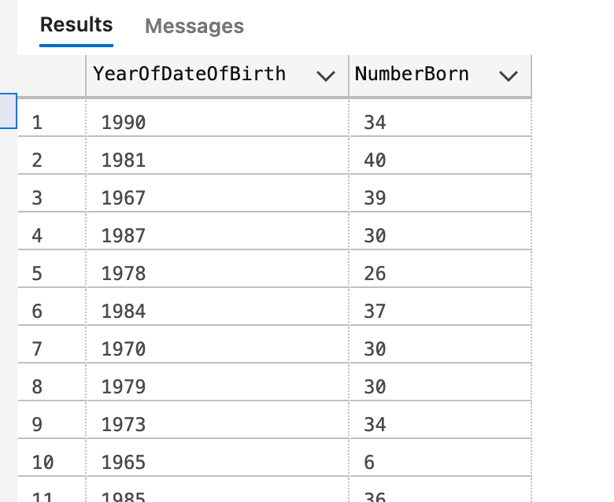

# 04 `GROUP BY` et `ORDER BY`


## Compter avec `COUNT`

On aimerai connaître le nombre de personne naient chaque année.

```sql
SELECT year(DateOfBirth) as YearOfDateOfBirth, COUNT(*) as NumberBorn
FROM tblEmployee
GROUP BY year(DateOfBirth)
```

Il n'est pas possible d'utiliser la fonction d'aggrégation `COUNT` sans un `GROUP BY`.


## Fonctionnement interne

Voici l'ordre d'écriture de la requête :

```sql
SELECT year(DateOfBirth) as YearOfDateOfBirth, COUNT(*) as NumberBorn
FROM tblEmployee
WHERE 1=1
GROUP BY year(DateOfBirth)
```

`SQL Server` calcule dans un ordre différent le résultat :

```sql
FROM tblEmployee
WHERE 1=1
GROUP BY year(DateOfBirth)
SELECT year(DateOfBirth) as YearOfDateOfBirth, COUNT(*) as NumberBorn
```

On choisis la table, on applique la condition `WHERE`, on groupe par le critère que l'on désire et enfin on affiche nos résultat.

C'est pourquoi la syntaxe suivante est impossible :

```sql
SELECT year(DateOfBirth) as YearOfDateOfBirth, COUNT(*) as NumberBorn
FROM tblEmployee
WHERE 1=1
GROUP BY YearOfDateOfBirth -- year(DateOfBirth)
```




## `ORDER BY`

Au moment du `GROUP BY` l'alias donné dans le `SELECT` n'est pas connu.



L'ordre des enregistrement affichés est dit `NON-DETERMINISTIC` = `NON DÉTERMINÉ`, ce qui veut dire que la requête jouée plusieurs fois ne renverra pas forcement les données dans le même ordre.

On doit définir formelement l'ordre pour le garantir.

```sql
SELECT year(DateOfBirth) as YearOfDateOfBirth, count(*) as NumberBorn
FROM tblEmployee
GROUP BY year(DateOfBirth)
ORDER BY year(DateOfBirth) -- ASC par défaut / DESC
```

On peut aussi utiliser `descending` `DESC`.

