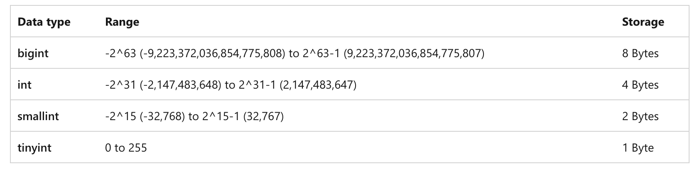
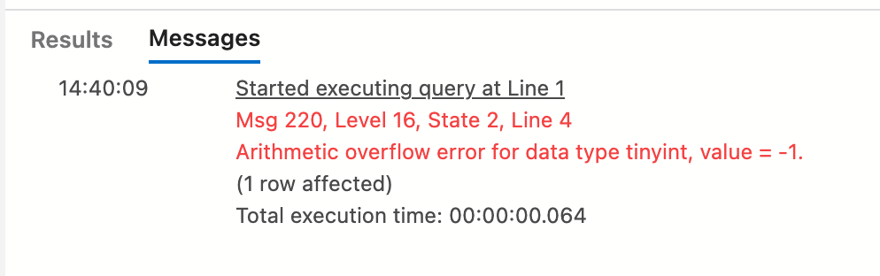
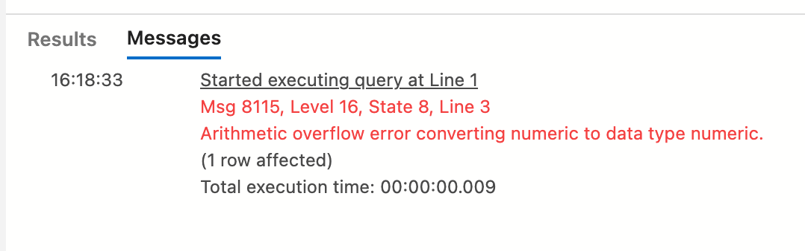
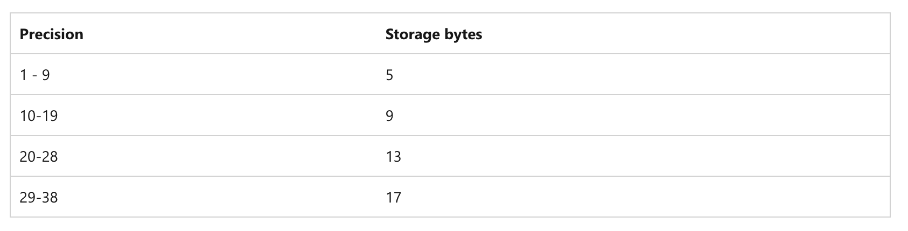

# 02 Les types `Number`

## Déclarer une variable `DECLARE`

```sql
DECLARE @myvar AS int = 2
```

`@` est obligatoire, `AS` est facultatif mais rend le code plus lisible.

```sql
DECLARE @myvar AS int
SET @myvar = 2
```

On utilise `SET` pour assigner une valeur à une variable en dehors de la déclaration ou pour modifier sa valeur.

On peut alors l'utiliser dans sa propre assignation :

```sql
DECLARE @myvar AS int = 2

SET @myvar = @myvar + 1

SELECT @myvar AS myVariable
```


## `Cast` dans un autre type

On peut assigner un `float` à une variable déclarée `int` :

```sql
DECLARE @myvar AS int

SET @myvar = 2.7

SELECT @myvar AS myVariable
```

```
2
```

La valeur est coupée avant le point des décimales.

### Avec une valeur négative `-3.87`

```sql
DECLARE @myvar AS int

SET @myvar = -3.87

SELECT @myvar AS myVariable
```

```
-3
```

De même la partie décimale est juste retirée.


## Ajouter des commentaires `-- commentaire`

```sql
-- initialise a variable

DECLARE @myvar AS int = 2

-- Increase the value by 1

SET @myvar = @myvar

-- Retrieve that value

SELECT @myvar AS myVariable

```


## Les types entiers



On a quatre types entiers `int`, `bigint`, `smallint`, `tinyint`.

Sur une `database` avec des millions de ligne, utiliser le plus petit type possible sauve une grande quantité d'espace.

La différence entre `int` et `tintint` est de 3 `bytes`, sur une `DB` d'un milliard de lignes, cela représente `3GB` !


### `Overflow`

```sql
DECLARE @myvar AS tinyint = 2

SET @myvar = @myvar - 3

SELECT @myvar AS myVariable
```



On obtient une erreur d'`overflow`, ce qui n'est pas toujours le cas avec certain langage de programmation :

```cs
// c#
byte a = 2;
byte b = (byte)(a - 3);

Console.WriteLine($"a: {a}, b: {b} ");
```

```
a: 2, b: 255 
```

Il y a aussi une erreur de `cast` si on ne fait pas le `cast` explicitement (ici avec `(byte)(a - 3)`).

Pour que cela fonctionne on peut utiliser les `smallint`, sur `2 Bytes`, ils supportent les valeurs négatives.

```sql
DECLARE @myvar AS smallint = 2

SET @myvar = @myvar - 3

SELECT @myvar AS myVariable
```

Comparé au `c#`, il n'y a que `4` types entiers.


## `Decimal` et `Numeric`

C'est exactement le même type.

On peut préciser le nombre de chiffres ainsi que le nombre de chiffres derrière la virgule (le point).

```sql
DECLARE @myvar AS decimal(7,2) -- 12345.67
```

Tandis que :

```sql
DECLARE @myvar AS decimal(7, 2) -- or numeric(7,2)
SET @myvar = 123456.7

SELECT @myvar AS myVariable
```



On n'est pas obligé de mettre un nombre de chiffres derrière la virgule :

```sql
DECLARE @myvar AS decimal(7)
SET @myvar = 12345.67

SELECT @myvar AS MyVariable
```

```
12346
```

On a la valeur arrondie (et non tronquée comme avec `int`).

```sql
SET @myvar = 12345.49 -- 12345
```


### `numeric(p, s)`

Par défaut `s` (`scale`) vaut `0`.

`p` (`precision`) vaut 18 : `100 000 000 000 000 000`

On n'utilise pas la valeur par défaut !




## `money` et `smallmoney`

#### ! les calcules sont imprécis

```sql
DECLARE
    @mon1 MONEY,
    @mon2 MONEY,
    @mon3 MONEY,
    @mon4 MONEY,
    @num1 DECIMAL(19,4),
    @num2 DECIMAL(19,4),
    @num3 DECIMAL(19,4),
    @num4 DECIMAL(19,4)

    SELECT
    @mon1 = 100, @mon2 = 339, @mon3 = 10000,
    @num1 = 100, @num2 = 339, @num3 = 10000

    SET @mon4 = @mon1/@mon2*@mon3
    SET @num4 = @num1/@num2*@num3

    SELECT @mon4 AS moneyresult,
    @num4 AS numericresult
```


Si on exécute des calcules autre que addition et soustraction, il vaut mieux utiliser `decimal(10,4)`.

> Le mieux étant d'effectuer les calcules dans la couche applicative pas en base de données (utilisation de librairies adaptées)
>
> https://stackoverflow.com/questions/582797/should-you-choose-the-money-or-decimalx-y-datatypes-in-sql-server#:~:text=Money%20is%20stored%20in%20the,doesn't%20change%20during%20calculations.


## `float` et `real`

#### ! ce sont des valeurs aproximatives

Il y a deux variantes `float(24)` => `4 bytes` et `float(53)` => `8 bytes`.

Un real est en fait un `float(24)`.

```sql
DECLARE @a AS decimal(7,2)
DECLARE @b AS decimal(7,2)
SET @a = 0.29
SET @b = 0.11

DECLARE @c AS float(24)
DECLARE @d AS float(24)
SET @c = 0.29
SET @d = 0.11

SELECT @a + @b AS DecimalResult, @c + @d AS Float24Result
```

