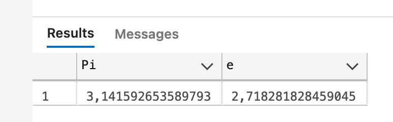
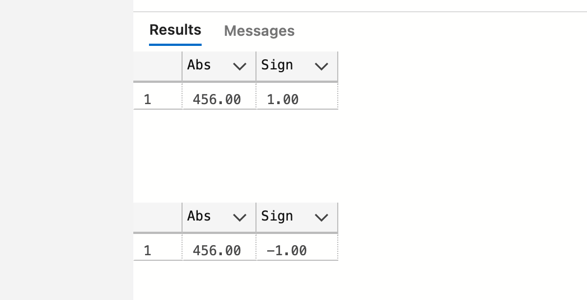

# 03 Les fonctions mathématiques

## Opérations sur les valeurs numériques

```sql
DECLARE @myvar AS numeric(7,2) = 3

SELECT @myvar + 2
SELECT @myvar - 2
SELECT @myvar * 2
SELECT @myvar / 2
```

### Les carrés

Pour l'opération "mettre au carré", on utilise une fonction mathématique :

```sql
SELECT POWER(@myvar, 2) -- POWER(@myvar, 3)
SELECT SQUARE(@myvar)
```


### Les racines carrés

La racine carré est en fait la puissance `1/2`

```sql
SET @myvar = 25

SELECT POWER(@myvar, 0.5)
SELECT SQRT(@myvar) -- SQUARE ROOT
```


## `FLOOR`, `CEILING` et `ROUND`

```sql
SELECT FLOOR(@myvar) Floor, CEILING(@myvar) Ceiling, round(@myvar, 0) Round

set @myvar = 2.5
SELECT FLOOR(@myvar) Floor, CEILING(@myvar) Ceiling, round(@myvar, 0) Round

set @myvar = 2.8
SELECT FLOOR(@myvar) Floor, CEILING(@myvar) Ceiling, round(@myvar, 0) Round

set @myvar = -2.8
SELECT FLOOR(@myvar) Floor, CEILING(@myvar) Ceiling, round(@myvar, 0) Round
```


|      | FLOOR | CEILING | ROUND |
| ---- | ----- | ------- | ----- |
| 2.3  | 2     | 3       | 2     |
| 2.5  | 2     | 3       | 3     |
| 2.8  | 2     | 3       | 3     |
| -2.8 | -3    | -2      | -3    |

### Problème avec `round`

`Round` ne donne pas forcement le résultat que l'on attend :

```sql
set @myvar = 12.345
SELECT  round(@myvar, 1) Round
```

```
12.40
```

En fait `round` arrondie deux à deux de droite à gauche :

```
345 => 350
35 => 40
=> 12.40
```

```sql
set @myvar = 12.345
SELECT  round(@myvar, 2) Round
```

```
12.35
```

Ce qu'on attend.


### Avec une précision négative

```sql
set @myvar = 12.345
SELECT  round(@myvar,-1) Round
```

On arrondi à la dizaine :

```
10
```


## `PI` et `e`

```sql
SELECT PI() as Pi, EXP(1) as e
```




## `ABS` et `SIGN`

```sql
SET @myvar = 456
SELECT ABS(@myvar) as Abs, SIGN(@myvar) as Sign

SET @myvar = -456
SELECT ABS(@myvar) as Abs, SIGN(@myvar) as Sign
```



```sql
SET @myvar = 0
SELECT ABS(@myvar) as Abs, SIGN(@myvar) as Sign
```

```
Abs : 0 | Sign : 0 
```


## `RAND`

```sql
SELECT RAND() -- une nouvelle valeur à chaque foiis

SELECT RAND(678) -- toujours la même valeur
```

Donne une valeur aléatoire entre `0` et `1`.