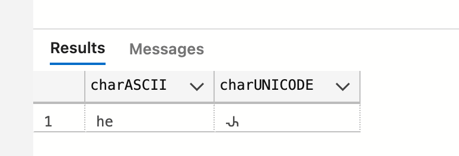

# 05 Les chaînes de caractères

## Ancienne table

On avait créé une table :

```sql
CREATE TABLE tbl1Table (
	EmployeeNumber int,
    EmployeeName int
)
```


## `4` types de base

`char` => `ASCII`

 `varchar` => `ASCII`

 `nchar` => `UNICODE`

`nvarchar` => `UNICODE`


### `ASCII ` 255 code caractère


1 caractère est sur un `byte`.

### `UNICODE` 

Agrandit l'interval de valeurs possible pour les caractères.

Contient l'interval `ASCII`.

1 caractère = 2 `bytes`.


## Déclarer un type caractère

En `T_SQL` les chaînes de caractères sont contenu entre **simple** guillemets.

```sql
DECLARE @myChar AS char(10)
SET @myChar = 'hello'
```


## Taille de la chaîne : `LEN`

```sql
SELECT @myChar, len(@myChar) as MyLenght
```


### `DATALENGTH`

Taille de la donnée

```sql
SELECT @myChar, len(@myChar) as MyLenght, DATALENGTH(@myChar)
```


On perd 5 `bytes`


## `varchar`

```sql
DECLARE @myChar AS varchar(10)
SET @myChar = 'hello'

SELECT @myChar, len(@myChar) AS MyLenght, DATALENGTH(@myChar)
```


On ne perd plus de place.

Le désavantage c'est qu'on perd `2 bytes` supplémentaire par donnée.

On utilise `char` pour une donnée de longueur fixe (un numéro national, un code de référence, un trigramme), sinon on utilise `varchar`.


## `nchar`

```sql
DECLARE @myChar AS nchar(10)
SET @myChar = '' -- 2 simples guillemets

SELECT @myChar, len(@myChar) as MyLenght, DATALENGTH(@myChar) as MyDataLength
```


Pour une chaîne vide on perd ici `20 bytes`, car chaque `nchar` vaut `2 bytes`.


## Afficher un caractère `unicode`

```sql
DECLARE @myChar AS nvarchar(10)
SET @myChar = 'hello؄'

SELECT @myChar, len(@myChar) as MyLenght, DATALENGTH(@myChar) as MyDataLength

DECLARE @myChar2 AS varchar(10)
SET @myChar2 = 'hello؄'

SELECT @myChar2, len(@myChar2) as MyLenght, DATALENGTH(@myChar2) as MyDataLength
```


On voit que le caractère arabe apparaît sous forme d'un point d'interrogation pour le `varchar` comme pour le `nvarchar`.

C'est parce que les simples guillemets représente une chaîne de type `char`, pour avoir un type `nchar` il faut préfixer sa chaîne avec un `N` majuscule : `N'hello؄'`

```sql
DECLARE @myChar AS nvarchar(10)
SET @myChar = N'hello؄'

SELECT @myChar, len(@myChar) as MyLenght, DATALENGTH(@myChar) as MyDataLength
```


Deux raisons d'éviter les conversion implicite de `char` en `nchar`

- cela prend du temps processeur
- Certains symboles seront remplacés par un point d'interrogation


## Quelle taille pour les `char` et `nchar`

Le minimum est `1` et le maximum est `8000`.

On a aussi `varchar(max)` et `nvarchar(max)` qui valent `2 GigaBytes`.

> `text` et `ntext` est l'ancienne façon de d'appeler `varchar(max)` et `nvarchar(max)`.
>
> Cette syntaxe est obsolète.


## `left` et `right`

Récupère un certain nombre de caractères sur une chaîne.

```sql
DECLARE @charASCII as varchar(10) = 'hellothere'
DECLARE @charUNICODE as nvarchar(10) = N'hello𑀴'

SELECT left(@charASCII, 2) as charASCII, right(@charUNICODE, 2) AS charUNICODE
```



On voit que le caractère spécial (alphabet Brahmi `𑀴`) compte pour `2` caractères.


## `substring`

Dans `sql server` on compte à partir de `1`, contrairement à `c#` où la numérotation (l'index) commence à `0`.

```sql
DECLARE @charASCII as varchar(10) = 'hellothere'

SELECT substring(@charASCII,3,2) AS charASCII
```

```
ll
```

`h` -> `1`

`e` -> `2`

`l` -> `3`

En commençant au troisième caractère (inclus), on prend `2` caractères : `ll`.

```sql
SELECT substring(string, startIndex, numberOfChar)
```


## `ltrim` et `rtrim`

Supprime les espaces à gauche ou à droite.

```sql
DECLARE @charASCII as varchar(10) = '  hello    '

SELECT ltrim(@charASCII) AS ltrim, rtrim(@charASCII) AS rtrim
```

> `trim` existe depuis `SQL Server 2017`


## `replace`

```sql
SELECT replace(@charASCII, 'o','oooo')
```

```
  helloooo   
```


## `upper` et `lower`

```sql
SELECT upper(@charUNICODE) AS UPPER, lower(@charUNICODE) AS LOWER
```


## Joindre des chaîne de caractère

```sql
DECLARE @firtsname AS nvarchar(20), @middlename AS nvarchar(20), @lastname AS nvarchar(20)

SET @firtsname = 'Jonh'
SET @middlename = 'Walker'
SET @lastname = 'Smith'

SELECT @firtsname + @middlename + @lastname AS FullName
```

```
JonhWalkerSmith
```

On peut mettre plusieurs déclaration sur la même ligne.

On ne peut pas assigner plusieurs fois sur la même ligne.

`+` concatène les chaînes de caractère.


## Problème avec `NULL`

```sql
DECLARE @firtsname AS nvarchar(20), @middlename AS nvarchar(20), @lastname AS nvarchar(20)

SET @firtsname = 'Sarah'
-- SET @middlename = 'Walker'
SET @lastname = 'Millgan'

SELECT @firtsname + ' ' + @middlename + ' ' + @lastname AS FullName
```

```
NULL
```

Car `@middlename` est `NULL`.


## Solution venant de `Access` et ajouté à `SQL Server`

### `iif`

```sql
SELECT @firtsname + iif(@middlename is null, '', ' ' + @middlename) + ' ' + @lastname AS FullName
```

```
Sarah Millgan
```

La question `@something == NULL` n'a pas de sens.

À la place on demande si c'est `NULL` : `@something is NULL`.


### `CASE WHEN`

```sql
CASE WHEN condition THEN expression1 ELSE expression2 END
```

On peut avoir plusieurs conditions :

```sql
CASE WHEN cond1 THEN expr1 WHEN cond2 THEN expr2 ELSE expr3 END
```

```sql
SELECT CASE WHEN @myInt < 7 THEN 'Plus petit que 7' WHEN @myInt > 9 THEN 'Plus gand que 9' ELSE '7 8 ou 9' END AS Solution
```

Dans notre cas :

```sql
SELECT @firtsname + CASE WHEN @middlename IS NULL THEN '' ELSE ' ' + @middlename END + ' ' + @lastname
```


### `coalesce`

Cette fonction prend autant d'argument que l'on veut. Elle teste chaque argument, s'il est `NULL` elle passe au suivant, sinon elle renvoie la valeur de l'argument.

```sql
SELECT @firstname + ' ' + colaesce(@middlename, '') + ' ' + @lastname
```

Dans notre cas l'utilisation de `coalesce` ajoute deux espaces après `@firstname` si `@middlename` est `NULL`.

On peut facilement corrigé ce problème car un `string` avec `NULL` donne `NULL` :

```sql
SELECT firstname + coalesce(' ' + @middlename, '') + ' ' + @lastname
```


### `CONCAT`

`CONCAT` ignore les argument `NULL` et concatène les autres.

C'est LA solution élégante

```sql
SELECT CONCAT(@firstname, ' ' + @middlename,' ',@lastname) AS FullName
```


## Joindre une chaîne et un nombre

```sql
SELECT 'hello world ' + 1234
```


Une erreur de conversion est levée. La précédence des conversions tente de convertir `'hello world'` en `int`.

```sql
SELECT 'hello world ' + CONVERT(varchar(20), 1234)
```

```
hello world 1234
```

Maintenant cela fonctionne, de même :

```sql
SELECT 'hello world ' + CAST(1234 AS varchar(20))
```


### `format`

On a souvent besoin de formater les valeurs numériques, pour représenter une monnaie par exemple.

```sql
SELECT 'my salary is; ' + format(2340.5, 'C')
```

`C` pour `currency` (monnaie)

```
my salary is; $2,340.50
```

L'affichage va dépendre de la `culture` choisie pour la `db`.

Il faut régionaliser.

```sql
SELECT 'my salary is; ' + format(2340.5, 'C', 'en-GB')
SELECT 'my salary is; ' + format(2340.5, 'C', 'fr-FR')
```

Le troisième argument est ce qu'on appelle la `culture`, l'ensemble de règles locales de formatage.


Pour aller plus loin :

https://docs.microsoft.com/en-us/dotnet/standard/base-types/standard-numeric-format-strings


