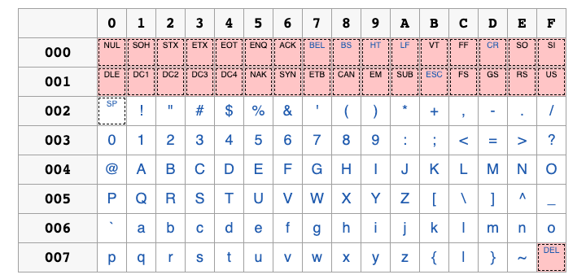
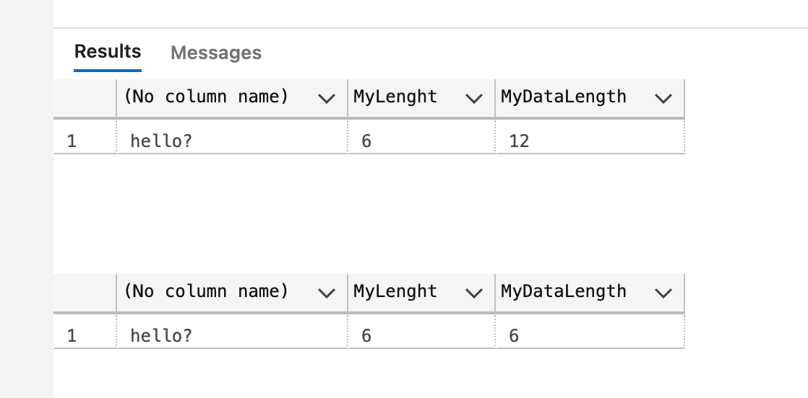

# 05 Les chaînes de caractères

## Ancienne table

On avait créé une table :

```sql
CREATE TABLE tbl1Table (
	EmployeeNumber int,
    EmployeeName int
)
```


## `4` types de base

`char` => `ASCII`

 `varchar` => `ASCII`

 `nchar` => `UNICODE`

`nvarchar` => `UNICODE`


### `ASCII ` 255 code caractère



1 caractère est sur un `byte`.

### `UNICODE` 

Agrandit l'interval de valeurs possible pour les caractères.

Contient l'interval `ASCII`.

1 caractère = 2 `bytes`.


## Déclarer un type caractère

En `T_SQL` les chaînes de caractères sont contenu entre **simple** guillemets.

```sql
DECLARE @myChar AS char(10)
SET @myChar = 'hello'
```


## Taille de la chaîne : `LEN`

```sql
SELECT @myChar, len(@myChar) as MyLenght
```


### `DATALENGTH`

Taille de la donnée

```sql
SELECT @myChar, len(@myChar) as MyLenght, DATALENGTH(@myChar)
```


On perd 5 `bytes`


## `varchar`

```sql
DECLARE @myChar AS varchar(10)
SET @myChar = 'hello'

SELECT @myChar, len(@myChar) AS MyLenght, DATALENGTH(@myChar)
```


On ne perd plus de place.

Le désavantage c'est qu'on perd `2 bytes` supplémentaire par donnée.

On utilise `char` pour une donnée de longueur fixe (un numéro national, un code de référence, un trigramme), sinon on utilise `varchar`.


## `nchar`

```sql
DECLARE @myChar AS nchar(10)
SET @myChar = '' -- 2 simples guillemets

SELECT @myChar, len(@myChar) as MyLenght, DATALENGTH(@myChar) as MyDataLength
```


Pour une chaîne vide on perd ici `20 bytes`, car chaque `nchar` vaut `2 bytes`.


## Afficher un caractère `unicode`

```sql
DECLARE @myChar AS nvarchar(10)
SET @myChar = 'hello؄'

SELECT @myChar, len(@myChar) as MyLenght, DATALENGTH(@myChar) as MyDataLength

DECLARE @myChar2 AS varchar(10)
SET @myChar2 = 'hello؄'

SELECT @myChar2, len(@myChar2) as MyLenght, DATALENGTH(@myChar2) as MyDataLength
```



On voit que le caractère arabe apparaît sous forme d'un point d'interrogation pour le `varchar` comme pour le `nvarchar`.

C'est parce que les simples guillemets représente une chaîne de type `char`, pour avoir un type `nchar` il faut préfixer sa chaîne avec un `N` majuscule : `N'hello؄'`

```sql
DECLARE @myChar AS nvarchar(10)
SET @myChar = N'hello؄'

SELECT @myChar, len(@myChar) as MyLenght, DATALENGTH(@myChar) as MyDataLength
```


Deux raisons d'éviter les conversion implicite de `char` en `nchar`

- cela prend du temps processeur
- Certains symboles seront remplacés par un point d'interrogation


