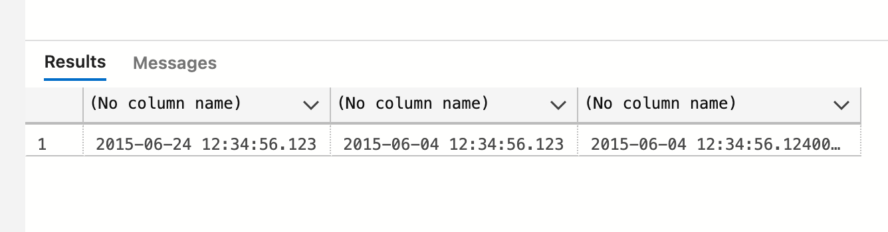
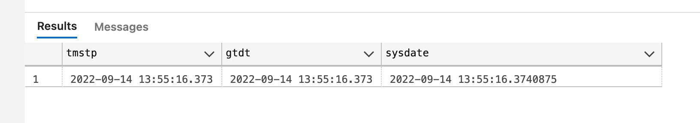

# 07 Le type `dates`

https://docs.microsoft.com/en-us/sql/t-sql/functions/date-and-time-data-types-and-functions-transact-sql?view=sql-server-ver16


## `datetime`

Du 01 janvier 1753 au 31 décembre 9999.

Précision : 0,00333 seconde

taille : 8 bytes

Problème de taille et de précision.

```sql
DECLARE @mydate as datetime = '2015-06-24 12:34:56.124'

SELECT @mydate
```


la précision étant de `0.00333`, il ne peut y avoir comme dernier chiffre que `3`, `7` ou `0` (en arrondissant `0.00666` vers `0.007` et `0.00999` vers `0.000`)

On peut aussi écrire la date sans tiret :

```sql
DECLARE @mydate2 as datetime = '20150604 12:34:56.124'
```


## `Date`

Si on a pas besoin de l'heure.

Du 01 janvier 0001 au 31 décembre 9999.

Taille : 3 bytes


## `smalldatetime`

S'arrête le 06 juin 2079 !!!

taille : 4 bytes

précision : à la minute.


## `datetime2`

On peut définir la précision en nanoseconde.

Du 01 janvier 0001 au 31 décembre 9999.

Taille : de 6 à 8 bytes

Plus léger que `datetime` et avec une plus grosse plage de valeurs.

```sql
DECLARE @mydate as datetime = '2015-06-24 12:34:56.124'
DECLARE @mydate2 as datetime = '20150604 12:34:56.124'
DECLARE @mydate3 as datetime2 = '20150604 12:34:56.124'

SELECT @mydate, @mydate2, @mydate3
```



On remarque la précision accrue de `datetime2`.

On peut choisir la précision, jusqu'à `3`, `datetime2` prend `6 bytes`.

On peut aller jusqu'à `7`

```sql
DECLARE @mydate0 as datetime2(0) = '20150624 12:34:56.124'
DECLARE @mydate1 as datetime2(1) = '20150624 12:34:56.124'
DECLARE @mydate2 as datetime2(2) = '20150624 12:34:56.124'
DECLARE @mydate3 as datetime2(3) = '20150624 12:34:56.124'
DECLARE @mydate4 as datetime2(4) = '20150604 12:34:56.124'
DECLARE @mydate5 as datetime2(5) = '20150604 12:34:56.124'
DECLARE @mydate6 as datetime2(6) = '20150604 12:34:56.124'
DECLARE @mydate7 as datetime2(7) = '20150604 12:34:56.124'
DECLARE @mydatedefault as datetime2 = '20150604 12:34:56.124'

SELECT 
    @mydate0, datalength(@mydate0) as T0, 
    @mydate1, datalength(@mydate1) as T1,
    @mydate2, datalength(@mydate2) as T2
SELECT 
    @mydate3, datalength(@mydate3) as T3,
    @mydate4, datalength(@mydate4) as T4
SELECT
    @mydate5, datalength(@mydate5) as T5,
    @mydate6, datalength(@mydate6) as T6, 
    @mydate7, datalength(@mydate7) as T7
SELECT
    @mydatedefault, datalength(@mydatedefault) as TDefault
```

Dans `datetime2(n)`, `n` est le nombre de nanoseconde précisée allant de `0` à `7`.


## `datefromparts`

```sql
SELECT datefromparts(2015,10,27)
```

```
2015-10-27
```


## `datetime2fromparts`

```sql
SELECT datetime2fromparts(2019,11,23,15,56,33,4528,4)
```

Le dernier argument étant la précision et devant correspondre au nombre de chiffres de l'avant dernier argument.

```
2019-11-23 15:56:33.4528
```


## `year`, `month` et `day`

```sql
DECLARE @mydate as datetime2(2) = '2019-09-26 12:00:00.00'

SELECT year(@mydate) as year, month(@mydate) as month, day(@mydate) as day
```


## `date` du jour

```sql
SELECT 
	CURRENT_TIMESTAMP as tmstp, -- datetime fini par 0, 3 ou 7
	getdate() as gtdt,  -- datetime
	SYSDATETIME() as sysdate -- datetime2(7)
```



`CURRENT_TIMESTAMP` est du `sql` standard.

`Microsoft` n'aimant la syntaxe avec `_` à ajouter `getdate()` qui est identique.

`SYSDATETIME()` quant à lui est plus précis et renvoie un `dattime2(7)`.


##  `dateadd(type, quantity, date)`

Ajoute du temps à une date :

```sql
DECLARE @mydate AS datetime2(3) = '2018-08-19 15:32:42.678'

SELECT 
	dateadd(YEAR, 2, @mydate), 
	dateadd(WEEK, 8, @mydate), 
	dateadd(MINUTE, 893, @mydate)
```


## `datename`

```sql
SELECT 
	datename(WEEKDAY, getdate()), 
	datename(YEAR, getdate()), 
	datename(QUARTER, getdate()), 
	datename(MONTH, getdate())
```


Va donner une version littéral si elle existe (ici pour `WEEKDAY` et `MONTH`).


## `datepart`

```sql
SELECT datepart(HOUR, SYSDATETIME())
```

> Il n'y a pas de fonction `HOUR(@date)` comme `YEAR(@date)` ou `DAY(@date)`


## `datediff`

va donner l'écart de temps entre deux dates

```sql
DECLARE @mydate AS datetime2(3) = '2018-08-19 15:32:42.678'

SELECT datediff(MONTH, @mydate, getdate()), datediff(DAY, @mydate, getdate())
```


