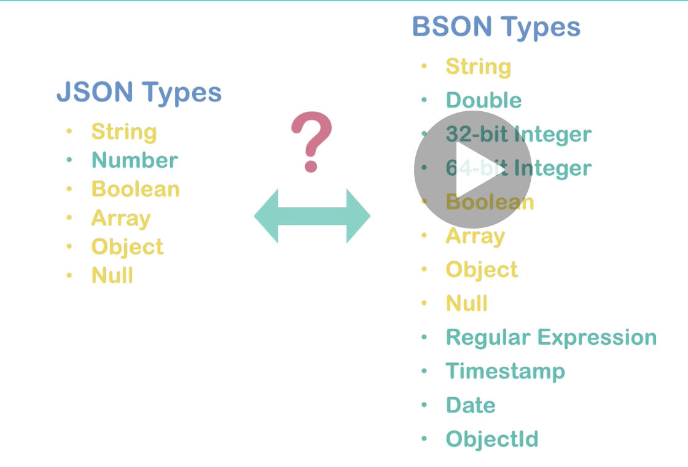
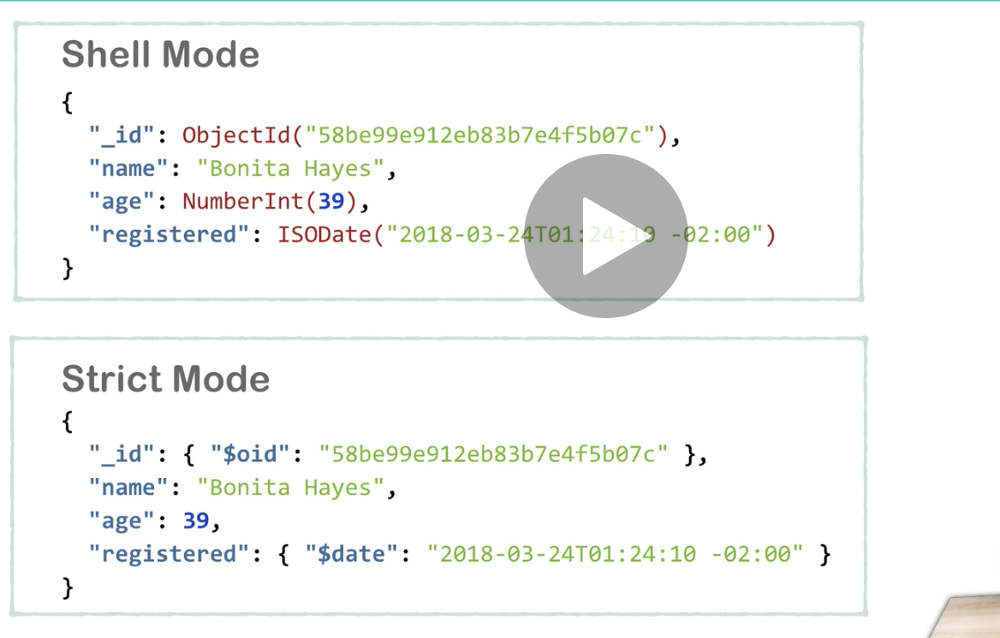

# 01 Introduction `mongoDB`

## `JSON`

Il y a 6 types en `json`

1. string
2. number
3. boolean
4. array
5. object
6. null

## `BSON`

`B`inary `json`.

C'est le format qu'utilise `mongoDB` pour enregistrer les données.

`bson` supporte plus de type de données.

|                                                                                                                      |                                                                                                                     |
| -------------------------------------------------------------------------------------------------------------------- | ------------------------------------------------------------------------------------------------------------------- |
| - string  - double  - 32 bits integer  - 64 bits integer  - boolean  - array  - Object | - null  - regular expression - timestamp - date - objectId - binary data - others ... |

## Convertir `json` en `bson` et vice versa : `extended json`

Il existe deux modes `shell mode` et `strict mode`.

### `shell mode`

- Types `bson` en ligne
- le mode interne de `mongoDB`
- Le shell de `mongoDB` comprends ce mode

### `strict mode`

- Représente les types `bson` utilisant un nom de clé spécial commençant par `$`
- standard `json` compatible
- Fonctionne avec les parser `json`

Les deux modes sont supportés par les driver externe de `mongoDB` et les `api rest`.

Supporté aussi par `mongoimport utility`.

On voit que le `strict mode` est du `json` valide.
