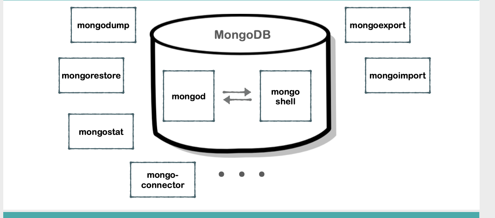
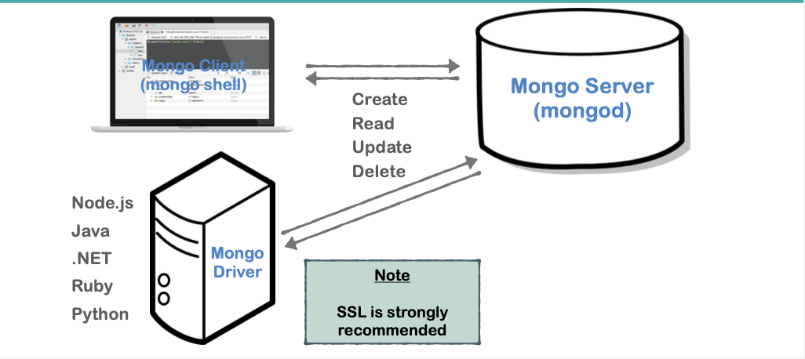

# 02 structure de `mongoDB`

Une base de données `mongoDB` consite en un ensemble de collections contenant des documents.

Par défaut `mongoDB` fournis deux bases de données `admin` et `local`.

Ce sont les outils fournis par `mongoDB`

- `mongod` le serviec de base de données à proprement parlé
- `mongo shell` un shell permettant de gérer les opérations `crud` sur la `bdd`
- `nomdump` et `mongorestore` pour réaliser un `dump` et le restaurer
- `mongoexport` et `mongoimport` pour importetr et exporter des données
- `mongostat` pour avoir des infos de performance de sa `bdd`

`ssl` est vivement recommandé pour communiquer avec `mongod` (le serveur `mongoDB`).

`mongo shell` peut être sur une autre machine.

il faut un `mongo driver` pour se connecter à la `bdd` depuis le serveur de code (serveur web).
