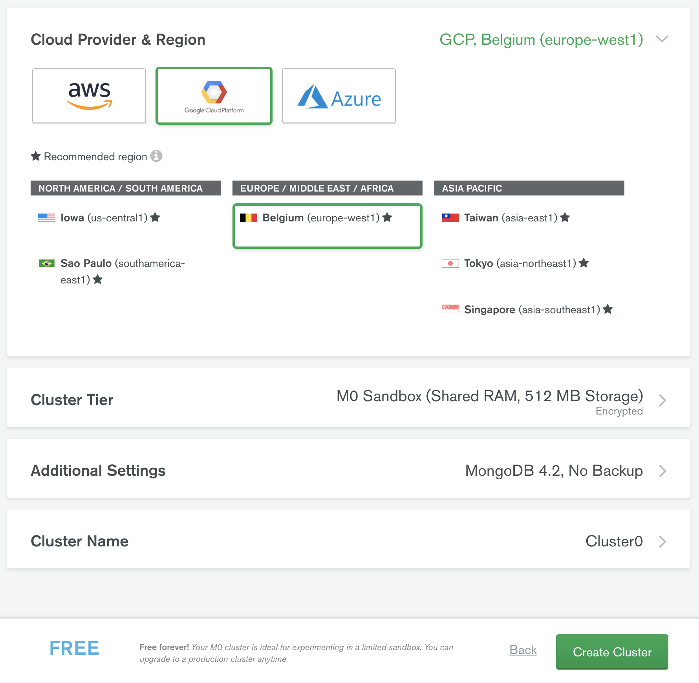
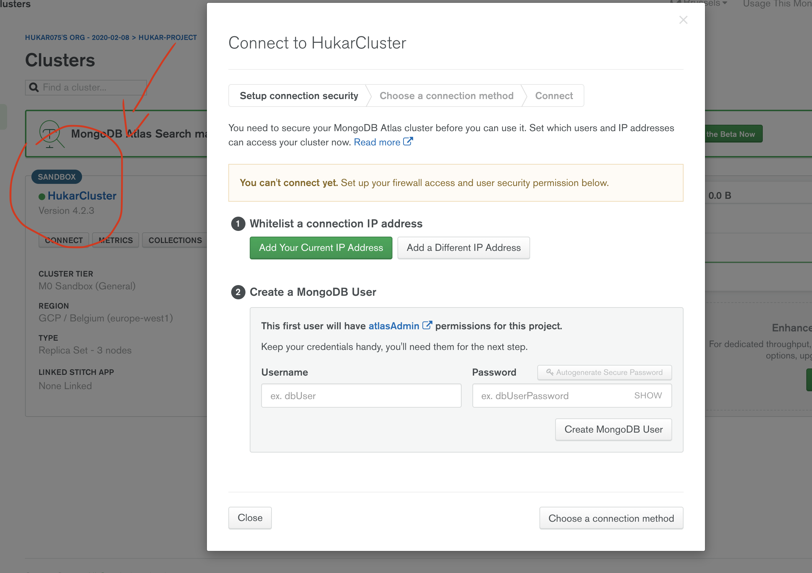
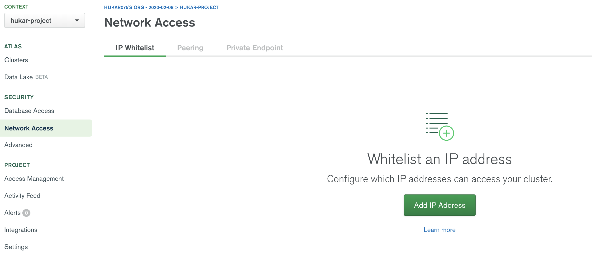
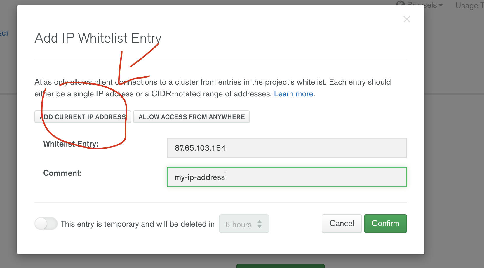

# 03 installation

## Local

### d'abord désinstaller

Remove all the mongoDB contains before reinstalling

1. Vérifiez si un service mongo est en cours

```bash
launchctl list | grep mongo
```

2. enlever les `LaunchAgents`

```bash
launchctl unload ~/Library/LaunchAgents/homebrew.mxcl.mongodb.plist
rm -f ~/Library/LaunchAgents/homebrew.mxcl.mongodb.plist
launchctl remove homebrew.mxcl.mongodb
```

3. Tuer tous les processus liés à `mongod`

```bash
ps aux | grep -v grep | grep mongo
pkill -f mongod
```

4. Désinstaller `mongodb`

```bash
# Si installé via brew
brew uninstall mongodb
# Si c'est installé manuellement on peut simplement supprimer le dossier
rm -rf <mongodb_folder>
```

5. Confirmation de l'existence d'un fichier lié à Mongo

```bash
ls -al /usr/local/bin/mong*
ls -al ~/Library/LaunchAgents
```

6. Si vous disposez d'un dossier séparé pour les `db`

```bash
rm -rf /usr/local/var/mongodb
rm -rf /data/db
```

C'est bon!

### `lauchctl`

permet d'utiliser `launchd` le service apple pour gérer les `daemon` et les agents.

### Insatallation avec `brew`

D'abord charger le repository :

```bash
brew tap mongodb/brew
```

Ensuite installer `mongoDB`

```bash
brew install mongodb-community@4.2
```

### 3 endroits importants

- le fichier de configuration `/usr/local/etc/mongod.conf`

```
systemLog:
  destination: file
  path: /usr/local/var/log/mongodb/mongo.log
  logAppend: true
storage:
  dbPath: /usr/local/var/mongodb
net:
  bindIp: 127.0.0.1
```

On trouve le chemin pour le stockage et celui pour les `logs`

- Le [`log directory path`](https://docs.mongodb.com/manual/reference/configuration-options/#systemLog.path) : `/usr/local/var/log/mongodb`
- Le [`data directory path`](https://docs.mongodb.com/manual/reference/configuration-options/#storage.dbPath) : `/usr/local/var/mongodb`

### Lancer `mongod`

```bash
mongod --config /usr/local/etc/mongod.conf --fork
```

```
about to fork child process, waiting until server is ready for connections.
forked process: 83429
child process started successfully, parent exiting
```

`--fork` pour lancer le service comme un `daemon` en toile de fond.

### Éteindre le service

Dans le `mongoshell`

```
> use admin
switched to db admin
> db.shutdownServer()
```

### Vérifier que `mongod` tourne

```bash
ps aux | grep -v grep | grep mongo
```

```
kar 83429 0.0 0.2 5581252 27704 ?? S 3:24PM 0:01.12 mongod --config /usr/local/etc/mongod.conf --fork
```

### Lancer le shell `mongo`

```bash
mongo
```

```
> show dbs
admin   0.000GB
config  0.000GB
local   0.000GB
> db.version()
4.2.3
```

`show dbs` voire les base de données du serveur.

`db.version()` voire la version de `mongoDB`.

### `mongoDB` comme un service `brew services`

On utilise `brew services`

```bash
brew services list
Name              Status  User Plist
mongodb-community stopped

brew services start mongodb-community@4.2
==> Successfully started `mongodb-community` (label: homebrew.mxcl.mongodb-commu

brew services list
Name              Status  User Plist
mongodb-community started kar  /Users/kar/Library/LaunchAgents/homebrew.mxcl.mongodb-community.plist
```

## Serveur dédié

Pour la production il faut installer `mongoDB` sur un serveur dédié.

- digital ocean : droplet = machine virtuel dédié
- Hetzner
- GoDaddy
- Amazon Web Service EC2

## `mongoDB` as a service : `mongoDB Atlas`

Utilisation de `mongoDb atlas`.

Connexion avec mon compte Google.

### Créer un projet


Cliquer sur `New Project`


Cliquer sur `Create Project`.

### Créer un cluster



Voilà le cluster de trois nœuds


Replica Set Configuration :

un primary

deux secondary

### Créer un user



login : hukar

password : hukar


SCRAM : Salted Connection Response Authentication Mechanism = authentification à trois paramètres `username`, `password`, `authentication database`.

### Ajouter son `ip`





### Se connecter sur un `mongo shell`


```bash
mongo "mongodb+srv://hukarcluster-w1mpz.gcp.mongodb.net/test"  --username hukar
```

On me demande ensuite mon mot de passe `hukar`.

```
MongoDB shell version v4.2.3
Enter password:
connecting to: mongodb://hukarcluster-shard-00-01-w1mpz.gcp.mongodb.net:27017,
						hukarcluster-shard-00-02-w1mpz.gcp.mongodb.net:27017,
						hukarcluster-shard-00-00-w1mpz.gcp.mongodb.net:27017/test?authSource=admin&compressors=disabled&gssapiServiceName=mongodb&replicaSet=HukarCluster-shard-0&ssl=true
```

On voit les trois nœuds faisant partis du cluster, on voit aussi que `ssl` est utilisé (par défaut obligatoire).

```bash
MongoDB server version: 4.2.3
MongoDB Enterprise HukarCluster-shard-0:PRIMARY> show dbs
admin  0.000GB
local  1.419GB
MongoDB Enterprise HukarCluster-shard-0:PRIMARY> rs.status()
{
	"set" : "HukarCluster-shard-0",
	"date" : ISODate("2020-03-25T06:43:49.960Z"),
	"myState" : 1,
	"term" : NumberLong(2),
	"syncingTo" : "",
	"syncSourceHost" : "",
	// ...
```

`rs.status` avoir les infos du `replica set`.
