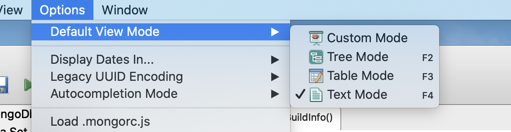

# 06 `Mongo Shell`

Basé sur `spider-monkey engine` et supporte donc `ecmascript 6`.

## `db.serverBuildInfo()`

```bash
> db.serverBuildInfo()
{
	"version" : "4.2.3",
	"gitVersion" : "6874650b362138df74be53d366bbefc321ea32d4",
	"modules" : [ ],
	"allocator" : "system",
	"javascriptEngine" : "mozjs",
	"sysInfo" : "deprecated",
	"versionArray" : [
		4,
		2,
		3,
		0
	],
	"openssl" : {
		"running" : "Apple Secure Transport"
	},
	"buildEnvironment" : {
		"distmod" : "",
		"distarch" : "x86_64",
		"cc" : "/Applications/Xcode10.2.0.app/Contents/Developer/Toolchains/XcodeDefault.xctoolchain/usr/bin/clang: Apple LLVM version 10.0.1 (clang-1001.0.46.3)",
		"ccflags" : "-isysroot /Applications/Xcode10.2.0.app/Contents/Developer/Platforms/MacOSX.platform/Developer/SDKs/MacOSX10.14.sdk -mmacosx-version-min=10.12 -target darwin16.0.0 -arch x86_64 -fno-omit-frame-pointer -fno-strict-aliasing -ggdb -pthread -Wall -Wsign-compare -Wno-unknown-pragmas -Winvalid-pch -Werror -O2 -Wno-unused-local-typedefs -Wno-unused-function -Wno-unused-private-field -Wno-deprecated-declarations -Wno-tautological-constant-out-of-range-compare -Wno-tautological-constant-compare -Wno-tautological-unsigned-zero-compare -Wno-tautological-unsigned-enum-zero-compare -Wno-unused-const-variable -Wno-missing-braces -Wno-inconsistent-missing-override -Wno-potentially-evaluated-expression -Wno-unused-lambda-capture -Wno-exceptions -Wunguarded-availability -fstack-protector-strong -fno-builtin-memcmp",
		"cxx" : "/Applications/Xcode10.2.0.app/Contents/Developer/Toolchains/XcodeDefault.xctoolchain/usr/bin/clang++: Apple LLVM version 10.0.1 (clang-1001.0.46.3)",
		"cxxflags" : "-Woverloaded-virtual -Werror=unused-result -Wpessimizing-move -Wredundant-move -Wno-undefined-var-template -Wno-instantiation-after-specialization -fsized-deallocation -stdlib=libc++ -std=c++17",
		"linkflags" : "-Wl,-syslibroot,/Applications/Xcode10.2.0.app/Contents/Developer/Platforms/MacOSX.platform/Developer/SDKs/MacOSX10.14.sdk -mmacosx-version-min=10.12 -target darwin16.0.0 -arch x86_64 -Wl,-bind_at_load -Wl,-fatal_warnings -fstack-protector-strong -stdlib=libc++",
		"target_arch" : "x86_64",
		"target_os" : "macOS"
	},
	"bits" : 64,
	"debug" : false,
	"maxBsonObjectSize" : 16777216,
	"storageEngines" : [
		"biggie",
		"devnull",
		"ephemeralForTest",
		"wiredTiger"
	],
	"ok" : 1
}
```

avec `robo 3t`


Pour afficher en texte :



### info importante

```js
"maxBsonObjectSize" : 16777216,
```

C'est la taille maximal d'un objet `bson` `16777216 / 1024 / 1024 = 16MB` .

Pour sauvegarder des fichier par exemple, regarder `GridFS`.

## ## `interpreterVersion()`

```bash
> interpreterVersion()
MozJS-60
```

## mongoDB server version

```bash
mongod --version
```

```
db version v4.2.3
git version: 6874650b362138df74be53d366bbefc321ea32d4
allocator: system
modules: none
build environment:
    distarch: x86_64
    target_arch: x86_64
```

```js
> db.version()
4.2.3
```

## mongo shell version

```bash
mongo --version
```

```
MongoDB shell version v4.2.3
git version: 6874650b362138df74be53d366bbefc321ea32d4
allocator: system
modules: none
build environment:
    distarch: x86_64
    target_arch: x86_64
```

```js
> version()
4.2.3
```

Ces versions pourraient être différentes.
