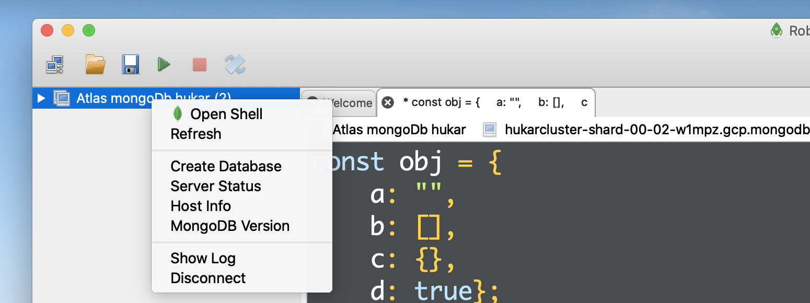
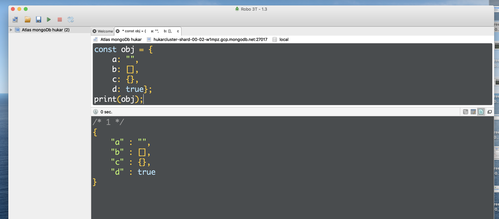
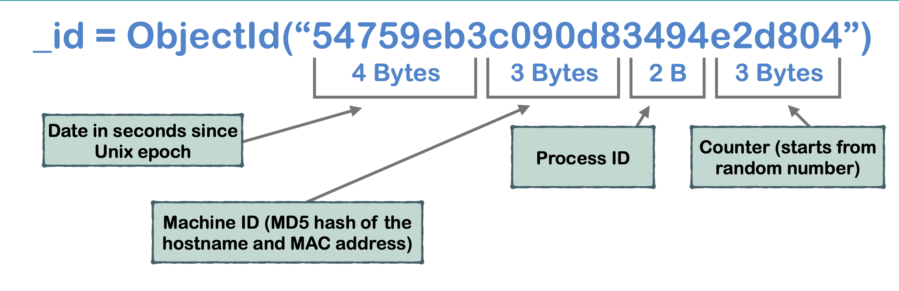

# 09 les types

## Les plus courants types `BSON`

|                                                       |                                           |
| ----------------------------------------------------- | ----------------------------------------- |
| ObjectId<br />Object<br />Array<br />String<br />Date | int32<br />int64<br />Double<br />Boolean |

## La syntaxe des types dans le `shell mode`

| Type     | Syntaxe       |
| -------- | ------------- |
| ObjectId | ObjectId( )   |
| Object   | { }           |
| Array    | [ ]           |
| String   | " "           |
| Int32    | NumberInt( )  |
| Int64    | NumberLong( ) |
| Double   | 0.0           |
| Boolean  | true / false  |
| Date     | ISODate( )    |

## Dans `robo 3T`

Pour ouvrir le `shell` click droit sur sa connexion :



On utilise `print()` à la place de `console.log` :



## `BSON ` type Identifiant

|   Type   | Number ID | String ID  |
| :------: | :-------: | :--------: |
|  String  |     2     |  "string"  |
|  Object  |     3     |  "object"  |
|  Array   |     4     |  "array"   |
| Boolean  |     8     | "boolean"  |
|  Int32   |    16     |   "int"    |
|  Int64   |    18     |   "long"   |
|  Double  |     1     |  "double"  |
|   Date   |     9     |   "date"   |
| ObjectId |     7     | "objectId" |

On peut utiliser le `$` avec soit le `number id` soit le `string id` dans `mongoDb` pour l'écriture de requête.

## `_id`

C'est un identifiant unique dans la base de données.

`_id` est un champs obligatoire.

On peut l'assigner manuellement, par exemple dans le cas d'importation de données.

Il est créé automatiquement s'il n'est pas assigné manuellement (ce qui est recommandé).

On utilise le `bson` type `ObjectId`.

`ObjectId` est une valeur de 12 octets (byte) créée automatiquement par `MongoDb`.

```js
_id = ObjectId("5e7b70be74532b4b137a4d52");
```



Voilà comment est généré l'identifiant `_id` :

- Date unix en seconde 4 octets
- machine id (hash MD5 du hostname et de l'adresse MAC) 3 octets
- l'ID du processus 2 octets
- Un compteur démarrant sur un nombre aléatoire 3 octets

#### ! ce n'est plus le cas maintenant on trouve cela dans la doc :

- 4-byte _timestamp value_, representing the ObjectId’s creation, measured in seconds since the Unix epoch
- a 5-byte _random value_
- a 3-byte _incrementing counter_, initialized to a random value

## Généré des `_id`

```js
> ObjectId()
ObjectId("5e7b7631 36be793d3d f6f7a1")
> ObjectId()
ObjectId("5e7b7634 36be793d3d f6f7a2")
> ObjectId()
ObjectId("5e7b7636 36be793d3d f6f7a3")
> ObjectId()
ObjectId("5e7b7642 36be793d3d f6f7a4")
```

On voit bien le `timestamp` avancer, le nombre aléatoire au milieu reste le même et le nombre de fin s'incrémente à chaque appelle.

## `Date` et `ISODate`

Format de l'`ISODate` :

```js
ISODate("2020-03-25T15:29:31.070Z");
```

Pour obtenir la date ISO du moment deux méthodes :

```js
new Date();
// ou
ISODate();
```

Attention `Date()` renvoie un `string` et pas une `ISODate` :


## Créer des `ISODate`

```js
new Date("2020-03-25");
new Date(2020, 2, 24); // les mois commencent à 0
new Date("march 25, 2020, 16:43:12");
```

```js
ISODate("2020-03-25T00:00:00Z"); // le plus fidèle
ISODate("2020-03-23T23:00:00Z"); // il y a conversion mezone la ti
ISODate("2020-03-25T15:43:12Z"); // idem ici attention au décalage de l'heure !!
```

Il faut être prudent lors des conversions de dates, il faut prendre en compte les différentes syntaxes et le décalage horaire.

### Le plus sûre

```js
new Date("2020-03-25T16:46:00"); // local Timezone
new Date("2020-03-25T16:46:00Z"); // UTC
```

```js
ISODate("2020-03-25T15:46:00Z");
ISODate("2020-03-25T16:46:00Z");
```

## Les nombres `bson`

| Type           | Number ID | String ID | Shell Mode Syntax |
| -------------- | --------- | --------- | ----------------- |
| 32-bit integer | 16        | "int"     | NumberInt( )      |
| 64-bit integer | 18        | "long"    | NumberLong( )     |
| Double         | 1         | "double"  | \_                |

```js
const o = { a: 10, b: 0, c: 4.7, d: NumberInt(9), e: NumberLong(5) };
print(o);
```

```js
/* 1 */
{
    "a" : 10.0,
    "b" : 0.0,
    "c" : 4.7,
    "d" : 9,
    "e" : NumberLong(5)
}
```

On voit que `10` est transformé en `10.0`, idem pour `0` en `0.0`.

`NumberInt(9)` est transformé en `9`.

Regardons les types :


