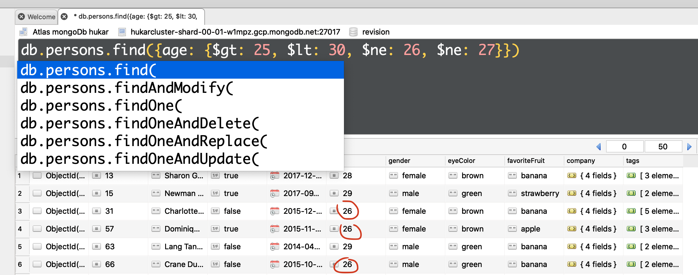
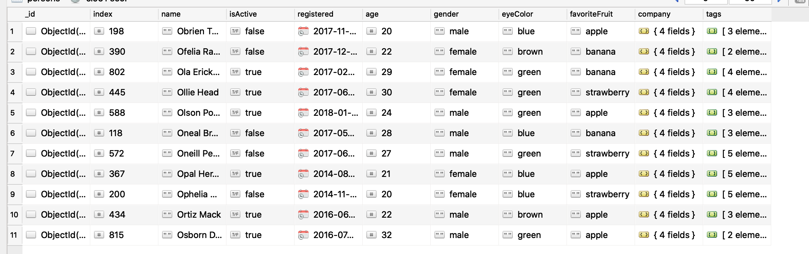

# 02 les opérateurs : `operators`

## définition

Les `operators` définissent des conditions sur les propriétés, **plus grand que**, **pas égal** ou encore **dans**.

```js
{<fieldname1>: {<operator1>: <value1}, ... }
```

exemple :

```js
db.persons
  .find({
    age: { $gt: 25 },
    eyeColor: { $in: ["green", "blue"] },
    favoriteFruit: { $ne: "banana" },
  })
  .count();

302;
```

## Opérateurs de comparaison

6 opérateurs :

1. `$ne` pas égal
2. `$eq` égal
3. `$gt` plus grand que
4. `$gte` plus grand que ou égal
5. `$lt` plus petit que
6. `$lte` plus petit que ou égal

### exemple

```js
db.persons.find({ age: { $gt: 25, $lt: 27 } });
```

Ici la virgule `,` signifie `and` implicite.

#### la `,` est un `et` logique implicite.

```js
db.persons.find({ age: { $gt: 25, $lt: 30, $ne: 26 } });
```

On peut ajouter qu'on ne veut pas les personnes ayant 26 ans.

#### ! si on utilise plusieurs fois `$ne`, seul le dernier écrasera les autres

```js
db.persons.find({ age: { $gt: 25, $lt: 30, $ne: 26, $ne: 27 } });
```

`$ne: 26` est écrasé par `$ne: 27`, comme dans n'importe quel objet javascript et on aura bien les personnes avec `age: 26`.



### Avec les chaînes de caractères

```js
db.persons.find({ name: { $gte: "E" } }).sort({ name: 1 });
```


#### toutes les personnes dont le nom commence par `"O"`

```js
db.persons.find({ name: { $gte: "O", $lt: "P" } }).sort({ name: 1 });
```



### Les opérateurs de comparaison fonctionne aussi avec les `dates`

```js
db.persons.find({ registered: { $gte: ISODate("2017-11-04T10:00:17.000Z") } });
```

> Les opérateurs de comparaison fonctionnent avec les nombres, les chaînes de caractères et les dates.

## `$in` et `$nin`

```js
db.persons
  .find({
    eyeColor: { $in: ["blue", "green"] },
    favoriteFruit: { $nin: ["banana", "strawberry"] },
  })
  .count();

226;
```

Cela répond au `or` logique : Qui a les yeux bleu `ou` vert.

#### `$in` est un `ou` logique implicite.
