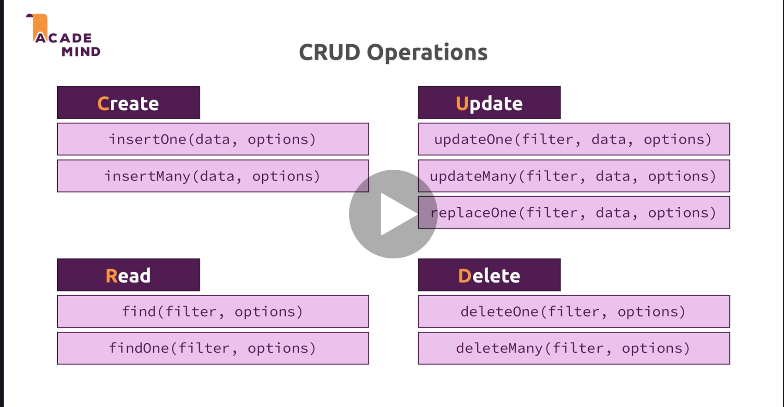

# 02 `CRUD`

## `BSON`

`B`inary `JSON`.

**Mongo DB** utilise le `BSON` et non le `JSON` pour stocker ses documents.

`ObjectId("6037afc144532e2e4de65980")` est une valeur `BSON` ajoutée automatiquement à chaque enregistrement.

Dans le `shell`, on écrit du javascript (pas d'obligation de guillemets pour les clés) qui sera traduis automatiquement en `BSON`.

```js
db.flightData.insertOne({departureAirport: "TXL", arrivalAirport: "LHR"})
```

On enregistre :

```bash
{
	"_id" : ObjectId("6037afc144532e2e4de65980"),
	"departureAirport" : "TXL",
	"arrivalAirport" : "LHR"
}
```

## `_id`

On peut donner sa propre valeur explicite à `_id`.

```js
db.flightData.insertOne({departureAirport: "TXL", arrivalAirport: "LHR", _id: "txl-lhr-01"})
```

```bash
{
	"_id" : "txl-lhr-01",
	"departureAirport" : "TXL",
	"arrivalAirport" : "LHR"
}
```

`_id` est obligatoire et unique, si on introduit deux documents avec le même `_id` 

on lève une erreur `duplicate key _id` :

```bash
WriteError({
	"index" : 0,
	"code" : 11000,
	"errmsg" : "E11000 duplicate key error collection: flights.flightData index: _id_ dup key: { _id: \"txl-lhr-01\" }",
	"op" : {
		"departureAirport" : "TXL",
		"arrivalAirport" : "LHR",
		"_id" : "txl-lhr-01"
	}
}) :
```


## Basic `crud`



## `deleteOne` et `deleteMany` : `(<filter>)`

```js
db.flightData.deleteOne({_id: "txl-lhr-01"})
```

```bash
{ "acknowledged" : true, "deletedCount" : 1 }
```

Le critère de sélection est aussi un `document` et il est placé entre accolades.

```js
db.flightData.deleteMany()
```

```bash
uncaught exception: Error: find() requires query criteria :
Bulk/this.find@src/mongo/shell/bulk_api.js:796:23
DBCollection.prototype.deleteMany@src/mongo/shell/crud_api.js:420:20
@(shell):1:1
```

On ne peut pas utiliser `deleteMany` sans ajouter un critère de sélection.

```bash
> db.flightData.deleteMany({marker: "ToDelete"})
{ "acknowledged" : true, "deletedCount" : 2 }
> db.flightData.find().pretty()
```

Si on n'avait pas de critère, on aurait pu écrire :

```bash
> db.flightData.deleteMany({})
```


## `updateOne` et `updateMany` : 

## `(<filter>, <new Content>)`

```js
db.flightData.updateOne({distance: 12000}, {marker: "deleted"})
```

```bash
uncaught exception: Error: the update operation document must contain atomic operators :
DBCollection.prototype.updateOne@src/mongo/shell/crud_api.js:565:19
@(shell):1:1
```

Il faut un opérateur pour indiquer à **Mongo** ce qu'il doit faire avec la nouvelle valeur.

Les opérateurs commencent par `$`.

```js
db.flightData.updateOne({distance: 12000}, {$set: {marker: "deleted"}})
```

```bash
{ "acknowledged" : true, "matchedCount" : 1, "modifiedCount" : 1 }
```

On vient d'ajouter un champs `marker`.

```js
db.flightData.updateMany({},{$set: {marker: "ToDelete"}})
```

Le critère peut être un `document` vide pour sélectionner tous les `documents`.

```bash
{ "acknowledged" : true, "matchedCount" : 2, "modifiedCount" : 2 }
```

Comme nous avons deux `documents` dans notre `collection`, deux `documents` ont été modifiés.


## `update(<filter>,<new Document>)`

```js
db.flightData.update({_id:ObjectId("6037bf2d44532e2e4de65982")},{$set:{delayed:false}})

WriteResult({ "nMatched" : 1, "nUpserted" : 0, "nModified" : 1 })
```

`update` fonctionne un peu comme `updateMany` à la différence que `update` accepte un objet de remplacement en deuxième argument :

```bash
> db.flightData.update({_id:ObjectId("6037bf2d44532e2e4de65982")},{delayed:true})
WriteResult({ "nMatched" : 1, "nUpserted" : 0, "nModified" : 1 })

> db.flightData.find().pretty()
{ "_id" : ObjectId("6037bf2d44532e2e4de65982"), "delayed" : true }
{
	"_id" : ObjectId("6037bf2d44532e2e4de65983"),
	"departureAirport" : "LHR",
	"arrivalAirport" : "TXL",
	"aircraft" : "Airbus A320",
	"distance" : 950,
	"intercontinental" : false
}
```

On voit que l'objet n'a conservé que son `_id` et que tout le reste a été remplacé.

Pour cette raison il est plutôt conseillé d'utiliser `updateOne` ou `updateMany` qui n'accepte pas de remplacer la totalité du document (obligation d'un opérateur `$set`).


## `replaceOne(<filter>, <new Document>)`

Identique à `update` mais plus explicite :

```bash
> db.flightData.replaceOne({_id:ObjectId("6037bf2d44532e2e4de65982")},{
...     "departureAirport": "MUC",
...     "arrivalAirport": "SFO",
...     "aircraft": "Airbus A380",
...     "distance": 12000,
...     "intercontinental": true
...   })
{ "acknowledged" : true, "matchedCount" : 1, "modifiedCount" : 1 }
```
```bash
> db.flightData.find().pretty()
{
	"_id" : ObjectId("6037bf2d44532e2e4de65982"),
	"departureAirport" : "MUC",
	"arrivalAirport" : "SFO",
	"aircraft" : "Airbus A380",
	"distance" : 12000,
	"intercontinental" : true
}
{
	"_id" : ObjectId("6037bf2d44532e2e4de65983"),
	"departureAirport" : "LHR",
	"arrivalAirport" : "TXL",
	"aircraft" : "Airbus A320",
	"distance" : 950,
	"intercontinental" : false
}
```


## `insertMany(<Array>)`

```bash
> db.flightData.insertMany([
...   {
...     "departureAirport": "MUC",
...     "arrivalAirport": "SFO",
...     "aircraft": "Airbus A380",
...     "distance": 12000,
...     "intercontinental": true
...   },
...   {
...     "departureAirport": "LHR",
...     "arrivalAirport": "TXL",
...     "aircraft": "Airbus A320",
...     "distance": 950,
...     "intercontinental": false
...   }
... ])
{
	"acknowledged" : true,
	"insertedIds" : [
		ObjectId("6037bf2d44532e2e4de65982"),
		ObjectId("6037bf2d44532e2e4de65983")
	]
}
```

On passe un tableau de documents à `insertMany`.

Les `ObjectId` sont créés par **Mongo DB**.


## `find([<filter>])` et `findOne(<filter>)`

On peut ajouter un critère à `find` pour filtrer les documents :

```bash
> db.flightData.find({intercontinental: true}).pretty()
{
	"_id" : ObjectId("6037bf2d44532e2e4de65982"),
	"departureAirport" : "MUC",
	"arrivalAirport" : "SFO",
	"aircraft" : "Airbus A380",
	"distance" : 12000,
	"intercontinental" : true
}
```

Ou encore :

```js
db.flightData.find({distance: 12000}).pretty()
```

### Opérateurs de comparaison `$gt` et `$lt`

```bash
> db.flightData.find({distance: {$gt: 10000}}).pretty()
{
	"_id" : ObjectId("6037bf2d44532e2e4de65982"),
	"departureAirport" : "MUC",
	"arrivalAirport" : "SFO",
	"aircraft" : "Airbus A380",
	"distance" : 12000,
	"intercontinental" : true
}
```

Si on modifie le critèe de `distance` :

```bash
> db.flightData.find({distance: {$gt: 900}}).pretty()
{
	"_id" : ObjectId("6037bf2d44532e2e4de65982"),
	"departureAirport" : "MUC",
	"arrivalAirport" : "SFO",
	"aircraft" : "Airbus A380",
	"distance" : 12000,
	"intercontinental" : true
}
{
	"_id" : ObjectId("6037bf2d44532e2e4de65983"),
	"departureAirport" : "LHR",
	"arrivalAirport" : "TXL",
	"aircraft" : "Airbus A320",
	"distance" : 950,
	"intercontinental" : false
}
```

On récupère cette fois deux `documents`.

Pour ne sélectionner que le premier on utilise `findOne`.

```bash
> db.flightData.findOne({distance: {$gt: 900}})
{
	"_id" : ObjectId("6037bf2d44532e2e4de65982"),
	"departureAirport" : "MUC",
	"arrivalAirport" : "SFO",
	"aircraft" : "Airbus A380",
	"distance" : 12000,
	"intercontinental" : true
}
```

> ! `findOne` ne supporte pas `pretty`, cela lève une erreur.


## `cursor`

Si on a un nombre élevé de `documents`, `find` ne renvoie pas tous les `documents` mais un `cursor` :

```bash
# ...
{
	"_id" : ObjectId("6038b4af44532e2e4de65997"),
	"name" : "Albert Twostone",
	"age" : 68
}
Type "it" for more
```

```bash
> it
{
	"_id" : ObjectId("6038b4af44532e2e4de65998"),
	"name" : "Gordon Black",
	"age" : 38
}
```


Un `cursor` est un objet sur lequel on peut boucler (itérer) pour récupérer tous les `documents`.

Le `Mongo DB Shell` renvoie les `20` premiers documents.

Pour avoir la totalité des `documents`, on utilise `toArray()` :

```bash
> db.passengers.find().pretty().toArray()

[
	{
		"_id" : ObjectId("6038b4af44532e2e4de65984"),
		"name" : "Max Schwarzmueller",
		"age" : 29
	},
	# ...
	{
		"_id" : ObjectId("6038b4af44532e2e4de65998"),
		"name" : "Gordon Black",
		"age" : 38
	}
]
```

`Gordon Black` est bien le dernier `document` de la `collection`.

### `forEach`

Pour itérer sur toute la collection on peu utiliser la fonction `forEach` :

```bash
db.passengers.find().forEach(doc => printjson(doc))
```

`printjson` est une fonction `built-in` du `Mongo Shell`.

### ! `find` renvoie un `cursor` et pas les éléments eux-même.

`forEach` est une manière efficace de traiter un grand nombre de `documents` car il les traîte un par un sans surcharger la mémoire.

`findOne` en comparaison renvoie un `document`, `pretty` étant une méthode de `cursor`, ne fonctionne pas avec `findOne`.


## Projection

Permet de renvoyer certain champs uniquement des documents.

```js
> db.passengers.find({},{name: 1}).pretty()
{
	"_id" : ObjectId("6038b4af44532e2e4de65984"),
	"name" : "Max Schwarzmueller"
}
{ "_id" : ObjectId("6038b4af44532e2e4de65985"), "name" : "Manu Lorenz" }
{ "_id" : ObjectId("6038b4af44532e2e4de65986"), "name" : "Chris Hayton" }
{ "_id" : ObjectId("6038b4af44532e2e4de65987"), "name" : "Sandeep Kumar" }
{ "_id" : ObjectId("6038b4af44532e2e4de65988"), "name" : "Maria Jones" }
// ...
```

`{}` sélectionne tous les documents (pas de filtre).

`{name: 1}` crée une `projection` de `name`.

On récupère seulement le champ `name` et l'`_id`.

Par défaut l'`_id` est incluse dans la `projection`.

On peut exclure explicitement un champ en lui donnant la valeur zéro dans la projection :

### `db.passengers.find({},{name: 1, _id: 0}).pretty()`

```js
> db.passengers.find({},{name: 1, _id: 0}).pretty()
{ "name" : "Max Schwarzmueller" }
{ "name" : "Manu Lorenz" }
{ "name" : "Chris Hayton" }
{ "name" : "Sandeep Kumar" }
{ "name" : "Maria Jones" }
// ...
```


## `Documents` imbriqués et `Tableau`

On a une limite de `100` niveaux d'imbrications des documents.

Un `document` ne peut pas excéder `16mb`.

On peut aussi avoir des tableaux.

### `embedded document`

On peut imbriquer des documents entre eux :

```js
> db.flightData.updateMany({},{$set: {status: {description: "on-time",lastUpdated:"1 hour ago"}}})
{ "acknowledged" : true, "matchedCount" : 2, "modifiedCount" : 2 }
```

```js
> db.flightData.find().pretty()
{
	"_id" : ObjectId("6037bf2d44532e2e4de65982"),
	"departureAirport" : "MUC",
	"arrivalAirport" : "SFO",
	"aircraft" : "Airbus A380",
	"distance" : 12000,
	"intercontinental" : true,
	"status" : {
		"description" : "on-time",
		"lastUpdated" : "1 hour ago"
	}
}
{
	"_id" : ObjectId("6037bf2d44532e2e4de65983"),
	"departureAirport" : "LHR",
	"arrivalAirport" : "TXL",
	"aircraft" : "Airbus A320",
	"distance" : 950,
	"intercontinental" : false,
	"status" : {
		"description" : "on-time",
		"lastUpdated" : "1 hour ago"
	}
}
```


### `Array`

```js
> db.passengers.updateOne({"name" : "Klaus Arber"},{$set: {hobbies:["cooking","gymnastique"]}})
{ "acknowledged" : true, "matchedCount" : 1, "modifiedCount" : 1 }
```

```js
{
	"_id" : ObjectId("6038b4af44532e2e4de65996"),
	"name" : "Klaus Arber",
	"age" : 53,
	"hobbies" : [
		"cooking",
		"gymnastique"
	]
}
```


### Accès aux données

`findOne` ne renvoie pas un `cursor` mais un document, on peut donc accéder aux éléments d'un `tableau` comme ceci :

```js
> db.passengers.findOne({"name" : "Klaus Arber"}).hobbies
[ "cooking", "gymnastique" ]
```

### Filtrer avec un élément de `tableau`

`Mongo` est suffisamment intélligent pour comprendre qu'un champ de filtre est un `tableau` et que l'élément à chercher est une valeur de ce tableau :

```js
> db.passengers.find({hobbies: "cooking"}).pretty()
{
	"_id" : ObjectId("6038b4af44532e2e4de65996"),
	"name" : "Klaus Arber",
	"age" : 53,
	"hobbies" : [
		"cooking",
		"gymnastique"
	]
}
```


### Filtrer un document imbriqué

```js
> db.flightData.find({status.description:"on-time"}).pretty()
uncaught exception: SyntaxError: missing : after property id :
@(shell):1:26
```

En fait lorsqu'on recherche un champ imbriqué dans un autre `document`, on doit entourer l'ensemble `document.champ` avec des guillemets (double ou simple).

```js
> db.flightData.find({'status.description':"on-time"}).pretty()
{
	"_id" : ObjectId("6037bf2d44532e2e4de65982"),
	"departureAirport" : "MUC",
	"arrivalAirport" : "SFO",
	"aircraft" : "Airbus A380",
	"distance" : 12000,
	"intercontinental" : true,
	"status" : {
		"description" : "on-time",
		"lastUpdated" : "1 hour ago"
	}
}
{
	"_id" : ObjectId("6037bf2d44532e2e4de65983"),
	"departureAirport" : "LHR",
	"arrivalAirport" : "TXL",
	"aircraft" : "Airbus A320",
	"distance" : 950,
	"intercontinental" : false,
	"status" : {
		"description" : "on-time",
		"lastUpdated" : "1 hour ago"
	}
}
```

#### ! `"document.champ"` entre guillemets.

On peut continuer la chaîne si besoin : `"document1.document2.champ":"valeur"`


### Modifier un tableau et un document

```js
db.patients.updateOne(
    { firstName: 'Michel' },
    {
        $set: {
            age: 99,
            lastName: 'DRUCKER',
        },
        $push: { history: { disease: 'warm', treatment: 'water' } },
    }
)
```

#### `$push: { history: { disease: 'warm', treatment: 'water' } },`


### Sélectionner un `document` dans un `tableau`

```js
> db.patients.deleteMany({history: {$elemMatch: {disease: "cold"}}})
{ "acknowledged" : true, "deletedCount" : 2 }
```

#### `{arrayName: {$elemMatch: {key: value}}}`

Syntaxe alternative

```js
db.patients.deleteMany({"history.disease": "cold"})
```


## résumé


