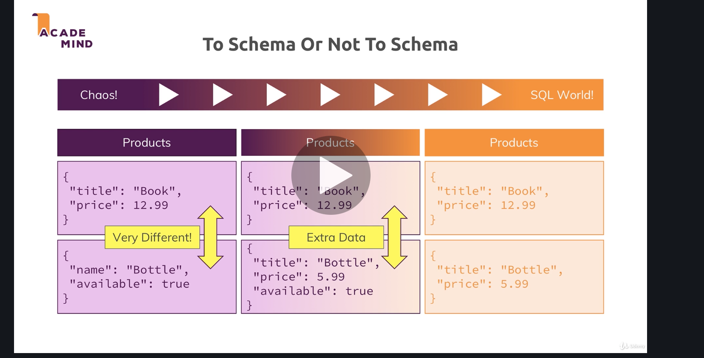
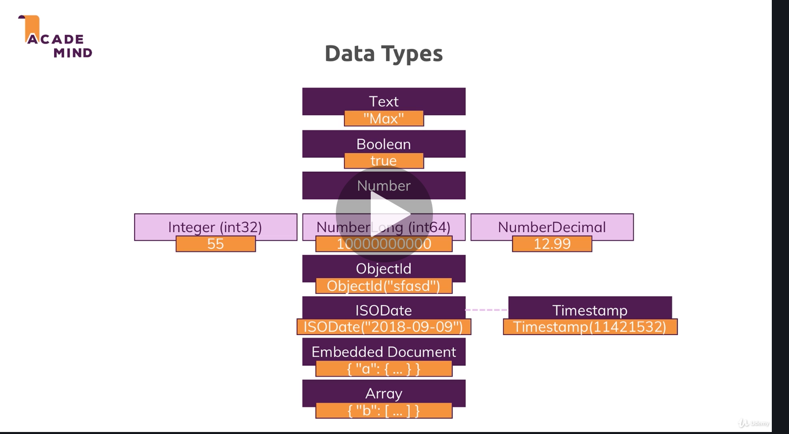
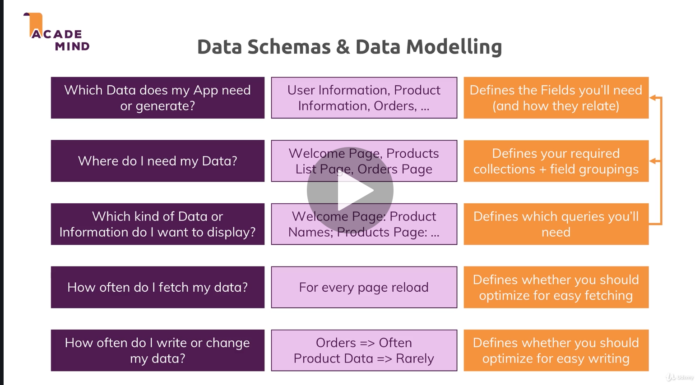
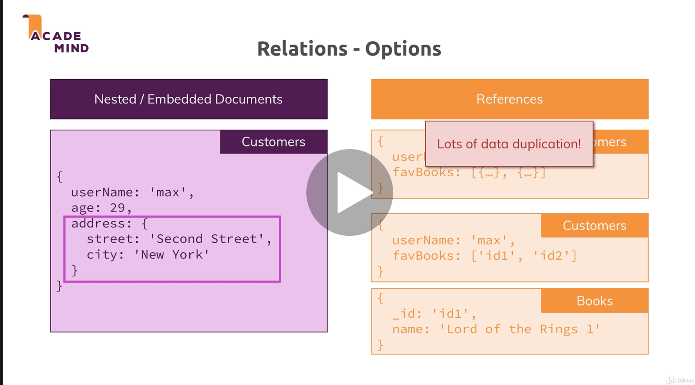
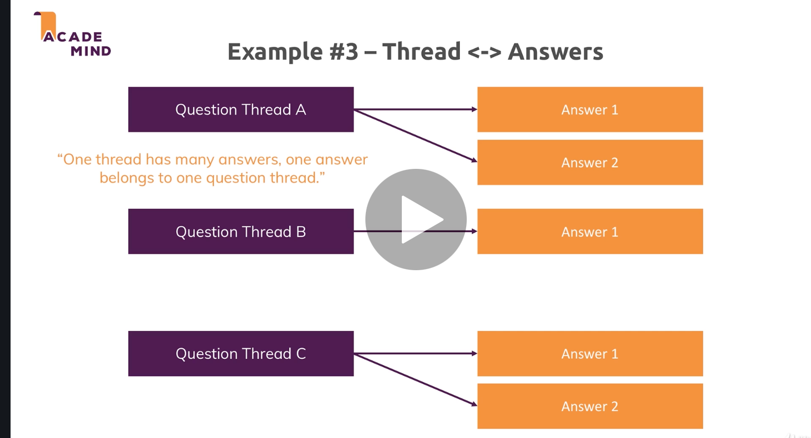
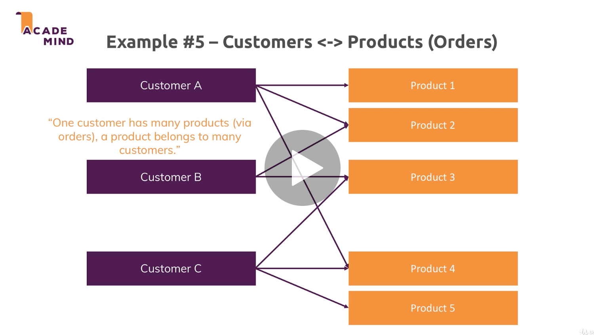
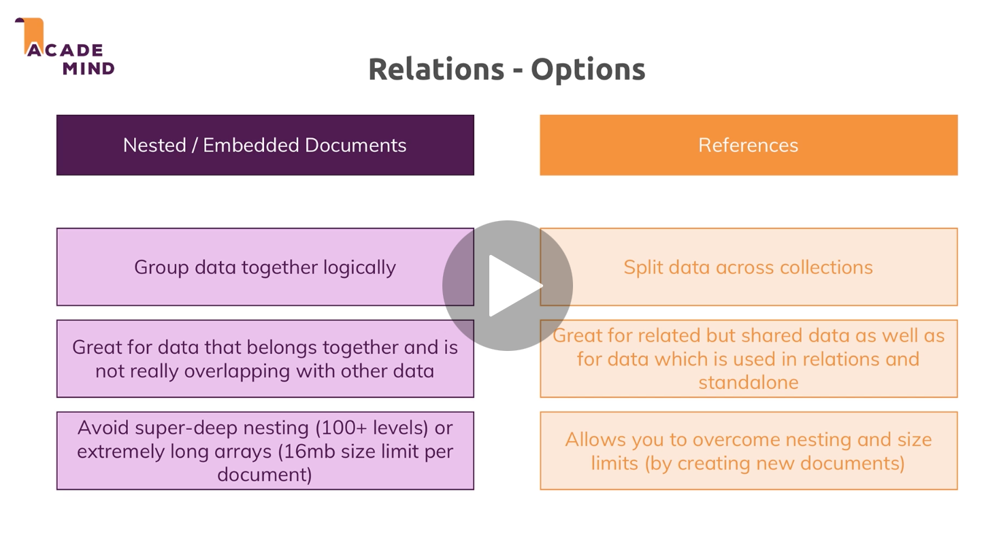
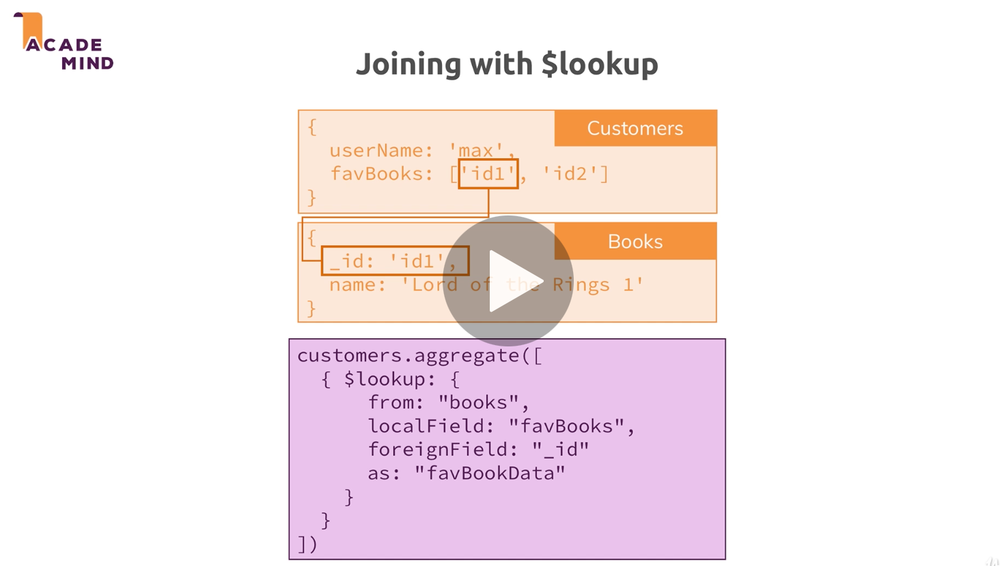

# 03 Schémas et relations

## Mettre à zéro une base de données

```bash
use databaseName
db.myCollection.drop()
db.dropDatabase()
```


## Schema

De base, `Mongo DB` n'impose pas de schémas :

```js
> use shop
switched to db shop
> db.products.insertOne({name: "Book", price: 8.99})
{
	"acknowledged" : true,
	"insertedId" : ObjectId("603fa4fdbabd17fd31ac7d16")
}
> db.products.insertOne({title: "t-shirt", description: {size:"l", color:"blue"}})
{
	"acknowledged" : true,
	"insertedId" : ObjectId("603fa55bbabd17fd31ac7d17")
}
> db.products.find().pretty()
{
	"_id" : ObjectId("603fa4fdbabd17fd31ac7d16"),
	"name" : "Book",
	"price" : 8.99
}
{
	"_id" : ObjectId("603fa55bbabd17fd31ac7d17"),
	"title" : "t-shirt",
	"description" : {
		"size" : "l",
		"color" : "blue"
	}
}
```

Ici les deux `documents` ont des schémas totalement différents.

En pratique il peut être intéressant de forcer un `schémas` par exemple pour être sûr d'avoir un prix.

## Structurer les documents

On a un dégradé de possibilités pour structurer ses `documents`, du plus chaotique au plus ordonné :



Si on veut suivre une structure rigide comme avec les bases de données SQL, on peut mettre un champs à `null` :

```js
> db.products.find().pretty()
{
	"_id" : ObjectId("603fbaa2babd17fd31ac7d18"),
	"name" : "T-shirt",
	"price" : 9.99,
	"details" : null
}
{
	"_id" : ObjectId("603fbac6babd17fd31ac7d19"),
	"name" : "Intel computer",
	"price" : 1027.99,
	"details" : {
		"cpu" : 4,
		"ram" : 16
	}
}
{
	"_id" : ObjectId("603fbae3babd17fd31ac7d1a"),
	"name" : "Cooking blender",
	"price" : 78.9,
	"details" : null
}
```

Le style plus `Mongo DB` serait ne ne pas enregistre les champs `null`:

```js
> db.products.find().pretty()
{
	"_id" : ObjectId("603fbaa2babd17fd31ac7d18"),
	"name" : "T-shirt",
	"price" : 9.99
}
{
	"_id" : ObjectId("603fbac6babd17fd31ac7d19"),
	"name" : "Intel computer",
	"price" : 1027.99,
	"details" : {
		"cpu" : 4,
		"ram" : 16
	}
}
{
	"_id" : ObjectId("603fbae3babd17fd31ac7d1a"),
	"name" : "Cooking blender",
	"price" : 78.9
}
```

C'est ce que permet une approche `schema-less`.


## Les `types`



`text` est seulement limité par la taille maximum d'un `document` : `16mb`

`number` est par défaut un type `double` : `float64`

`Objectid` est ordonnable car utilise un `timestamp`

`Timestamp` deux documents d'une collection ne peuvent pas avoir le même `Timestamp`

### Exemple

```js
> db.companies.insertOne({name: "Fresh Apples Inc", isStartup: true, employees: 32,funding: 23454321766543678, details: {ceo: "Hukar"}, tags: ["hey","yo!","tiling", {mark: "hollé"}], foundingDate: new Date(), insertedAt: new Timestamp()})
```

```js
> db.companies.find().pretty()
{
	"_id" : ObjectId("6040f43fbabd17fd31ac7d1b"),
	"name" : "Fresh Apples Inc",
	"isStartup" : true,
	"employees" : 32,
	"funding" : 23454321766543680,
	"details" : {
		"ceo" : "Hukar"
	},
	"tags" : [
		"hey",
		"yo!",
		"tiling",
		{
			"mark" : "hollé"
		}
	],
	"foundingDate" : ISODate("2021-03-04T14:52:47.462Z"),
	"insertedAt" : Timestamp(1614869567, 1)
}
```

On remarque les types `ISODate` et `Timestamp` obtenus à l'aide de `new Date()` et `new Timestamp()` dans le `shell`.

`Timestamp` est en millisecondes.

La `Date` est décalé d'une heure par rapport à l'heure de Bruxelles. Le `z` à la fin signifie `UTC`.

> Le **temps universel coordonné** ou **UTC** (en anglais, coordinated universal time) est une [échelle de temps](https://fr.wikipedia.org/wiki/Échelle_de_temps) adoptée comme base du temps civil international par la majorité des [pays du globe](https://fr.wikipedia.org/wiki/Liste_des_États_du_monde_par_continent).

### ! Aux nombres

`23454321766543678` transmis dans le `shell`

`23454321766543680` enregistré dans `Mongo DB`

Avec les nombres à virgule flottante (type par défaut des nombres dans le `shell`), nous avons des valeurs approchées, pas exact.

## Statistique de la DB : `db.stats()`

```js
> db.stats()
{
	"db" : "companies",
	"collections" : 1,
	"views" : 0,
	"objects" : 2,
	"avgObjSize" : 240,
	"dataSize" : 480,
	"storageSize" : 36864,
	"indexes" : 1,
	"indexSize" : 36864,
	"totalSize" : 73728,
	"scaleFactor" : 1,
	"fsUsedSize" : 51080216576,
	"fsTotalSize" : 499963174912,
	"ok" : 1
}
```

### Taille d'un nombre

```js
> db.numbers.insertOne({a: 1})
{
	"acknowledged" : true,
	"insertedId" : ObjectId("6040f814babd17fd31ac7d1d")
}
> db.stats()
{
	"db" : "companies",
	"collections" : 1,
	"views" : 0,
	"objects" : 1,
	"avgObjSize" : 33,
	"dataSize" : 33,
	"storageSize" : 4096,
	"indexes" : 1,
	"indexSize" : 4096,
	"totalSize" : 8192,
	"scaleFactor" : 1,
	"fsUsedSize" : 51083296768,
	"fsTotalSize" : 499963174912,
	"ok" : 1
}
```

`"avgObjSize" : 33,` avec le type par défaut (`double`).

Je peux spécifier explicitement un type `int32` avec `NumberInt(nb)` :

```js
> db.numbers.insertOne({a: NumberInt(1)})
{
	"acknowledged" : true,
	"insertedId" : ObjectId("6040f8acbabd17fd31ac7d1e")
}
> db.stats()
{
	"db" : "companies",
	"collections" : 1,
	"views" : 0,
	"objects" : 1,
	"avgObjSize" : 29,
	"dataSize" : 29,
	"storageSize" : 20480,
	"indexes" : 1,
	"indexSize" : 20480,
	"totalSize" : 40960,
	"scaleFactor" : 1,
	"fsUsedSize" : 51085799424,
	"fsTotalSize" : 499963174912,
	"ok" : 1
}
```

`"avgObjSize" : 29,` la taille en mémoire est plus petite.

On a aussi `NumberLong` pour un `int64`.

Si on veut un nombre à virgule de haute précision on peut utiliser `NumberDecimal("12.98")`.


## Data Schema et Data Modelling



Définir les données ainsi que les requêtes permet de construire les structures de données les plus efficaces pour son application.


## Relations

On peut choisir d'imbriquer les données (comme pour une adresse) ou de les relier par référence :



Si l'objet imbriqué est présent dans de nombreux `documents` et qu'on désire pouvoir le modifier, il est peut être nécessaire de le lier par référence aux `documents` parents.


## One To One => `embedded`

### Avec référence :

Un patient et son traitement sont enregistrés dans deux collections différentes et reliés par référence :

```js
// db.patients
{
	"_id" : ObjectId("6041c678babd17fd31ac7d1f"),
	"name" : "Toto Lacrevette",
	"traitment" : "tr-01"
}

// db.traitment
{ 
  	"_id" : "tr-01", 
    "history" : [ "cold", "indigest", "buttons" ] 
}
```


```js
// retrouver l'id du traitement
> var trId = db.patients.findOne({name:"Toto Lacrevette"}).traitment
> trId
tr-01

// retrouver le traitement
> db.traitment.findOne({_id: trId})
{ "_id" : "tr-01", "history" : [ "cold", "indigest", "buttons" ] }
```

Si on a besoin d'effectuer des analyses sur deux entités en relation `One To One` mais de manière séparées, cela peut être une solution.

### En imbriquant :

On peut supprimer une étape (une requête) en imbriquant le traitement dans le `document` patient:

```js
{
	"_id" : ObjectId("6041c8e9babd17fd31ac7d20"),
	"name" : "Toto",
	"traitmentHistory" : {
		"diseases" : [
			"cold",
			"broken leg"
		]
	}
}
```

On obtient les infos sur le patient en une seule requête.


## One To Many

### Avec référence :



```js
> db.question.insertOne({title: "wich technologie you're loving ?", answers: ["q1a1", "q1a2"]})
{
	"acknowledged" : true,
	"insertedId" : ObjectId("60422898babd17fd31ac7d22")
}
```

```js
> db.answers.insertMany([{title: "mongo",_id:"q1a1"},{title: "node js",_id:"q1a2"}])
{ "acknowledged" : true, "insertedIds" : [ "q1a1", "q1a2" ] }
```

### Ville et citoyen

Si la relation implique d'un côté beaucoup d'entrée, on ne peut pas créer un tableau d'`_id` sans se heurter à la limite de `16mb`.

On ne va pas sauver les `_id` de chaque citoyen dans la ville, mais sauver l'`_id` de la ville chez chaque citoyen :

```js
> db.cities.insertOne({name: "Bruxelles"})
{
	"acknowledged" : true,
	"insertedId" : ObjectId("60422b7ababd17fd31ac7d25")
}
```

```js
> db.citizen.insertMany([{name: "Wolf", city: ObjectId("60422b7ababd17fd31ac7d25")},{name: "Sarah", city: ObjectId("60422b7ababd17fd31ac7d25")}])
{
	"acknowledged" : true,
	"insertedIds" : [
		ObjectId("60422bebbabd17fd31ac7d26"),
		ObjectId("60422bebbabd17fd31ac7d27")
	]
}
```


### En imbriquant :

```js
> db.person.find().pretty()
{
	"_id" : ObjectId("604227e6babd17fd31ac7d21"),
	"name" : "Tim",
	"pets" : [
		{
			"name" : "Fifi",
			"specy" : "pig"
		},
		{
			"name" : "rocket",
			"specy" : "chinchila"
		}
	]
}
```

`One To Few` se prête bien à l'imbrication.


## Many To Many



### Copie du modèle relationnel

On peut développer un système en trois `collection` comme en `SQL` classique avec table de jointure :

```js
> db.products.insertOne({label: "bicycle", price: 890.90})
{
	"acknowledged" : true,
	"insertedId" : ObjectId("60422d75babd17fd31ac7d28")
}
```

```js
> db.customers.insertOne({name: "Michel"})
{
	"acknowledged" : true,
	"insertedId" : ObjectId("60422d8fbabd17fd31ac7d29")
}
```

```js
> db.orders.insertOne({customerId: ObjectId("60422d8fbabd17fd31ac7d29"), productId: ObjectId("60422d75babd17fd31ac7d28"), quantity: 3})
{
	"acknowledged" : true,
	"insertedId" : ObjectId("60422dc8babd17fd31ac7d2a")
}
```

Ici la `collection` `orders` joue le rôle de table de jointure avec le champ `quantity` en plus.


### Seulement en deux `collections`

On peut en `Mongo DB` imbriquer les commandes (`orders`) directement dans le client (`customer`) :

```js
> db.customers.updateOne({_id: ObjectId("60422d8fbabd17fd31ac7d29")}, {$set: {orders: [{productId: ObjectId("60422d75babd17fd31ac7d28"), quantity: 55}]}})
{ "acknowledged" : true, "matchedCount" : 1, "modifiedCount" : 1 }
> db.customers.find().pretty()
{
	"_id" : ObjectId("60422d8fbabd17fd31ac7d29"),
	"name" : "Michel",
	"orders" : [
		{
			"productId" : ObjectId("60422d75babd17fd31ac7d28"),
			"quantity" : 55
		}
	]
}
```


### En une `collection` sans références

```js
> db.customers.updateOne({name: "Michel"},{$set: {orders: [{title: "T-shirt", price: 6.99, quantity: 2}]}})
{ "acknowledged" : true, "matchedCount" : 1, "modifiedCount" : 1 }
> db.customers.find().pretty()
{
	"_id" : ObjectId("60422d8fbabd17fd31ac7d29"),
	"name" : "Michel",
	"orders" : [
		{
			"title" : "T-shirt",
			"price" : 6.99,
			"quantity" : 2
		}
	]
}
```

On peut utiliser l'encapsulation complète si :

- On ne doit pas modifié la commande si le produit change
- les commandes sont toujours demandées par client
- S'il n'y a pas de risque de dépasser les `16mb` par exemple si le client achète pour une multinational des fournitures de bureau


### Utiliser les références

Pour des films avec des acteurs, les données sont suscéptibles de changer. Le nom de famille, l'age et l'adresse de l'acteur peut changer.

Si on imbrique l'acteur dans le film, en cas de changement, on devra reporter la modification dans tous les films où cet acteur est présent.

Il est plus simple dans ce cas de référencer les acteurs dans les films :

```js
> db.actors.insertMany([{name: "Tito Bacchato", age: 56},{name: "Renee Mopapa", age: 39}])
{
	"acknowledged" : true,
	"insertedIds" : [
		ObjectId("60423423babd17fd31ac7d2b"),
		ObjectId("60423423babd17fd31ac7d2c")
	]
}
```
```js
> db.movies.insertOne({title: "Ice ice Kiki", actors: [ObjectId("60423423babd17fd31ac7d2b"),ObjectId("60423423babd17fd31ac7d2c")]})
{
	"acknowledged" : true,
	"insertedId" : ObjectId("60423457babd17fd31ac7d2d")
}
```
```js
> db.movies.find().pretty()
{
	"_id" : ObjectId("60423457babd17fd31ac7d2d"),
	"title" : "Ice ice Kiki",
	"actors" : [
		ObjectId("60423423babd17fd31ac7d2b"),
		ObjectId("60423423babd17fd31ac7d2c")
	]
}
```


## Résumé des `Relation`



Les `embedded documents` sont idéal pour grouper la logique des requêtes. il faut faire attention aux limitations.

Les `references` peuvent être utiles pour séparer les données dans des `collections` différentes. Cela permet de dépasser les limitations et il peut arriver, pour des données très changeante, que ce soit la seule solution afin d'éviter beaucoup décriture en modification.


## `$lookup`



L'opérateur `$lookup` va permettre de joindre des `documents` séparés par référence.

Il fait partie de `l'aggregation framework`.

```js
> db.movies.aggregate([
  {$lookup: {
    from: "actors",
    localField: "actors", 
    foreignField: "_id", 
    as : "actorsData"
  }}
]).pretty()
{
	"_id" : ObjectId("60423457babd17fd31ac7d2d"),
	"title" : "Ice ice Kiki",
	"actors" : [
		ObjectId("60423423babd17fd31ac7d2b"),
		ObjectId("60423423babd17fd31ac7d2c")
	],
	"actorsData" : [
		{
			"_id" : ObjectId("60423423babd17fd31ac7d2b"),
			"name" : "Tito Bacchato",
			"age" : 56
		},
		{
			"_id" : ObjectId("60423423babd17fd31ac7d2c"),
			"name" : "Renee Mopapa",
			"age" : 39
		}
	]
}
```

Si le contexte s'y prête, il faut préférer l'imbrication moins coûteuse en performance.

Si nécessaire en cas de référence, on peut utiliser `$lookup`.

Les champs sont renseigné entre guillemets : `"_id"` par exemple.


## Schema Validation

### Créer une `collection` de manière explicite : `db.createCollection()`


