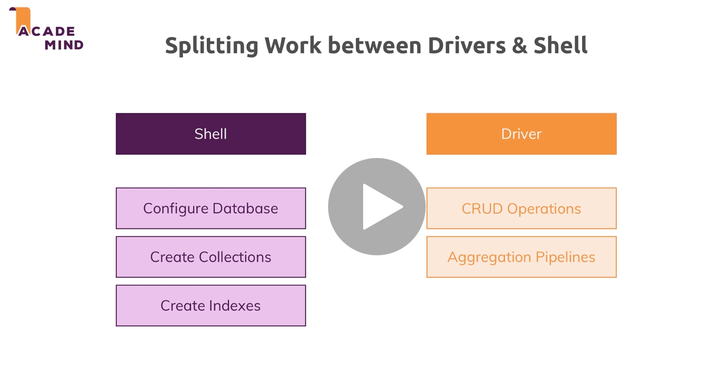

# 04 Driver pour `Node js`

On va plutôt créer et configurer les `collections` et les `indexes` et la `validation` via le `shell`.

Les opérations de `crud` seront plutôt réalisés par le `driver`.

## Préparation

On crée un `cluster` dans `Mongo Atlas`.

Il faut un utilisateur en lecture-écriture seulement.

Il faut vérifier la `white list` pour son `IP`.

`login` : HukarMaxUser

`pwd`: HukarMaxUser99