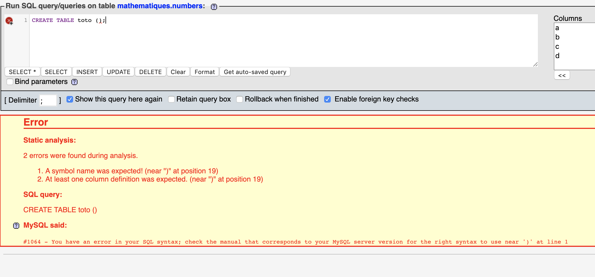

# create table

```sql
CREATE DATABASE [IF NOT EXISTS] sales;
```

```sql
CREATE TABLE table_name ();
```

On doit au moins préciser une colonne



Syntaxe :

```sql
CREATE TABLE table_name (
	column_1 data_ty constraints,
    column_2 data_type constraints,
    ...
    column_n data_type constraints
);
```

Exemple :

```sql
CREATE DATABASE IF NOT EXISTS salesdb;

USE salesdb;

CREATE TABLE sales (
	purchase_number INT NOT NULL PRIMARY KEY AUTO_INCREMENT
);
```

Maintenat ajoutons des colonnes :

```sql
ALTER TABLE sales
ADD (
	date_of_purchase DATE NOT NULL,
    customer_id INT,
    item_code VARCHAR(10) NOT NULL
);
```

## Base de données par défaut

```sql
USE data_base;
SELECT * FROM table_name;
```

### Syntax alternative

On peut aussi relier un objet database avec un objet SQL en utilisant le `dot operator` :

```sql
database_object.sql_object
```

`.` relie les deux objets.

```sql
SELECT * FROM sales.customers
```

## Rappel

Pour effacer une table `DROP`

```sql
DROP TABLE sales;
```

