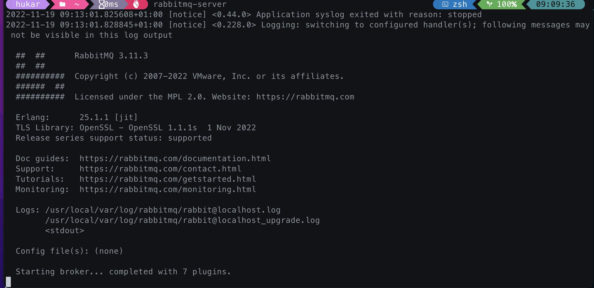

# 01 Installation de `RabbitMQ`

## Sur `MacOS` avec `homebrew`

```bash
brew update

brew install rabbitmq
```

Ensuite pour rendre disponible les commandes on ouvre le fichier `.zshcr` :

```bash
# If you come from bash you might have to change your $PATH.
# export PATH=$HOME/bin:/usr/local/bin:$PATH

# Path to your oh-my-zsh installation.
export ZSH="$HOME/.oh-my-zsh"

# Path for RabbitMQ
export PATH=$PATH:/usr/local/sbin

# ...
```

On y ajoute `export PATH=$PATH:/usr/local/sbin`

On lance ensuite le `server` : `rabbitmq-server`



