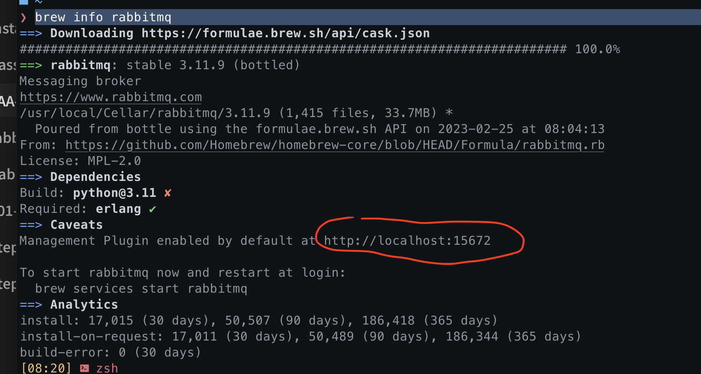
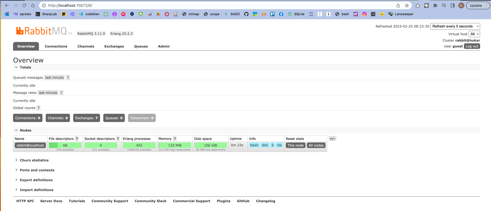
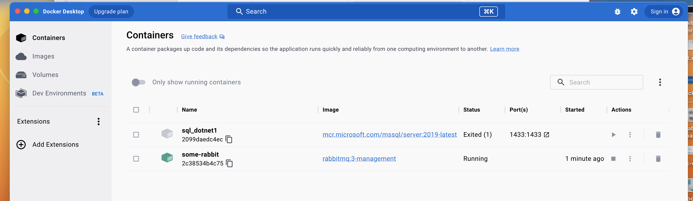
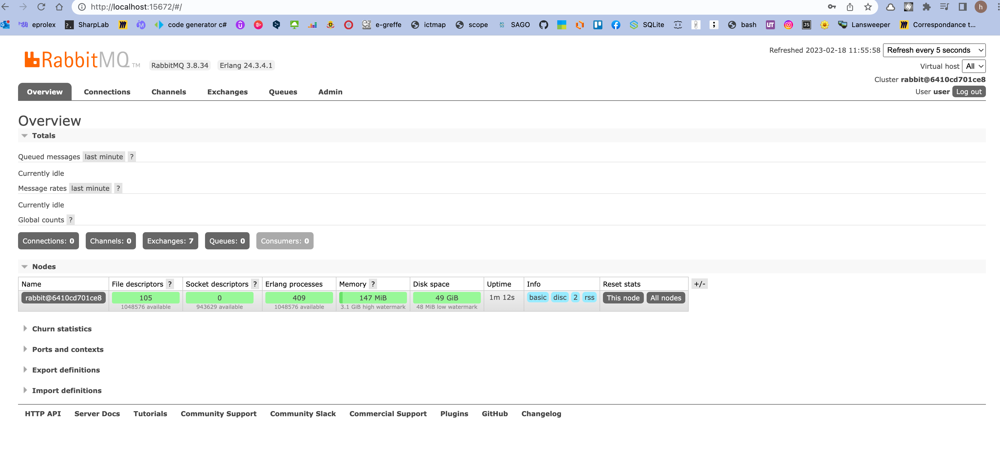
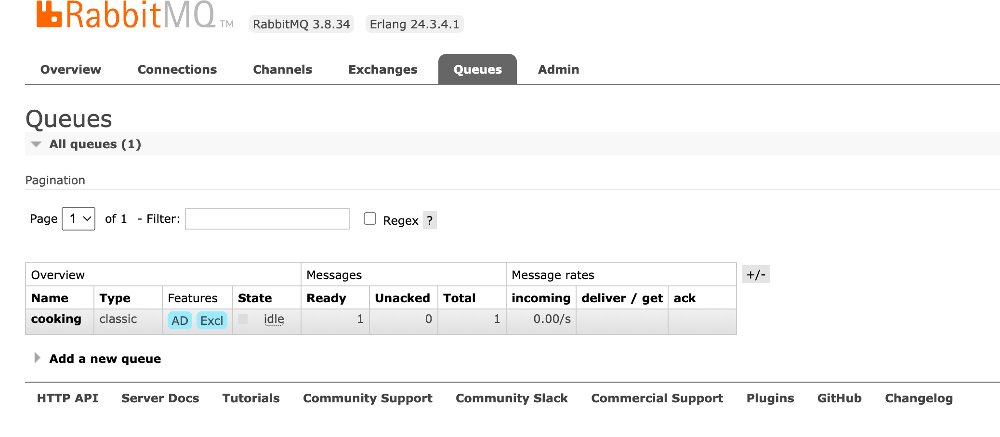
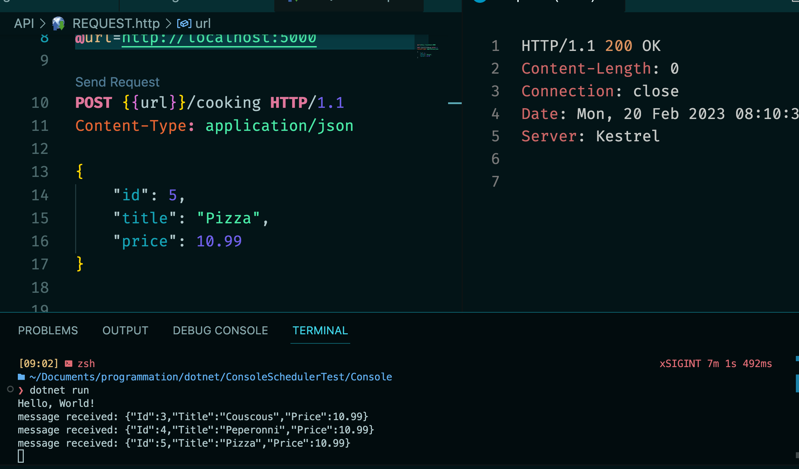

# AA Installation de `RabbitMQ`


## Sur `MacOS` avec `homebrew`

```bash
brew update

brew install rabbitmq
```

Ensuite pour rendre disponible les commandes on ouvre le fichier `.zshcr` :

```bash
# If you come from bash you might have to change your $PATH.
# export PATH=$HOME/bin:/usr/local/bin:$PATH

# Path to your oh-my-zsh installation.
export ZSH="$HOME/.oh-my-zsh"

# Path for RabbitMQ
export PATH=$PATH:/usr/local/sbin

# ...
```

On y ajoute `export PATH=$PATH:/usr/local/sbin`

On lance ensuite le `server` : `rabbitmq-server`


Taper `stop` pour terminer.

On peut aussi utiliser `Homebrew` pour démarrer ou éteindre le service :

```bash
brew services start rabbitmq
```

```bash
brew services stop rabbitmq
```

Pour avoir les `infos` d'installation on tape :

```bash
brew info rabbitmq
```



On récupère ainsi l'`url` de l'intreface `admin` de `rabbitmq`.

User: `guest`

Password: `guest`




## Installation avec `Docker`

Configurer `user` et `password`:

```bash
$ docker run -it --rm --name my-rabbit -p 5672:5672 -p 15672:15672 -e RABBITMQ_DEFAULT_USER=hukar -e RABBITMQ_DEFAULT_PASS=huk@r99_ rabbitmq:3.11-management
```

Si l'image n'est pas présente localement, `docker` la télécharge.



`Docker` a installé la dernière version `3.11.9`.

On se log comme précédemment.


## Installation du `nuget` `RabbitMQ.Client`

```bash
dotnet add package RabbitMQ.Client
```


## Installation de `RabbitMQ` avec `Docker Compose`

Créer un fichier `docker-compose.yml`

```yml
version: '3.8'
services:
  rabbitmq:
  	container_name: "rabbitmq"
  	image: rabbitmq:3.8-management-alpine
  	environment:
  		- RABBITMQ_DEFAULT_USER=user
  		- RABBITMQ_DEFAULT_PASS=mypassword
  	ports:
  		# RabbitMQ instance
  		- '5672:5672'
  		# Web interface
  		- '15672:15672'
```

#### ! n'accepte pas les `tab` mais les `space` (2 par décalage).

 `management` pour avoir l'interface utilisateur

On défini deux `ports`, un pour l'instance de `RabbitMQ` et un pour l'`interface web`.


### Utiliser `docker-compose.yml`

```bash
docker-compose up
```

Cette commande se charge de télécharger tout ce qui est nécessaire (normalement seulement la première fois).

On peut se connecter sur l'interface avec l'`URL` : http://localhost:15672/


Username : `user`

Password : `mypassword`

Une fois loggué:




## Envoyer un `Message` depuis une application `.net`

```cs
using System.Text;
using System.Text.Json;
using RabbitMQ.Client;

namespace ConsoleSchedulerTest;

public class MessageProducer
{
    public void SendingMessage<T>(T message)
    {
        var factory = new ConnectionFactory {
            HostName = "localhost",
            UserName = "user",
            Password = "mypass",
            VirtualHost = "/"
        };

        var conn = factory.CreateConnection();

        using var channel = conn.CreateModel();

        channel.QueueDeclare("cooking", durable: true, exclusive: false);

        var jsonString = JsonSerializer.Serialize(message);
        var body = Encoding.UTF8.GetBytes(jsonString);

        channel.BasicPublish("", "cooking", body: body);
    }
}
```

> #### ! il faut mettre `exclusive` à `false` si on veut utiliser la `queue` dans le programme `Receiver`.

On déclare une `Queue` avec `channel.DeclareQueue` et on envoie un `message` à la `queue` avec `channel.BasicPublish`.

Dans un `endpoint` :

```cs
app.MapPost("cooking", (Cooking cooking, IMessageProducer messageProducer) => {
    messageProducer.SendingMessage<Cooking>(cooking);
});
```



Dans l'`interface` de `RabbitMQ`, on voie qu'une `queue` a été créée et qu'elle a un total de `1 message`.

> Ici on voie que la `queue` est `Excl` : `exclusive`, cela posait des problèmes de partage entre mes deux programmes, je l'ai mis à `false`.

## Recevoir un `Message` dans un programme `Console` :  `.net`

```cs
using System.Text;
using RabbitMQ.Client;
using RabbitMQ.Client.Events;

var factory = new ConnectionFactory
{
    HostName = "localhost",
    UserName = "user",
    Password = "mypass",
    VirtualHost = "/"
};

var conn = factory.CreateConnection();

using var channel = conn.CreateModel();

channel.QueueDeclare("cooking", durable: true, exclusive: false);

var consumer = new EventingBasicConsumer(channel);

consumer.Received += (model, eventArgs) =>
{
    var body = eventArgs.Body.ToArray();

    var message = Encoding.UTF8.GetString(body);

    Console.WriteLine($"message received: {message}");
};

channel.BasicConsume("cooking", true, consumer);

Console.ReadKey();
```

À chaque fois qu'un message est envoyé dans la `Queue`, il est reçut par le programme `console`: 




