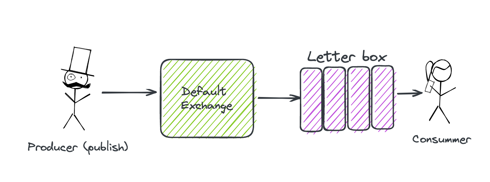

# 01 Introduction

## Terminologie


Une `connection` peut avoir plusieurs `channels`.

Cela isole les messages et préserve les ressources (1 `connection` par `consummer`).


## Exemple en `c#`



```bash
dotnet add package RabbitMQ.Client
```


`Producer` (`Console app`)

```cs
using RabbitMQ.Client;

var factory = new ConnectionFactory { HostName = "localhost" };

using var connection = factory.CreateConnection();
using var channel = connection.CreateModel();

channel.QueueDeclare(
	queue: "letterbox",
    durable: false,
    exclusive: false,
    autoDelete: false,
    arguments: null
);

var message = "This is my first message";

var encodedMessage = Encoding.UTF8.GetBytes(message);

channel.BasicPublish("", "letterbox", null, encodedMessage);

Console.WriteLine($"Published message: {message}");
```

`""` le premier argument représente le `default exchange`.

`ConnectionFactory` a des valeurs par défaut pour le `UserName` et le `Password`:

```cs
public string Password { get; set; } = "guest";
// ...
public string UserName { get; set; } = "guest";
```

On peut bien sûr redéfinir ces valeurs dans la liste d'initialisation:

```cs
var factory = new ConnectionFactory { HostName = "localhost", Password = "huk@r99_", UserName = "hukar" };
```


`Consumer` (`Console app`)

```cs
using RabbitMQ.Client;
using RabbitMQ.Client.Events;

var factory = new ConnectionFactory { HostName = "localhost" };

using var connection = factory.CreateConnection();
using var channel = connection.CreateModel();

channel.QueueDeclare(
	queue: "letterbox",
    durable: false,
    exclusive: false,
    autoDelete: false,
    arguments: null
);

var consumer = new EventingBasicConsumer(channel);

consumer.Received += (model, eventArgs) => {
  var body = eventArgs.Body.ToArray();
    var message = Encoding.UTF8.GetString(body);
    Console.WriteLine($"message received: {message}");
};

channel.BasicConsume(queue: "letterbox", autoAck: true, consumer: consumer);

Console.ReadKey();
```

