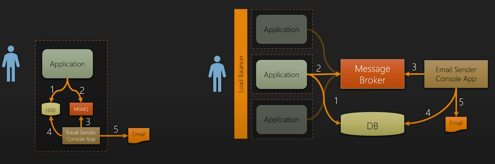
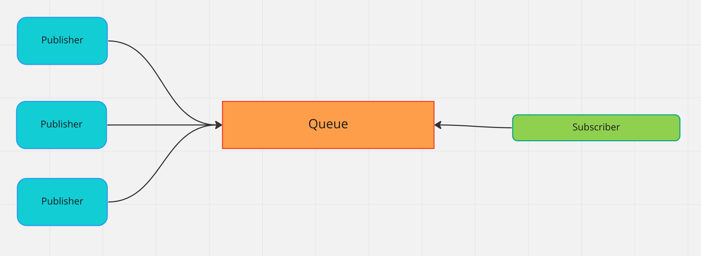
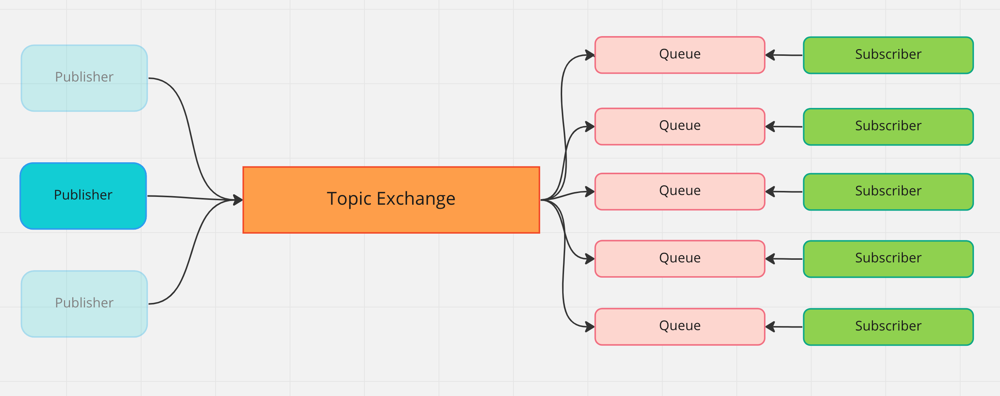
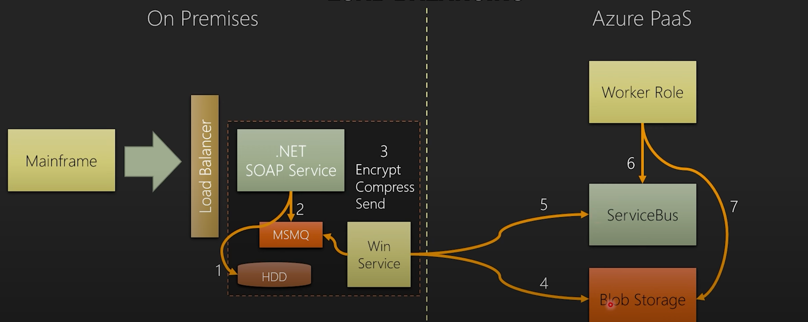
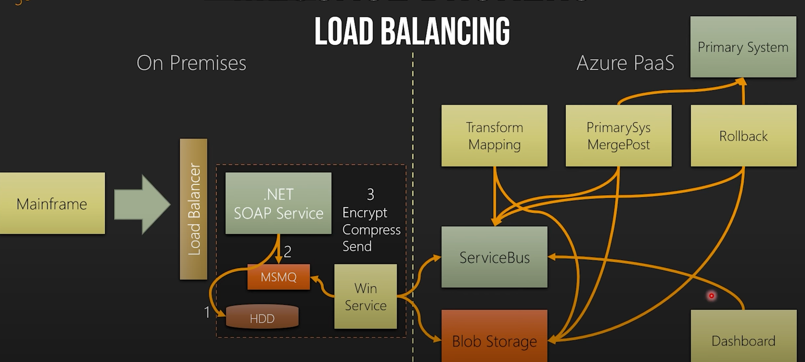

# 01 Présentation de `RabbitMQ` par Shiv Kumat

https://www.youtube.com/watch?v=sPjy97LcCO0&t=1520s&ab_channel=ShivKumar

## Différent type de traitement `asynchrone`

- `Async Background Work`
  Typiquement des `Threads` dans le `background`, pour ne pas bloquer l'`UI Thread` par exemple.
- `Async Fire & Forget`
  On communique avec un `service` (par exemple via `HTTP`) mais on n'est pas intéressé par la `réponse`. On n'attend pas de savoir si le `job` est un `succès` ou non.
- `Async I/O`
  `async/await`, principalement pour communiquer avec le `File System` ou via le `réseau`, communiquer avec l'extérieur.
- `Out-Of-Band Async`
  C'est ici que le `message broker` arrive. C'est un processus à l'extérieur de l'`application`. 

## Envoyer un `email`

`MSMQ` est une `queue` propre à `Windows` et sur la même machine que l'`application`.

Les `messages` envoyés à la `queue` doivent être court car la taille d'une `queue` est limité.

Une `Console Application` est `subscriber` pour cette `queue` et reçoit le `message`.

> De manière générale avec un `message broker`, le message ne doit pas contenir l'ensemble des informations, mais seulement un identifiant permettant au `subscriber` de retrouver ces `données`. Le `subscriber` a aussi accès à la `DB`.

On a pas besoin de bloquer notre `application` juste pour envoyer un `email`.

Cette tâche peux prendre un certain temps, elle peut échouer, l'`application` principale ne doit pas être dépendante de cette action. C'est une tâche asynchrone `out-of-band`.

Si on veut envoyer `10 000` `emails`, on envoie seulement `10 000 messages` au `message broker` ce qui est quasi immédiat, la `Console app subscriber` pourra alors gérer chaque `demande` de manière `asynchrone` sans que cela ralantisse l'`application`.

Dans le second modèle on sépare la `queue` de l'`application` pour en faire un `service` autonome.

La `Console App` peut ou non tournée en continue, ou bien tournée par moment via un `scheduler`.

## Quelque `Message Brokers`

- `MSMQ`
- `RabbitMQ`
- `Azure Queues`
- `Azure Service Bus`
- `Amazon MQ & SQS`
- `Apache Kafka`
- `IBM MQ`

## Message Brokers  : `Queues`

"Courtiers en messages"

Le `subscriber` n'est pas forcement `online` lorsque le `publisher` envoie un message dans la `Queue`.

C'est une action `asynchrone`.

Cela permet de découpler complètement le `publisher` du `subscriber`.

## Competing subscribers

Il y a une seule `Queue` avec plusieurs `subscriber`.

Les `subscribers` peuvent être plusieurs instances du même programme.

Ce pattern permet de vider la `Queue` rapidement.

Deux `subscribers` ne peuvent pas avoir le même message, si un `subscriber` prend un message, un autre `subscriber` aura le suivant.

## `Queues` et `Topics`

Chaque `subscriber` a sa propre `queue`, ce système est proche du fonctionnement un `email` où chaque `queue` est en quelque sorte une boite mail.

Contrairement au `pattern competing subscribers` où chaque message n'est vue que par un et un seul `subscriber`, ici chaque `subscriber` abonné à une queue voit tous ses messages indépendament de ce que font les autres.

## Exemple de l'encodage des fichiers sur `Youtube`

`4` est un `subscriber` qui est abonné au `FileReceivedTopic`, il va charger le fichier sur un `storage` externe et envoyer  (publié : `publisher`) un message au `Transcode Topic`.

Ce `subscriber` fonctionne sur la machine cliente.

Dans ce schéma on a un mélange de `Competing Subscribers` (les `transcoder`) et de `Topic Exchange`.

## `Mainframe` scénario

Le `mainframe` envoie des groupes de données importants en taille. L'encryption, la compression et l'envoie peut prendre beaucoup de temps au service `SOAP` utilisant ses propres `Thread`.

On peut décharger le service `SOAP` en utilisant une `Queue` :

Le service `SOAP` dépose les données sur le `HDD` et envoie un message à `MSMQ` ensuite un `Windows Service` encrypte, compresse et envoie vers `Azure` les données déposées sur le `HDD`. On fait les choses à la fois `asynchronously` et `out-of-band`.

En réalité sur la partie `Azure` on a une plus grande complexité, il y a aussi un `Dashboard` permettant de suivre les différent traitement sur les données.

Chaque `Worker` va chercher les données sur `Blob Storage`, les traite et les remet sur `Blob Storage` pour le prochain `Worker` en déposant au passage un nouveau message sur `ServiceBus`.

## Scénario des `Logs` (`Load Leveling`)

Plusieurs applications publient leur `logs` à un système centralisé d'analyse de `Logs`.

`MSMQ` a une limite du nombre de message. Si `RabbitMQ` est `HS` un certain nombre de temps, cela peut poser un problème.

Un `Windows Service ` va copier le `log` sur un `HDD` et désengorger la `MSMQ`. En cas de panne de `RabbitMQ`, le `Windows Service` pourra renvoyer les `logs` enregistrés sur le `HDD`.

Une `Queue` comme `RabbitMQ` supporte une charge de message énorme, pas la `DB`.

Utiliser `RabbitMQ` permet d'aplanir la charge sur la `DB` : `LOAD LEVELING`.

On ralentit ainsi l'arrivée des messages sur la `DB`, on crée un entonnoir avec un seul `Event Subscriber`.

On peut ajouter des `Event Subscriber` pour augmenter le débit ou en supprimer. On gère le débit vers la `DB`.

L'utilisation d'une `Queue` avec un seul `Subscriber` conserve la séquence des événements et l'ordre peut être respectée lors de l'enregistrement en `DB`.

## Les options de livraison du `message`

### `Receive and Delete` 

C'est le plus rapide, mais si le `subscriber` crash, le message est perdu.

### `Peek/Lock` 

Si un `subscriber` *peek* (regarde) un message, celui-ci disparaît pour les autres `subscriber`, mais le message n'est pas supprimé.

Après un certain temps (`timeout`) en cas de crash du Service `subscriber`, il réapparaît dans la `queue`.

Sinon le `subscriber` doit dire que tout est ok pour que le message soit supprimé (`acknowledgment`).

Il existe des mécanismes pour éviter un `poison message` qui ferait inévitablement crasher le service du `subscriber` à l'infini.

### `Session Peek/Lock`

Ce n'est plus un message et un seul qui est bloqué, mais un ensemble de messages.