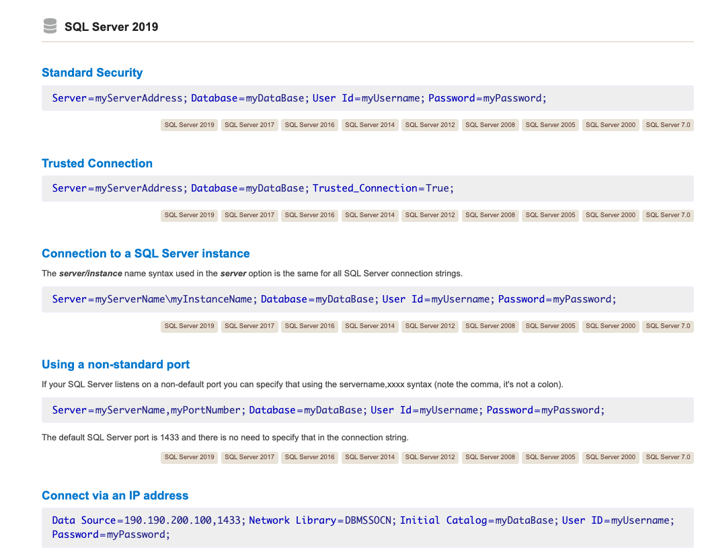

# 02 Connection

## Connection String

Dans `appsettings.json`

```cs
{
  "ConnectionStrings": {
    "HukarConnection":"Server=localhost,1433;Database=AdoTest;User=sa;Password=huk@r2Xmen99;Encrypt=false"
  },
    // ...
```

> Il faut utiliser `Encrypt=false` pour éviter ce genre d'erreur :
>
> ```
> Microsoft.Data.SqlClient.SqlException (0x80131904): A connection was successfully established with the server, but then an error occurred during the pre-login handshake. (provider: TCP Provider, error: 35 - An internal exception was caught)
>        ---> System.Security.Authentication.AuthenticationException: The remote certificate was rejected by the provided RemoteCertificateValidationCallback.
> ```


## Connection Class

### Passer la `Connection String`

```cs
var cnn = new SqlConnection(cnnString);
```


### Ouvrir la connexion

```cs
cnn.Open();
```


### Fermer quand c'est fini

```cs
cnn.Close();
```


### Disposer des ressource non géré

```cs
cnn.Dispose();
```

L'utilisation de programme extérieur à `.net` (fournit par Microsoft en `C`) doivent être disposés proprement.


## Se connecter à la `DB`

```cs
public class Connection
{
    public string connect(string cnnString)
    {
        SqlConnection cnn = new SqlConnection(cnnString);

        cnn.Open();

        var resultText = GetConnectionInformation(cnn);

        cnn.Close();

        cnn.Dispose();
        
        return resultText;
    }

    public string GetConnectionInformation(SqlConnection cnn)
    {
        stringBuilder sb = new StringBuilder(1024);
        
        sb.AppendLine("Connection String: " + cnn.ConnectionString);
    }
}
```

`resultText`

```
"Connection String: Server=localhost,1433;Database=AdoTest;User=sa;Encrypt=false
State: Open
Connection Timeout: 15
Database: AdoTest
Data Source: localhost,1433
Server Version: 15.00.4123
Workstation ID: kms"
```


## Test avec un `endpoint`

```cs
public static class ApplicationEndpoints
{
    public static WebApplication MapApplicationEndpoints(this WebApplication app)
    {
        app.MapGet("/connectinfo", (HukarConnection HukarCnn, IConfiguration configuration) => {
            var cnnString = configuration.GetConnectionString("HukarConnection");
            var infoConnection = HukarCnn.Connect(cnnString);

            return Ok(infoConnection);
        });

        return app;
    }
}
```

Dans `Program.cs`

```cs
// ...
builder.Services.AddScoped<HukarConnection>();

var app = builder.Build();

// ...
app.MapApplicationEndpoints();

app.Run();
```


## Utiliser un `using block`

```cs
public string ConnectUsingBlock(string cnnString)
{
    using(SqlConnection cnn = new SqlConnection(cnnString))
    {
        cnn.Open();

    	var resultText = GetConnectionInformation(cnn);
    }

    return resultText;
}
```

Le `using block` permet un `Close` et un `Dispose` automatique (voire [AA-pool-connection.md](AA-pool-connection)).


## Gérer les erreurs

On peut encadrer son code avec un `try and catch`.

```cs
public string ConnectWithError()
{
    var cnnString = "Server=Error;ConnectionTimeout=5;Databse=error;User=sa;Password=huk@k2Xmen99;Encrypt=false";
    var resultText = "";
    try
    {
        using var cnn = new SqlConnection(cnnString);
    cnn.Open();

    resultText = GetConnectionInformation(cnn);
    }
    catch(Exception ex)
    {
        resultText = $"Hukar Error {ex.ToString()}";
    }
    
    return resultText;
}
```


## La référence pour les `Connection Strings`

https://www.connectionstrings.com/microsoft-data-sqlclient/

