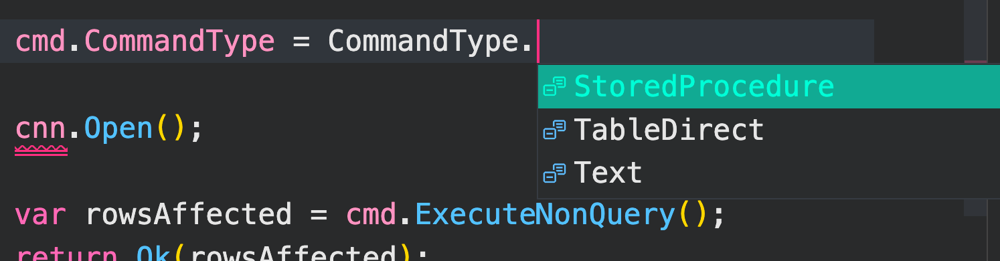

# 04 Les `action command` :

#  `INSERT` `UPDATE` et `DELETE`


## `INSERT INTO` : `ExecuteNonQuery`

```cs
var sql = @"INSERT INTO Product (Name,Price)
			VALUES ('GSM', 678), ('tablet', 879)";

try {
    using var cnn = new SqlConnection(cnnString);
    using var cmd = new SqlCommand(sql, cnn);
    
    cmd.CommandType = CommandType.Text; // valeur par défaut, ligne facultative

    cnn.Open();

    var rowsAffected = cmd.ExecuteNonQuery();
    return rowsAffected; // renvoie 2 pour les deux enregistrements
}
catch(Exception ex) {
    return ex.ToString();
}
```

`CommandType.Text` est la valeur par défaut, on pourrait avoir `StoredProcedure` à la place.



`ExecuteNonQuery` ne renvoie pas un `scalar`, mais le nombre de ligne affectées.


