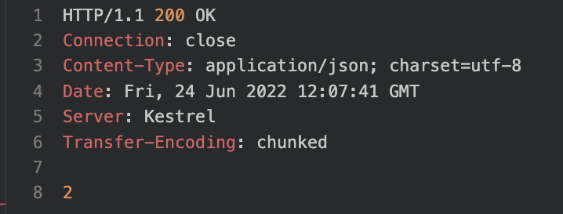

# 07 Transaction

- On veut exécuter plus d'une clause `sql` sur la `DB`
- C'est un système tout ou rien
- Soit on `commit`, soit on `rollback` (en cas d'erreur)


## Transaction Processing : `BeginTransaction`

```cs
public static IResult TransactionProcessing(ConnectionString cnnStr)
    {
        var sql = @"INSERT INTO Product (Name, Price) 
                    VALUES (@Name, @Price)";
        int rowsAffected; 

        try {
            using var cnn = new SqlConnection(cnnStr.Get());
            cnn.Open();  // si pas ici => Exception
            using var trn = cnn.BeginTransaction();
            try {
            using var cmd = new SqlCommand(sql, cnn);
                
                cmd.Transaction = trn;

                cmd.Parameters.Add(new SqlParameter("@Name", "wide tv"));
                cmd.Parameters.Add(new SqlParameter("@Price", 998));
                
                cmd.CommandType = CommandType.Text;

                // cnn.Open(); 
                
                rowsAffected = cmd.ExecuteNonQuery(); 
                
                // SECOND STATEMENT TO EXECUTE
                sql = @"INSERT INTO Product
                		VALUES (@Name, @Price)";
                
                cmd.CommandText = sql;
                
                cmd.Parameters.Clear();
                cmd.Parameters.Add(new SqlParameter("@Name", "scisor"));
                cmd.Parameters.Add(new SqlParameter("@Price", 26));
                
                rowsAffected += cmd.ExecuteNonQuery();
                
                // trn.Commit();
                return Ok(rowsAffected);
            } catch(Exception ex) {
                return BadRequest(ex.ToString());
            } 
        } catch(Exception ex) {
            return BadRequest(ex.ToString());
        }
    }
}
```

On doit toujours au moins utiliser un bloc `try` avec les `transactions`.

Ici on essaye de créer une `connection` puis d'exécuter une `transaction`.

Il faut passer la `transaction` à la `command` : `cmd.Transaction = trn`.


## `trn.Commit`

Si on appelle pas `trn.Commit` on obtient comme résultat :



On a bien `2` lignes (`2` `INSERT INTO`).

Mais en `DB` rien n'est ajouté :


Si je dé-commente cette ligne :

```cs
trn.Commit();
```

Je retrouve bien les `2` en `DB` :


##  `trn.Roolback`

```cs
try {
    using var cnn = new SqlConnection(cnnStr.Get());
    cnn.Open();
    using var trn = cnn.BeginTransaction();
    try {
        // ...

        trn.Commit();
        return Ok(rowsAffected);   
    } catch(Exception ex) { // catch pour la transaction
        trn.Rollback();
        return BadRequest(ex.ToString());
    } 
} catch(Exception ex) { // catch pour la connection
    return BadRequest(ex.ToString());
}
```

Je ne comprends pas l'utilité de `trn.Rollback` pour l'instant étant donné que `trn.Commit`n'est pas appelé en cas d'`Exception`.