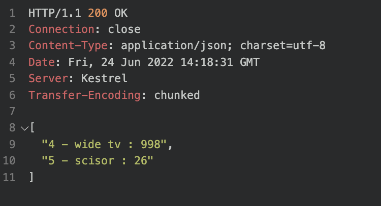
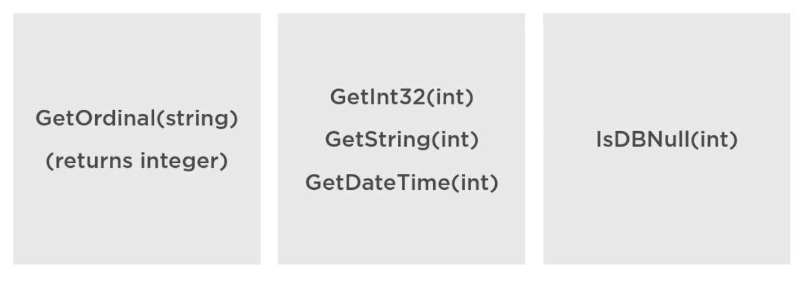

# 08 `DataReader`

- C'est un curseur `en-avant seulement` : `forward-only`.
- la méthode la plus rapide pour lire des données
- S'assurer de fermer (utiliser un `using block`)


## Lire des données

```cs
public static IResult GetProductsAsDataReader(ConnectionString cnnStr)
{
    var sql = "SELECT * FROM Product";

    List<string> products = new();

    using var cnn = new SqlConnection(cnnStr.Get());
    using var cmd = new SqlCommand(sql, cnn);

    cnn.Open();

    using SqlDataReader dr = cmd.ExecuteReader(CommandBehavior.CloseConnection);

    while(dr.Read()) {
        products.Add($"{dr["Id"].ToString()} - {dr["Name"]} : {dr["Price"].ToString()}");
    }


    return Ok(products);
}
```

`CommandBehaviour.CloseConnection` ferme la `connection` lorsque le `reader` est fermé.

Sinon on doit ajouter `reader.Close()`

Si le `reader` n'est pas fermé, la `connection`  reste bloqué sur ce `reader`. 




## `Cast` des données en entrée

On a besoin de `GetOrdinal`  car les autres méthodes de cast attendent l'index de position et pas le nom de colonne.

Par soucis de performance il est préférable de retrouver ses index en dehors de la boucle `while`.

On peut aussi tester si une valeur (colonne) est `null` avec son index passé à la méthode `IsDBNull`.




## Faire des conversions

```cs
List<Product> products = new();

while(dr.Read())
{
    var product = new {
        Id = dr.GetInt32(dr.GetOrdinal("Id"),
        Name = dr.GetString(dr.GetOrdinal("Name")),
     	Price = dr.GetDecimal(dr.GetOrdinal("Price")),
        RetireDate = dr.IsDBNull(dr.GetOrdinal("RetireDate")) ?
                     (DateTime?)null :
                     Convert.ToDateTime(dr["RetireDate"])
    };
                         
   	products.Add(product);
}
```

`GetOrdinal` retrouve l'index de la colonne en lui passant son nom (de colonne).

```cs
Column1 = reader.GetValue(reader.GetOrdinal("Column1Name")).ToString();
```

On peut ainsi mettre en cache la valeur de `GetOrdinal` :

> https://stackoverflow.com/questions/1079366/why-use-the-getordinal-method-of-the-sqldatareader
>
> I think that the reason to use GetOrdinal() is so that you can cache the result and re-use it multiple times for performance.

```cs
int valueOrdinal = reader.GetOrdinal("value");
while ( ... )
{
    var value = reader.GetString(valueOrdinal);
}
```

On évite d'exécuter GetOrdinal à chaque passage de boucle.

Sinon il existe `GetValue(2)` qui correspond à la colonne `3`.

C'est plus rapide et moins lisible, cela utilise uniquement l'index de l'emplacement d'une colonne.

```cs
Column1 = reader.GetValue(0).ToString().Trim();
```


## exemple complet d'un `Endpoint`

```cs
public static IResult DiConnection(HuConnection connection)
{
    List<Product> products = new();


    var sql = "SELECT * FROM Product";

    var cmd = new SqlCommand(sql, connection.Connection);
    connection.Connection.Open();

    var reader = cmd.ExecuteReader();

    var indexId = reader.GetOrdinal("Id");
    var indexName = reader.GetOrdinal("Name");
    var indexPrice = reader.GetOrdinal("Price");
    var indexIntroductionDate = reader.GetOrdinal("IntroductionDate");
    var indexRetireDate = reader.GetOrdinal("RetireDate");

    while(reader.Read())
    {
        products.Add(new Product {
            Id = reader.GetInt32(indexId),
            Name = reader.GetString(indexName),
            Price = reader.IsDBNull(indexPrice) ? null : reader.GetDecimal(indexPrice),
            IntroductionDate = reader.IsDBNull(indexIntroductionDate) ? null : reader.GetDateTime(indexIntroductionDate),
            RetireDate = reader.IsDBNull(indexRetireDate) ? null : reader.GetDateTime(indexRetireDate),
        });
    }

    return Ok(products);
}
```

Les `index` sont récupérés en dehors de la boucle `while`.

Les `null` sont traités grâce à la méthode `IsDBNull` du `SqlDataReader`.

La `connection` est envoyée par `DI`, pas besoin de `using`.

Par contre (même si je ne vois pas de conséquence), il faudrait certainement un `using` devant la `commande` et devant le `reader`.

> Si on regarde plusieurs sources, utiliser `using` avec  `SqlCommand` améliore les performances en évitant l'attente du `GC` : `Garbage Collector`.
>
> Il faut se dire que `SqlCommand` et `SqlDataReader` utilise des ressource non managées directement par mon code. Pour les libérés, ils peuvent invoquer `Dispose`.

> ## Règle :
>
> Toujours utiliser `using` avec des classes implémentant `IDisposable`.
