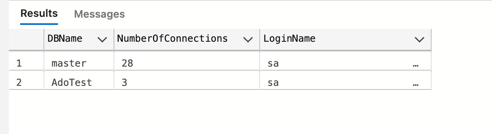

# AA Pool Connection


## Nombre max

On peut changer le nombre maximum de connexion dans le `connection string` :

```
Min Pool Size=0;Max Pool Size=100;Pooling=true;
```

On peut ainsi réduire le `Pool` dans sa `connection string` pour des raisons de tests.

`appsettings.json`

```json
"ConnectionStrings": {
    "HukarConnection":"Server=localhost,1433;Database=AdoTest;User=sa;Password=huk@r2Xmen99;Encrypt=false;Max Pool Size=3"
  },
```


Par défaut ce nombre est de `100`.

Une connection est rendus au `pool` avec l'usage de `close/dispose` ou en utilisant un `block using`.

Une connection inutilisé sera rendu automatiquement au `pool` après un certain temps.

Si toutes les connections sont prises on a une erreur :

```
HTTP/1.1 500 Internal Server Error
Connection: close
Content-Type: text/plain; charset=utf-8
Date: Wed, 22 Jun 2022 13:30:50 GMT
Server: Kestrel
Transfer-Encoding: chunked

System.InvalidOperationException: Timeout expired.  The timeout period elapsed prior to obtaining a connection from the pool.  This may have occurred because all pooled connections were in use and max pool size was reached.
```

```
Délai d'attente expiré.  Le délai d'attente s'est écoulé avant d'obtenir une connexion du pool.  Cela peut s'être produit parce que toutes les connexions du pool étaient utilisées et que la taille maximale du pool était atteinte.
```


## Monitorer les connections utilisées

Deux script `sql` trouvé sur `Stackoverflow` :

https://stackoverflow.com/questions/8738941/how-to-monitor-active-connection-pool-in-sql-server

```sql
SELECT * FROM sys.dm_exec_connections
```


Beaucoup d'info, apparemment les lignes contenant `0x00000...` sont des connections en utilisation.


```sql
SELECT 
    DB_NAME(dbid) as DBName, 
    COUNT(dbid) as NumberOfConnections,
    loginame as LoginName
FROM
    sys.sysprocesses
WHERE 
    dbid > 0
GROUP BY 
    dbid, loginame
;
```



Au départ `NumberOfConnections` pour `AdoTest` est à `1`.

Il y a donc `2` connections ouvertes dans le `pool`.

## Test du `pool` de connections

En mettant `Max Pool Size=3` dans le `connection string` je teste les connections ouvertes.

```cs
SqlConnection cnn = new SqlConnection(cnnString);

cnn.Open();

var resultText = GetConnectionInformation(cnn);

// cnn.Close();

// cnn.Dispose();
```

après la quatrième requête (ouverture de connection), le système flanche et j'ai l'erreur :

```
System.InvalidOperationException: Timeout expired.  The timeout period elapsed prior to obtaining a connection from the pool.  This may have occurred because all pooled connections were in use and max pool size was reached.
```

Si je teste en dé-commentant simplement `cnn.Close`, je n'ai plus d'erreur malgré les `3` petites connections. De même si je dé-commente seulement `cnn.Dispose`.

Apparemment `Close` et `Dispose` on des implémentations identique :

> If the [SqlConnection](https://docs.microsoft.com/en-us/dotnet/api/microsoft.data.sqlclient.sqlconnection?view=sqlclient-dotnet-standard-4.1) goes out of scope, it won't be closed. Therefore, you must explicitly close the connection by calling `Close` or `Dispose`. `Close` and `Dispose` are functionally equivalent. 
>
> https://docs.microsoft.com/en-us/dotnet/api/microsoft.data.sqlclient.sqlconnection.close?view=sqlclient-dotnet-standard-4.1#microsoft-data-sqlclient-sqlconnection-close

On trouve dans le code ceci pour `Dispose` :

```cs
override protected void Dispose(bool disposing)
{
    if (disposing)
    {
        _userConnectionOptions = null;
        _poolGroup = null;
        Close();
    }
    DisposeMe(disposing);
    base.Dispose(disposing);
}
```

`Dispose` appelle donc `Close` (il y a d'ailleurs une note à ce sujet dans `Close`).

Il faut utiliser `using` qui appelle `Dispose` ou `DisposeAsync` qui lui-même appelle `Close`.


> ## Différence entre `Close` et `Dispose`
>
> - 
>   So it works this way **1.** `con.Open() con.Close();` **2** `con.Open(); // reuse` **3.** `con.Dispose(); // use one time con.Open(); // error` 
>
>   – [Shaiju T](https://stackoverflow.com/users/2218697/shaiju-t)
>   
>   ```cs
>   app.MapGet("/testclose", (IConfiguration configuration) => {
>       List<string> connIds = new();
>     
>       var cnnString = configuration.GetConnectionString("HukarConnect");
>       SqlConnection connection = new(cnnString);
>     
>       connection.Open();
>       connIds.Add(connection.ClientConnectionId.ToString());
>       connection.Close();
>     
>       connection.Open();
>       connIds.Add(connection.ClientConnectionId.ToString());
>       connection.Close();
>     
>       return Ok(connIds);
>   });
>   ```
>   
>   Fonctionne parfaitement.
>   
>   ```cs
>   app.MapGet("/testclose", (IConfiguration configuration) => {
>       List<string> connIds = new();
>     
>       var cnnString = configuration.GetConnectionString("HukarConnect");
>       SqlConnection connection = new(cnnString);
>     
>       connection.Open();
>       connIds.Add(connection.ClientConnectionId.ToString());
>       connection.Dispose();
>     
>       connection.Open();
>       connIds.Add(connection.ClientConnectionId.ToString());
>       connection.Close();
>     
>       return Ok(connIds);
>   });
>   ```
>   
>   ```
>   System.InvalidOperationException: The ConnectionString property has not been initialized.
>   ```
>   
>   Une connection `Dispose` ne peut plus être réouverte avec `Open`.


