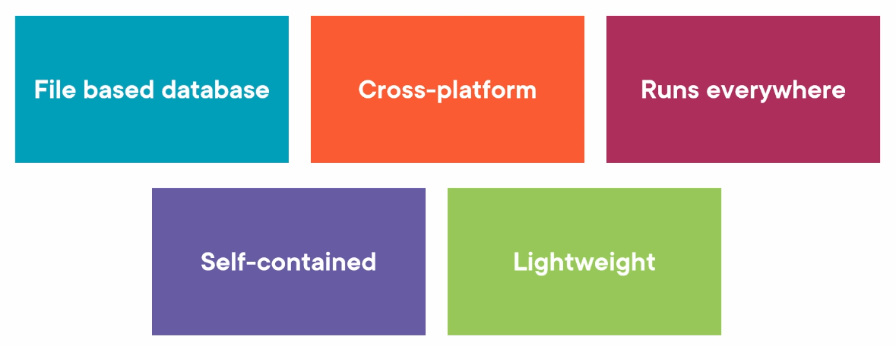

# 02 `Sqlite`




## Connexion

On ajoute le package nuget :

```
dotnet add package Microsoft.Data.Sqlite
```


## Types

On a `4` types :

- `INTEGER` : `Boolean`, `byte`,  `int` et `uint`
- `REAL` : `Single`, `Double`
- `BLOB` : `byte[]`
- `TEXT` : `char`, `string`, `guid`, toutes les types `date`


## Créer une table et insérer des données

Créer la connexion : `SqliteConnectio,`

```cs
var connectionString = "Data Source=mydb.db;";

using var cnn = new SqliteConnection(connectionString);
```

écrire le `sql` :

```cs
var sql = @"CREATE TABLE Employee (
    			Id INTEGER,
    			Name TEXT
			);
			INSERT INTO Employee 
			VALUES (1, 'Jonh'), (2, 'Remy');";
```

créer et exécuter la commande : `SqliteCommand`

```cs
using var cmd = new SqliteCommand(sql, cnn);

cnn.Open();

var numberOfRows = cmd.ExecuteNonQuery();

WriteLine(numberOfRows);
```

