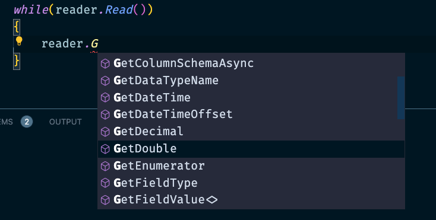

# 04 Résumé `ADO.Net`

Pour `Sql Server` et `Sqlite`


## Provider

```cs
using Microsoft.Data.SqlClient;

using Microsoft.Data.Sqlite;
```


## `Connection`

```cs
using var connection = new SqlConnection(connectionString);

using var connection = new SqliteConnection(connectionString);
```


## Créer une `Command`

```cs
using var command = connection.CreateCommand();
```

Va retourner le type correcte :

`SqlCommand` ou `SqliteCommand`.

On doit ensuite ajouter le `sql` :

```cs
command.CommandText = sqlQuery;
```

On peut aussi utiliser les différentes classes directement

```cs
using var command = new SqlCommand(sqlQuery, connection);

using var command = new SqliteCommand(sqlQuery, connection);
```


## Exécution de la `command`

```cs
// On ouvre la connexion
connection.Open() // existe aussi une version Async
    
using var reader = command.ExecuteReader(); 
```

`ExecuteScalar` retourne la première colonne de la première ligne du résultat.

`ExecuteNonQuery` retourne le nombre de ligne(s) affectée(s).

On a un `reader` associé au provider : `SqlDataReader` ou `SqliteDataReader`.

On demande au `reader` s'il a récupéré des enregistrements :

```cs
if(reader.HasRows == false)
{
    return;
}

while(reader.Read())
{
    
}
```


## Récupérer les données

Le `reader` possède plusieurs méthode ds le style `GetType` :



Pour les utiliser, il faut connaitre l'index de la donnée dans la base (le numéro de la colonne).

```cs
var OrderId = reader.GetGuid(0);
```

On peut aussi les récupérer avec leur nom de colonne :

```cs
var OrderId = reader["Id"];
```

