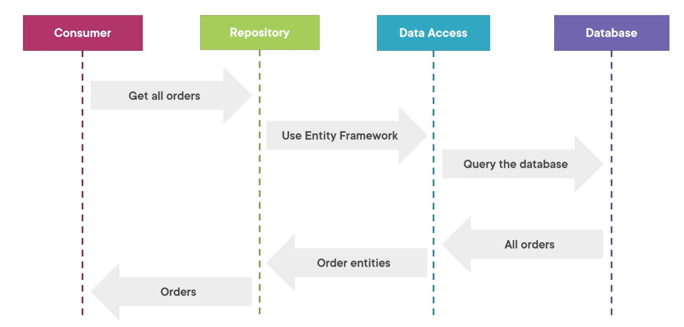
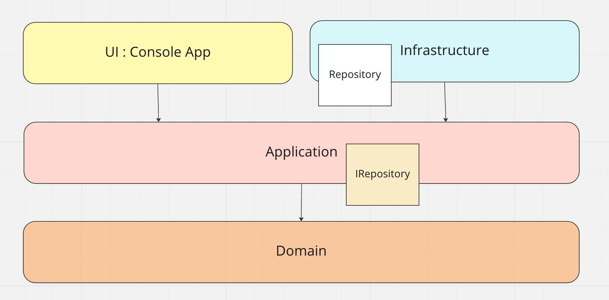
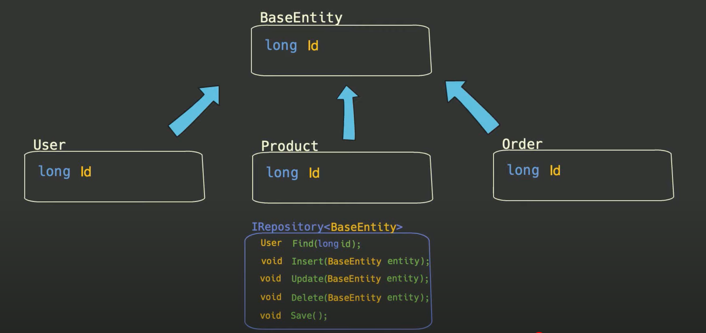

# 07 le `Repository Pattern`




## Avantage

- **Ne pas répéter l'accès aux données** : le code du `repository` devient centralisé et accessible dans n'importe quel contrôleur sans répétition.
- **Facilite l'écriture de test** : accès aux données découplé de la partie web, pas d'effet de bord.
- **Organise et centralise la logique**
- Facilite le changement de la couche `Data Access`.


Le but du `Repository Pattern` et de découpler le `controller` de la couche `Data Access`.

Dans une organisation `clean code`, l'implémentation du `repository` se trouverait dans un projet `Infrastructure` tandis que l'`interface` serait elle dans le projet `Application`.




## `IRepository<T>`

On créé une `interface` pour un `generic repository`.

```cs
public interface IRepository<T>
{
    T Add(T entity);
    T Update(T entity);
    T Get(Guid id);
    IEnumerable<T> All();
    IEnumerable<T> Find(Expression<Func<T, bool>> predicate);
    void SaveChanges();
}
```

> Je préfère :
>
> ```cs
> T GetById(Guid id);
> IEnumerable<T> GetAll();
> ```
>
> Je trouve le nom des méthodes plus explicite.

Je ne sais pas si `SaveChanges` est possible/a un intérêt avec `ADO.Net` ou `Dapper`.


On peut aussi utiliser une classe `BaseEntity` qui garantie qu'on a bien un `Id` par exemple.




