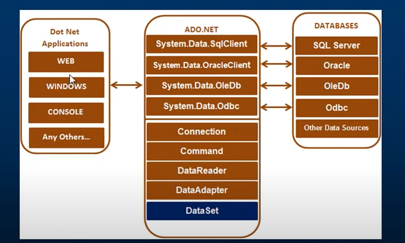
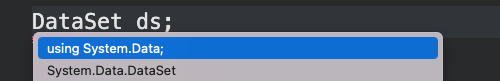

# 01 Qu'est que `ADO.NET`

`A`ctiveX `D`ata `O`bject

C'est un groupe de classes pouvant être utilisées pour accéder à des sources de données (`BDD` et `fichier XML`).

Ces données peuvent alors être consommées (utilisées) dans une application `.net`.


## Utilisation pour `SQL Server`

### Microsoft.Data.SqlClient

https://www.nuget.org/packages/Microsoft.Data.SqlClient/5.0.0-preview3.22168.1


## Code de base

```c#
// CONNECTION
string connectionString = "Server=localhost,1433;Database=AdoTest;User=sa;Password=huk@r2Xmen99;Encrypt=false";
SqlConnection con = new SqlConnection(connectionString);

// PREPARE THE SQL COMMAND
SqlCommand cmd = new SqlCommand("SELECT * FROM Product", con);

// OPEN CONNECTION
con.Open()
    
// EXECUTE COMMAND AND GET A READER
SqlDataReader reader = cmd.ExecuteReader();

// READ DATA
var result = new List<ProductDto>();

while(reader.Read())
{
    result.Add(
        new (
            reader["Name"].ToString() ?? "null value", 		
            Convert.ToInt32(reader["Price"])
        )
    );
}

// CLOSE CONNECTION
con.Close();
```

Pour se servir d'`Oracle` il suffit d'utiliser `System.Data.OracleClient` et de modifier légèrement le code :

```c#
string connectionString = "...";
OracleConnection con = new OracleConnection(connectionString);

// PREPARE THE SQL COMMAND
OracleCommand cmd = new OracleCommand("SELECT * FROM Product", con);

// OPEN CONNECTION
con.Open()
    
// EXECUTE COMMAND AND GET A READER
OracleDataReader reader = cmd.ExecuteReader();
```


## Schéma général



`ADO.NET` fonctionne avec tous les types d'application `.NET`.

`DataSet` n'est pas préfixé car il n'est pas dans le code du provider mais dans `System.Data.DataSet`.



