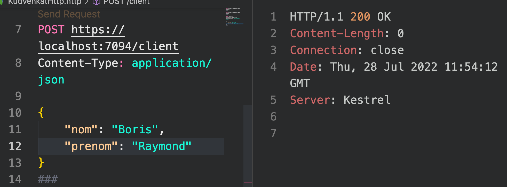

# 03 `SqlCommand`

`SqlCommand` prépare une requête `SQL` ou une procédure stockée qu'on veut exécuter sur `SQL Server`.

Il y a trois principales méthodes :

- `ExecuteReader` lorsqu'on s'attend à recevoir plusieurs lignes de données.
- `ExecuteNonQuery` utilisée pour les `INSERT`, `UPDATE` et `DELETE`
- `ExecuteScalar` quand on reçoit une valeur unique comme un `COUNT` ou un `AVG`


## Programme de base (`Minimal API`)

```c#
var builder = WebApplication.CreateBuilder(args);

var connectionString = builder.Configuration.GetConnectionString("HukarConnection");
builder.Services.AddScoped(_ => new SqlConnection(connectionString));

var app = builder.Build();

app.MapGet("/result", GetResults);
app.MapGet("/count", GetCount);
app.MapPost("/client", InsertClient);

app.Run();
```

Les `using` sont mis dans un fichier à part `GlobalUsings.cs`

```c#
global using Microsoft.Data.SqlClient;
```


## `ExecuteReader`

```c#
List<string> GetResults(SqlConnection con)
{
    var cmd = new SqlCommand("SELECT * FROM Client", con);

    con.Open();
    var reader = cmd.ExecuteReader();

    var result = new List<string>();
    while(reader.Read())
    {
        result.Add(
            $"nom: {reader["nom"].ToString()}, prénom : {reader["prenom"].ToString()}"
        );
    }

    return result;
}
```

```json
[
  "nom: Thuillier, prénom : Olivier",
  "nom: Thuillier, prénom : Luc",
  "nom: Thuillier, prénom : Théodore",
  "nom: Thuillier, prénom : Zinédine",
  "nom: Thuillier, prénom : Lucas",
  "nom: Edwards, prénom : Damians",
  "nom: Edwards, prénom : Damians"
]
```

On peut aussi utiliser l'`index` d'une colonne :

```c#
while(reader.Read())
{
    result.Add(
        $"id : {reader[2] ?? -1} n: {reader[0].ToString()}, p : {reader[1].ToString()}"
    );
}
```

```json
[
  "id : 1 n: Thuillier, p : Olivier",
  "id : 3 n: Thuillier, p : Luc",
  "id : 5 n: Thuillier, p : Théodore",
  "id : 12 n: Thuillier, p : Zinédine",
  "id : 13 n: Thuillier, p : Lucas",
  "id :  n: Edwards, p : Damians",
  "id :  n: Edwards, p : Damians"
]
```

On observe que rien n'est affiché pour les `ids` de `Edwards Damian`.

En fait une `exception` non attrapé est lancé à chaque fois qu'en `DB` une valeur `null` est renvoyée.

Pour les champs suscéptible de renvoyer une valeur `null` (ici `id`) il faut utiliser `IsDBNull` :

```cs
while(reader.Read())
{
    result.Add(
        $"id : {(reader.IsDBNull(2) ? "null" : reader[2])} n: {reader[0]}, p : {reader[1]}"
    );
}
```

 ```json
 [
   "id : 1 n: Thuillier, p : Olivier",
   "id : 3 n: Thuillier, p : Luc",
   "id : 5 n: Thuillier, p : Théodore",
   "id : 12 n: Thuillier, p : Zinédine",
   "id : 13 n: Thuillier, p : Lucas",
   "id : null n: Edwards, p : Damians",
   "id : null n: Edwards, p : Damians"
 ]
 ```


## `ExecuteNonQuery`

```c#
int InsertClient(SqlConnection con, ClientDto client)
{
    var sql = $"INSERT INTO Client (nom, prenom) VALUES ('{client.Nom}', '{client.Prenom}')";
    var cmd = new SqlCommand(sql, con);

    con.Open();
    var rowsAffected = cmd.ExecuteNonQuery();
    return rowsAffected;
}
```

Ce traitement n'est pas sécurisé contre l'injection `SQL`, c'est juste pour l'exemple.

`ExecuteNonQuery` renvoie le nombre de lignes affectées (`integer`).

#### Utilisation de `REST CLIENT`

```http
POST https://localhost:7094/client
Content-Type: application/json

{
    "nom": "Edwards",
    "prenom": "Damians"
}
```




### Exemple avec `DELETE`

```cs
app.MapDelete("/client", DeleteNullClientId);

int DeleteNullClientId(SqlConnection con)
{
    var cmd = new SqlCommand("DELETE FROM Client WHERE IDclient IS NULL", con);
    con.Open();
    var rowsAffected = cmd.ExecuteNonQuery();

    return rowsAffected;
}
```

```http
DELETE https://localhost:7094/client
```

```bash
3
```


## `ExecuteScalar`

```cs
int GetCount(SqlConnection con)
{
    var cmd = new SqlCommand("SELECT COUNT(*) FROM Client", con);

    con.Open();
    var count = (int)cmd.ExecuteScalar();

    return count;
}
```

```bash
8
```

`ExecuteScalar` peut renvoyer n'importe quel type de donnée, c'est pourquoi il renvoie le type `object` qui peut et doit ensuite être casté vers le type désiré (ici `int`).

À chaque fois qu'une requête renvoie une valeur unique (scalaire), il est préférable d'utiliser `ExecuteScalar` plutôt que `ExecuteReader` qui instancie inutilement un objet `SqlDataReader`.


## Syntaxe alternative pour `SqlCommand`

On peut décomposer l'utilisation de `SqlCommand` en plusieurs lignes :

```cs
// var cmd = new SqlCommand("SELECT * FROM Client", con);

var cmd = new SqlCommand();
cmd.CommandText = "SELECT * FROM Client";
cmd.Connection = con;
```

