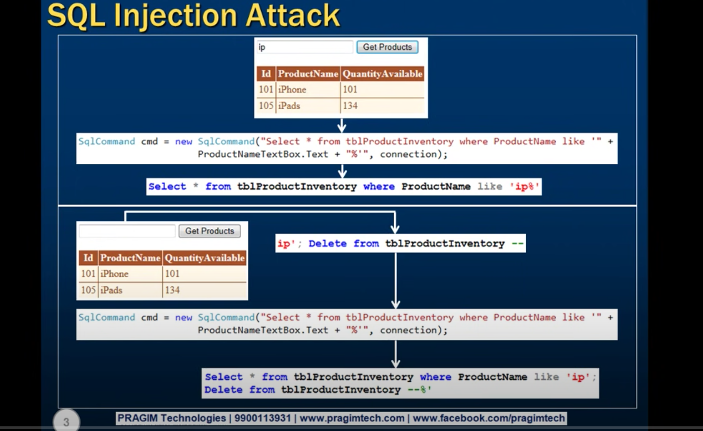
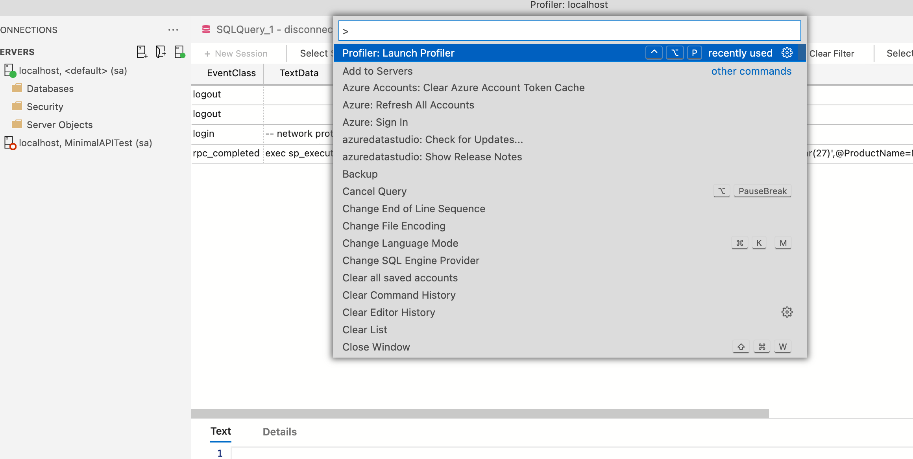
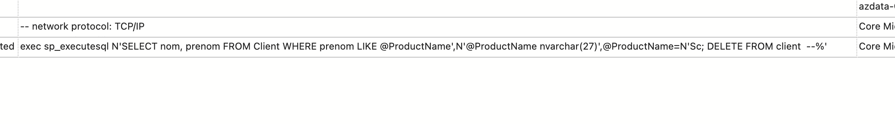
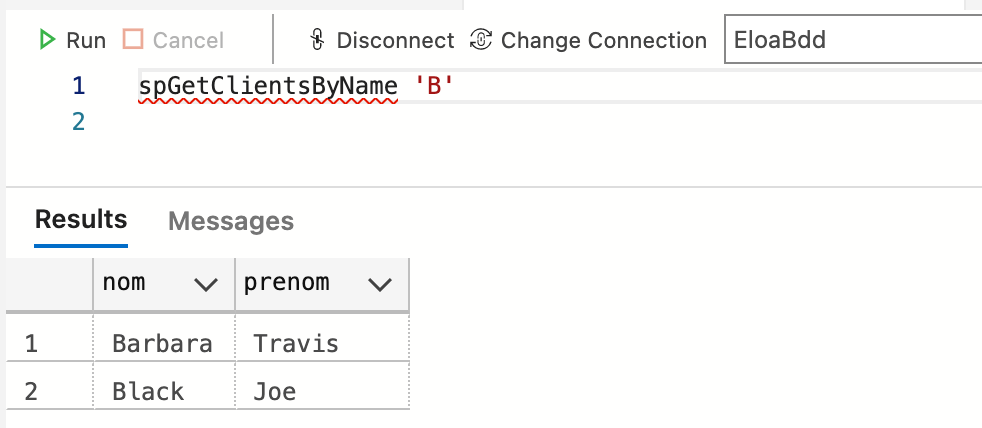

# 05 Prévenir les injections `SQL`



Il ne faut jamais écrire de requête en concatenant des données venant de l'extérieur et son propre code.

À la place on utilise les `requêtes pramétrées`ou les `procédures stockées`.


## Utiliser les requêtes paramétrées `@parameter`

Ancienne syntaxe vulnérable :

```c#
var cmd = new SqlCommand($"SELECT nom, prenom FROM Client WHERE prenom LIKE '{filter.FilterString}%'", con);
```


Nouvelle syntaxe :

```c#
var cmd = new SqlCommand("SELECT nom, prenom FROM Client WHERE prenom LIKE @ProductName", con);
cmd.Parameters.AddWithValue("@ProductName", $"{filter.FilterString}%");
```

Il existe aussi une méthode `Add` avec plusieurs `overload`, mais ici on utilise `AddWithValue(ParameterName, ParameterValue)`.

### Attaque injection `SQL`

```http
GET https://localhost:7094/client/filter
Content-Type: application/json

{
    "filterString": "Sc'; DELETE FROM client  --"
}
```

L'injection `SQL` ne fonctionne plus.

Si on lance le profiler de `Azure Data Studio` :

`shift + cmd +p`



On retrouve le `SQL` exécuté :



```sql
exec sp_executesql 
N'SELECT nom, prenom FROM Client WHERE prenom LIKE @ProductName',
N'@ProductName nvarchar(27)',
@ProductName=N'Sc''; DELETE FROM client  --%'
```

On note les doubles `simple qote` : `''` pour échapper le guillemet après `Sc` => `Sc''`.

Tout le contenu du paramètre est considéré comme un unique `string` (`nvarchar`).

On est ainsi protégé des attaques `injection SQL`.


## Avec les procédures stockées

On va écrire une procédure stockée :

```sql
CREATE PROCEDURE spGetClientsByName
@ClientName nvarchar(50)
AS
BEGIN
	SELECT nom, prenom FROM Client
	WHERE nom LIKE @ClientName + '%'
END
```

On teste la procédure :



### Modification du code 

```c#
var cmd = new SqlCommand("spGetClientsByName", con);
cmd.CommandType = CommandType.StoredProcedure;
cmd.Parameters.AddWithValue("@ClientName", $"{filter.FilterString}%");
```

On lance la requête :

```http
GET https://localhost:7094/client/filter
Content-Type: application/json

{
    "filterString": "B"
}
```

Réponse :

```json
[
  {
    "nom": "Barbara",
    "prenom": "Travis"
  },
  {
    "nom": "Black",
    "prenom": "Joe"
  }
]
```


### Tentative d'injection

```http
GET https://localhost:7094/client/filter
Content-Type: application/json

{
    "filterString": "Sc'; DELETE FROM client  --"
}
```

Dans le `Profiler` :

```sql
exec spGetClientsByName @ClientName=N'Sc''; DELETE FROM client  --%'
```

De nouveau l'injection ne fonctionne plus.