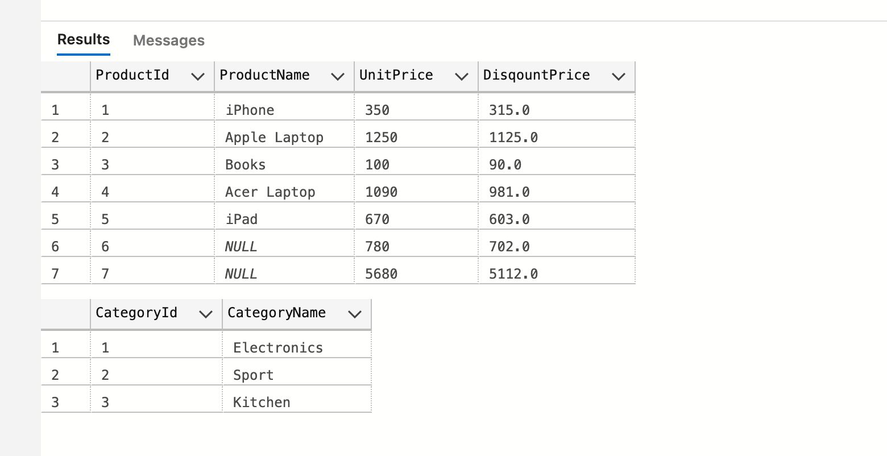

# 07 `SqlDataReader`

## Les avantages de `SqlDataReader`

`SqlDataReader` lit les données de la manière la plus efficace possible.

`SqlDataReader` est `read-only` et `forward-only` (`seulement en avant`), c'est à dire que si le `reader` est sur le deuxième enregistrement, il ne peut pas revenir en arrière sur le premier.

C'est la nature `forward-only` de `SqlDataReader` qui le rend efficace.

`SqlDataReader` est orienté connexion, il requière une connexion active à la source de données pour les lire.

Une instance de `SqlDataReader` ne peut pas être créée avec l'opérateur `new`.

La méthode `ExecuteReader` d'un objet de type `SqlCommand` crée et retourne une instance de `SqlDataReader`.


## Mise en place

```c#
string connectionString = builder.Configuration.GetConnectionString("HukarString");

builder.Services.AddScoped(_ => new SqlConnection(connectionString));

app.MapGet("/products", GetProduct);
```

```c#
List<ProductDto> GetProduct(SqlConnection con)
{
    SqlCommand cmd = new SqlCommand("SELECT * FROM ProductInventory", con);
    con.Open();

    using SqlDataReader reader = cmd.ExecuteReader(); 
    
    while(reader.Read())
    {
        // do something ...
    }
}
```

`con.Open()` doit obligatoirement être appelée avant l'appelle à `ExecuteReader`.

`SqlDataReader` doit être fermé (`Close`) si on veut que l'application soit scalable.

On peut utiliser un `using block` ou dans une clause `finally`.

La méthode `Read` d'un objet `SqlDataReader` est utilisée pour boucler sur les données.


## Utilisation d'une `DataTable`

`DataTable` fait parti de `System.Data`.

`reader.Read()` retourne un booléen, `false` s'il n'y a plus de ligne à lire.

```c#
using SqlDataReader reader = cmd.ExecuteReader(); 

DataTable table = new DataTable();

// AJOUTER UNE COLONNE
table.Columns.Add("Id");
table.Columns.Add("Name");
table.Columns.Add("Price");
table.Columns.Add("Reduce Price");

while(reader.Read())
{
    DataRow dataRow = table.NewRow();
    
    int originalPrice = Convert.ToInt32(reader["UnitPrice"]); // on peut aussi utiliser l'index de la colonne
    int discountPrice = originalPrice*0.9;
    
    dataRow["Id"] = reader["ProductId"];
    dataRow["Name"] = reader["ProductName"];
    dataRow["Price"] = originalPrice;
    dataRow["Reduce Price"] = discountPrice;
    
    table.Rows.Add(dataRow)
}

return table.AsEnumerable().Select(row => new ProductDto(
        Convert.ToInt32(row["Id"]),
        row["Name"].ToString(),
        Convert.ToInt32(row["Price"]),
        Convert.ToDouble(row["Reduce Price"])
    ));
```

Dans le cas d'une `api` ou on ne peut pas passer directement un `DataTable`, cela n'a pas beaucoup d'intérêt.


### Mon ancienne méthode

```c#
List<ProductDto> GetProducts(SqlConnection con)
{
    SqlCommand cmd = new("select * from Product", con);
    con.Open();
    using SqlDataReader reader = cmd.ExecuteReader();

    List<ProductDto> result = new();

    while(reader.Read())
    {
        int price = (int)reader["UnitPrice"];
        int discountPrice = price - price/10;
        result.Add(new(
            (int)reader["ProductId"],
            reader.IsDBNull("ProductName") ? "name is null" : reader["ProductName"].ToString()!,
            price,
            discountPrice
        ));
    }

    return result;
}
```


## La méthode `NextResult`

On veut récupérer deux sets de données :

```sql
SELECT *, UnitPrice*0.9 as DiscountPrice FROM Product; SELECT * FROM Category
```



La méthode `NextResult` permet de passer au deuxième `set` de données :

```cs
TwoSetsDto GetTwoSets(SqlConnection con)
{
    SqlCommand cmd = new SqlCommand("SELECT *, UnitPrice * 0.9 as DiscountPrice FROM Product; SELECT * FROM Category", con);
    con.Open();

    using SqlDataReader reader = cmd.ExecuteReader();

    List<ProductDto> products = new();
    List<CategoryDto> categories = new();

    while(reader.Read())
    {
        products.Add(new(
            reader.GetInt32("ProductId"),
            reader.IsDBNull("ProductName") ? "product name is null" : reader.GetString("ProductName"),
            reader.GetInt32("UnitPrice"),
            (double)reader.GetDecimal("DiscountPrice")
        ));
    }

    reader.NextResult(); // <= ici

    while(reader.Read())
    {
        categories.Add(new(
            reader.GetInt32("CategoryId"),
        reader.GetString("CategoryName")
        ));
    }

    return new TwoSetsDto(products, categories);
}
```

```http
HTTP/1.1 200 OK
Connection: close
Content-Type: application/json; charset=utf-8
Date: Thu, 18 Aug 2022 14:20:12 GMT
Server: Kestrel
Transfer-Encoding: chunked

{
  "$id": "1",
  "products": {
    "$id": "2",
    "$values": [
      {
        "$id": "3",
        "id": 1,
        "name": "iPhone",
        "price": 350,
        "discountPrice": 315
      },
      {
        "$id": "4",
```

On a des `"$id"`  et des `"$values"` intempestifs.

C'est dû à la configuration de `Json` :

```c#
builder.Services.Configure<HttpJson.JsonOptions>(
 options => options.SerializerOptions.ReferenceHandler = ReferenceHandler.Preserve
);
```

On remplace `ReferenceHandler.Preserve` par `ReferenceHandler.IgnoreCycles`.

```json
{
  "products": [
    {
      "id": 1,
      "name": "iPhone",
      "price": 350,
      "discountPrice": 315
    },
    {
      "id": 2,
        // ...
```

`NextResult` retourne `true` ou `false`, si on a plusieurs `ResultSet` on peut utiliser une boucle `while` :

```cs
while(reader.NextResult())
{
    // Process reader ...
}
```


