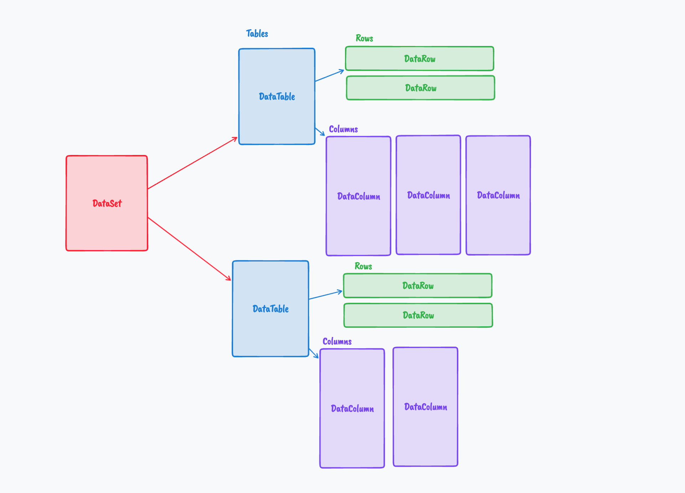
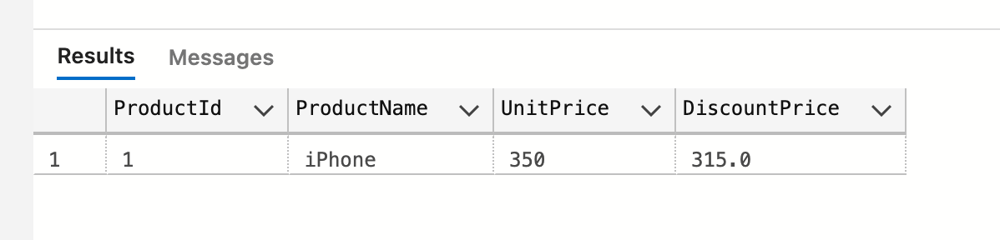

# 08 `SqlDataAdapter`

`SqlDataReader` est orienté connection et une connection ouverte et active est obligatoire.

`SqlDataAdapter` et `DataSet` fournissent un modèle déconnecté à l'accès aux données.

De même que pour `SqlCommand`, il faut fournir une commande `SQL` et une connexion à `SqlDataAdapter`.

## Implémentation

```cs
string connectionString = builder.Configuration.GetConnectionString("HukarConnection");

builder.Services.AddScoped(_ => new SqlConnection(connectionString));

app.MapGet("/products/dataadapter", GetProductsDataAdapter);
```

```cs
List<ProductDto> GetProductsDataAdapter(SqlConnection con)
{
	SqlDataAdapter da = new("SELECT * FROM ProductInventoty", con);
    DataSet ds = new();
    
    da.Fill(ds);
    
    List<ProductDto> products = new();

    foreach(DataRow row in ds.Tables["Table"]!.Rows)
    {
        products.Add(new(
            Convert.ToInt32(row["ProductId"]),
            row["ProductName"].ToString()!,
            Convert.ToInt32(row["UnitPrice"]),
            0
        ));
    }

    return products;
}
```

`DataSet` est indépendant des providers (`Sql`, `Oracle`,  `Odbc`) et est contenu dans `System.Data`.

Un `DataSet` est une représentation en mémoire de la base de données, tables et relations.

La méthode `Fill` ouvre la connexion, exécute la commande, rempli une `DataTable` du  `DataSet` et ferme la connexion pour nous.




## Avec une `procédure stockée`

```sql
CREATE PROCEDURE spGetProductInventory
AS
BEGIN
	SELECT * FROM ProductInventory
END
```

Définition du `endpoint` :

```cs
app.MapGet("/getdisconnected", GetDisconnectedProduct);
```

```cs
List<ProductDto> GetDisconnectedProduct(SqlConnection con)
{
    var sql = "spGetProductDiscount";

    List<ProductDto> products = new();

    var data = new SqlDataAdapter(sql, con);
    var dataSet = new DataSet();

    data.Fill(dataSet);

    foreach(DataRow row in dataSet.Tables[0].Rows)
    {
        products.Add(new(
            Convert.ToInt32(row["ProductId"]),
            row["ProductName"].ToString(),
            Convert.ToInt32(row["UnitPrice"]),
            Convert.ToDouble(row["DiscountPrice"])
        ));
    }

    return products;
}
```

`dataSet.Tables[0]` j'utilise l'index de la première `table` car je n'ai pas son nom.

Si mon `DataTable` était nommé, je pourrai écrire :

```cs
foreach(DataRow row in dataSet.Tables["MyTableName"].Rows)
```


`SqlDataAdapter` comprend directement que c'est une procédure stockée et pas une commande `SQL`.

On peut indiquer explicitement que c'est une `Stored Procedure` :

```cs
var data = new SqlDataAdapter(sql, con);
data.SelectCommand.CommandType = CommandType.StoredProcedure;

var dataSet = new DataSet();

data.Fill(dataSet);
```

#### `data.SelectCommand.CommandType = CommandType.StoredProcedure`

Si la procédure stockée a des paramètres, il est **obligatoire** de signaler que la commande est de type `Stored Procedure`.


## Procédure Stockée avec paramètres

### `Stored Procedure`

```sql
CREATE PROCEDURE spGetProductById
@ProductId int
AS
BEGIN
	SELECT *, UnitPrice*0.9 AS DiscountPrice FROM Product WHERE ProductId = @ProductId
END
```

```sql
spGetProductById 1
```



Dans le `endpoint` :

```cs
app.MapGet("/getdisconnected/{productId}", GetDisconnectedProductById);
```

```cs
List<ProductDto> GetDisconnectedProductById(SqlConnection con, int productId)
{
   List<ProductDto> products = new();

    var data = new SqlDataAdapter("spGetProductById", con);
    data.SelectCommand.CommandType = CommandType.StoredProcedure;
    
    // PASSER LES PARAMÈTRES
    data.SqlCommand.Parameters.AddWithValue("@ProductId", productId);

    var dataSet = new DataSet();

    data.Fill(dataSet);

    DataRow row = dataSet.Tables[0].Rows[0];
    
    return new ProductDto(
        Convert.ToInt32(row["ProductId"]),
        row["ProductName"].ToString(),
        Convert.ToInt32(row["UnitPrice"]),
        Convert.ToDouble(row["DiscountPrice"])
    );
}
```

#### `data.SqlCommand.Parameters.AddWithValue("@ProductId", productId)`

`Data.SqlCommand` est de type `SqlCommand`, on ajoute donc les paramètres de la même façon.

On pourrait écrire :

```cs
var data = new SqlDataAdapter();

data.SelectCommand = new SqlCommand("spGetProductById", con);
data.SelectCommand.CommandType = CommandType.StoredProcedure;
data.SelectCommand.Parameters.AddWithValue("@ProductId", productId);
```

