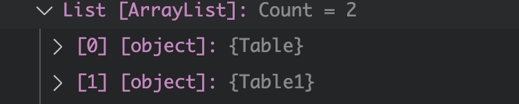

# 09 `DataSet`

- Charger deux ou plus `tables` dans un `DataSet` et les nommer


## Créer une procédure stockée ramenant deux set de données

```sql
CREATE PROCEDURE spGetTwoSets
AS
BEGIN
	SELECT *, UnitPrice*0.9 AS DiscountPrice FROM Product
	SELECT * FROM Category
END
```


## Implémentation du `endpoint`

```cs
app.MapGet("/twosets", GetTwoSets);
```

```cs
TwoSetsDto GetTwoSets(SqlConnection con)
{
    List<ProductDto> products = new();
    List<CategoryDto> categories = new();

    SqlDataAdapter dataAdapter = new("spGetTwoSets", con);
    dataAdapter.SelectCommand.CommandType = CommandType.StoredProcedure;
	
    DataSet dataSet = new();
   	dataAdapter.Fill(dataSet); 
   
    foreach(DataRow row in dataSet.Tables["Table"]!.Rows)
    {
        products.Add(new(
            Convert.ToInt32(row["ProductId"]),
            row["ProductName"].ToString(),
            Convert.ToInt32(row["UnitPrice"]),
            Convert.ToDouble(row["DiscountPrice"])
        ));
    }

    foreach(DataRow row in dataSet.Tables["Table1"]!.Rows)
    {
        categories.Add(new(
            Convert.ToInt32(row["CategoryId"]),
            row["CategoryName"].ToString()
        ));
    }

    return new TwoSetsDto(products, categories);
}
```


### Nommage par défaut des tables



Si on ne nomme pas nous-même les tables on a comme nom `Table` et `Table1`.

On peut aussi y accéder par l'index (`0`, `1`) :

```cs
// foreach(DataRow row in dataSet.Tables["Table1"]!.Rows)
foreach(DataRow row in dataSet.Tables[1]!.Rows)
```


### Donner des noms sémantiques aux tables

```cs
// ...
dataAdapter.Fill(dataSet);

dataSet.Tables[0].TableName = "ProductTable";
dataSet.Tables[1].TableName = "CategoryTable";

foreach(DataRow row in dataSet.Tables["ProductTable"]!.Rows)
{
    // ...
}

foreach(DataRow row in dataSet.Tables["CategoryTable"]!.Rows)
{
    // ...
}
```


## Mettre en cache un `Dataset`

J'utilise un simple `Dictionary` :

```cs
Dictionary<string, DataSet> cache = new();

app.MapGet("/loaddata", LoadData);
```

```cs
List<SimpleProductDto> LoadData(SqlConnection con)
{
    Console.WriteLine("Begin LoadData");
    
    List<SimpleProductDto> products = new();
    
    SqlDataAdapter dataAdapter = new("SELECT * FROM Product", con);
    DataSet dataSet = new();

    if(cache.ContainsKey("data") == false) {
        dataAdapter.Fill(dataSet);
        dataSet.Tables[0].TableName = "ProductTable";
        
        cache["data"] = dataSet; // <=

        foreach(DataRow row in dataSet.Tables["ProductTable"]!.Rows)
        {
            // ...
        }

        Console.WriteLine("Load data from database");
    }
    else {
        dataSet = cache["data"]; // <=

        foreach(DataRow row in dataSet.Tables["ProductTable"]!.Rows)
        {
           // ...
        }

        Console.WriteLine("Load data from cache");
    }

    return products;
}
```

Si on coupe la connexion à la base de données, l'application continu de fonctionner.

#### C'est un modèle déconnecté d'accès aux données


### effacer le `cache`

```cs
app.MapGet("/cleardata", ClearData);
```

```cs
void ClearData()
{
    if(cache.ContainsKey("data")) {
        cache.Remove("data");
    }
}
```

