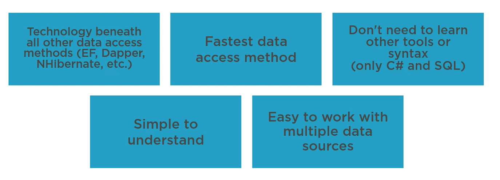

# 01 `ADO.NET`

## Qu'est-ce que `ADO.NET`

`ADO.NET` est la technologie derrière les autres méthodes d'accès aux données : 

`EF`, `Dapper`, `NHibernate`, etc.

C'est le moyen le plus rapide d'accéder aux données.

C'est juste du `c#` et du `sql`, pas besoin d'apprendre une nouvelle technologie.




## Les classes d'`ADO.NET`

### `Connected Classes`

`Connection` pour créer une connection à une base de données spécifique.

`Transaction` exécute des commandes avec une transaction.

`Command` la command `SQL` à envoyer à la `DB`.

`DataAdapter` remplie un `DataSet`/ `DataTable` avec les données.

`DataReader` Un rapide, `en avant seulement` (`forward-only`) curseur pour lire les données.


### `Disconnected Classes`

`DataSet` une collection d'une ou plusieurs `DataTables`.

`DataTable` Une unique table de données.

`DataView` Une vue (`view`) dans une `DataTable`.

`DataRow` Une unique ligne de données dans une `DataTable`.

`DataColumn` une unique colonne dans un `DataRow`.


### `Builder Classes`

`ConnectionString Builder` créer ou découper (break apart) une `connection string`.

`CommandBuilder` créer une commande `Insert`, `Update` ou `Delete`.


### `Providers`


>  `Microsoft.Data.SqlClient` , Depuis août 2019, remplace `System.Data.SqlClient`, elle conserve la même `API`.
>
> ```bash
> dotnet add package Microsoft.Data.SqlClient --version 4.1.0
> ```


## ORM

### Avantage

- *Mappe* automatiquement les colonnes aux propriétés
- Moins de `SQL` à écrire
- Code Génération : `code` <-> `DB`


### Inconvénient

- Plus lent que `ADO.NET`
- mauvais `SQL`
- Difficulté d'exécuter des procédures stockées.
- Apprendre un sous-langage et ses outils
- Utilise des configurations lourdes et des attributs
- Il peut y avoir des `breaking changes` entre les versions.


